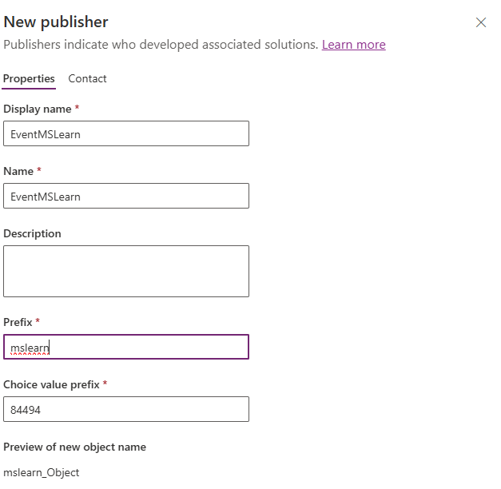

---
lab:
  title: 'Lab 1: Erstellen einer Lösung'
  learning path: 'Learning Path: Manage the Microsoft Power Platform environment'
  module: 'Module 1: Describe Microsoft Dataverse'
---

## Lernziel

In dieser Übung erstellen Sie eine Power Platform-Lösung zum Speichern der verschiedenen Komponenten, die Sie erstellen. In Power Platform werden Lösungen verwendet, um verschiedene Komponenten zu gruppieren und Transportierbarkeit zu ermöglichen. Die Lösung, die Sie in dieser Übung erstellen, wird während des restlichen Kurses verwendet.

### Szenario

Contoso Consulting ist eine professionelle Dienstleistungsorganisation, die sich auf IT- und KI-Beratungsdienste spezialisiert hat. Im Laufe des Jahres veranstalten sie viele verschiedene Events für ihre Kunden. Einige davon sind Events im Stil von Messen, bei denen viele Partner anwesend sind und Informationen zu neuen Produkten, Markttrends und Dienstleistungen bereitstellen. Andere finden das ganze Jahr über statt und sind kurze Webinare, in denen Details zu einzelnen Produkten vorgestellt werden.

Contoso möchte Power Platform verwenden, um eine Eventverwaltungslösung zu erstellen, mit der das Unternehmen die verschiedenen Events verwalten kann, die es im Laufe des Jahres veranstaltet.

In dieser Übung erstellen Sie eine Lösung, die für Application Lifecycle Management (ALM) verwendet wird, und um alle verschiedenen Apps, Websites und Flows zu gruppieren, die wir zusammen erstellen, damit sie einfach verwaltet und transportiert werden können.

Die geschätzte Dauer dieser Übung beträgt **15 bis 20** Minuten.

Nach erfolgreichem Abschluss dieser Übung werden Sie:

- eine Eventverwaltungslösung erstellen
- der Lösung die vorhandenen Tabellen „Konto“ und „Kontakt“ hinzufügen
- eine neue Tabelle namens „Events“ aus der Lösung erstellen

## Aufgabe 1: Erstellen einer Eventverwaltungslösung

1.  Öffnen Sie das [Power Apps Maker Portal](https://make.powerapps.com).
1.  Navigieren Sie zu **Lösungen**.
1.  Klicken Sie auf der Befehlsleiste auf **+ Neue Lösung**.
1.  Konfigurieren Sie im Bildschirm „Neue Lösung“ wie folgt:
    - **Anzeigename:** Ereignisverwaltung
    - **Name:** EventManagement
1.  Wählen Sie unter **Herausgeber** die Option **+ Neuer Herausgeber** aus.
1.  Konfigurieren Sie den neuen Herausgeber wie folgt.
    - **Anzeigename:** EventMSLearn
    - **Name:** EventMSLearn
    - **Präfix:** mslearn
    - **Präfix des Auswahlwerts:** Behalten Sie die Standardwerte bei.

    

1.  Wählen Sie die Schaltfläche **Speichern** aus, um den Herausgeber zu speichern.
1.  Wählen Sie im Feld **Herausgeber** den soeben erstellten **EventMSlearn**-Herausgeber aus.
1.  Wählen Sie **Als bevorzugte Lösung festlegen** aus.

    

1.  Wählen Sie **Erstellen** aus, um die Lösung zu erstellen.

## Aufgabe 2: Hinzufügen vorhandener Komponenten zu einer Lösung

Nachdem wir nun eine Lösung zum Speichern unserer Komponenten erstellt haben, werden wir einige vorhandene Tabellen hinzufügen. Wir werden die Tabellen „Konto“ und „Kontakt“ hinzufügen, damit sie in unseren verschiedenen Ereignisverwaltungs-Apps, -Flows und -Websites problemlos verwendet werden können. Als Erstes fügen wir der Lösung die Tabelle „Konto“ hinzu.

1.  Wechseln Sie bei Bedarf zur **Ereignisverwaltungslösung**, die Sie in der vorherigen Aufgabe erstellt haben.
1.  Wählen Sie auf der **Befehlsleiste** die Option **Vorhandene hinzufügen** aus.
1.  Wählen Sie im nächsten Menü die Option **Tabelle** aus.
1.  Wählen Sie die Tabelle **Konto** und dann **Weiter** aus.
1.  Wählen Sie auf dem Bildschirm **Ausgewählte Tabellen** die Option **Alle Objekte einschließen** aus.
1.  Wählen Sie **Hinzufügen**.

    Nachdem wir nun über die Tabelle „Konto“ verfügen, fügen wir die Tabelle „Kontakt“ hinzu.

1.  Wählen Sie auf der **Befehlsleiste** erneut die Schaltfläche **Vorhandene hinzufügen** aus.
1.  Wählen Sie im nächsten Menü die Option **Tabelle** aus.
1.  Wählen Sie die Tabelle **Kontakt** und dann **Weiter** aus .
1.  Wählen Sie auf dem Bildschirm **Ausgewählte Tabellen** die Option **Alle Objekte einschließen** aus.
1.  Wählen Sie **Hinzufügen** aus.

    

Herzlichen Glückwunsch. Sie haben erfolgreich eine neue Lösung mit Power Platform erstellt. Wir werden die Lösung weiterhin verwenden, um zusätzliche Komponenten hinzuzufügen.
