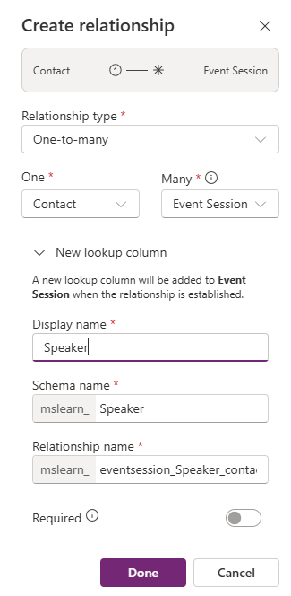
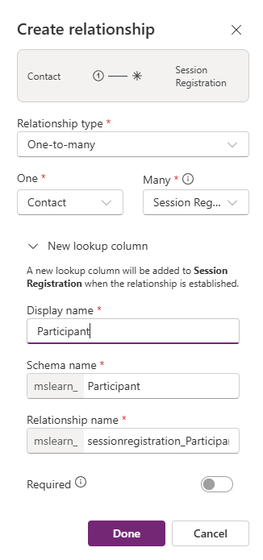

---
lab:
  title: "Lab\_2: Datenmodell erstellen"
  learning path: 'Learning Path: Manage the Microsoft Power Platform environment'
  module: 'Module 1: Describe Microsoft Dataverse'
---

## Lernziel

In dieser Übung verwenden Lernende Copilot, um ein Datenmodell zu erstellen. Sie geben eine Beschreibung des Tabellentyps an, den Sie erstellen möchten, und verwenden den Designer, um nach Bedarf Änderungen vorzunehmen, z. B. das Hinzufügen zusätzlicher Spalten.

Nach erfolgreichem Abschluss dieses Labs können Sie Folgendes:

- Copilot als Hilfsmittel beim Erstellen eines Datenmodells verwenden
- Tabellenspalten hinzufügen und bearbeiten

### Szenario

Contoso Consulting ist eine professionelle Dienstleistungsorganisation, die sich auf IT- und KI-Beratungsdienste spezialisiert hat. Im Laufe des Jahres veranstaltet sie viele verschiedene Events für ihre Kunden. Einige davon sind Events wie Messen, bei denen viele Partner anwesend sind und über neue Produkte, Markttrends und Dienstleistungen informieren. Andere finden das ganze Jahr über statt und sind kurze Webinare, in denen Details zu einzelnen Produkten vorgestellt werden.

Contoso möchte Power Platform verwenden, um eine Eventverwaltungslösung zu erstellen, mit der das Unternehmen die verschiedenen Events verwalten kann, die es im Laufe des Jahres veranstaltet. Darüber hinaus möchte Contoso einige Anwendungen entwickeln, um das Employee Equipment Check Out-Programm zu unterstützen. 

In dieser Übung erstellen Sie einen Datenmodell, das verwendet wird, um die verschiedenen Arten von Events, Eventregistrierungen und anderen Daten zu speichern, die Contoso benötigt, um seine Events effektiv zu verwalten. Außerdem erstellen Sie die Tabelle „Arbeitsmittel“, die in den anderen Anwendungen verwendet wird.  

### Details zum Lab

Bevor Sie mit dieser Übung beginnen, empfiehlt es sich, Folgendes abgeschlossen zu haben:

- **Lab 1: Erstellen einer Lösung**

> **Wichtig:** Dieses Lab verwendet KI, um die Komponenten zu erstellen. Da KI-Ergebnisse variieren können, sind Ihre Ergebnisse möglicherweise unterschiedlich (aber ähnlich) mit den im Lab definierten Ergebnissen. Die grundlegenden Konzepte, die im Lab beschrieben werden, sind identisch, unabhängig davon, was erstellt wurde oder wie es benannt wurde. Wenn die Tabellen und Spalten nicht exakt übereinstimmen, müssen Sie sich möglicherweise an das, was für Sie erstellt wurde, anpassen.

### Lab-Planung

Die geschätzte Dauer dieser Übung beträgt **30 bis 45** Minuten.

> **Hinweis:** Im vorherigen Lab haben wir eine Eventverwaltungslösung erstellt und als bevorzugte Lösung in dieser Umgebung festgelegt. Aus diesem Grund müssen wir nicht direkt zur Lösung wechseln, um unser Datenmodell zu erstellen. Die von uns erstellten Elemente werden der Lösung automatisch hinzugefügt.

## Aufgabe 1: Datenmodell erstellen

Contoso speichert derzeit Spenderkontaktinformationen in seiner Dataverse-Instanz. Das Unternehmen möchte Dataverse verwenden, um die beantragten Zuschüsse und die erhaltenen Spenden zu verfolgen. Sie müssen die erforderlichen Tabellen erstellen, um die zukünftigen Anwendungsanforderungen von Contoso zu unterstützen.

1.  Öffnen Sie bei Bedarf einen Webbrowser, und navigieren Sie zum [Power Apps](https://make.powerapps.com/) Maker Portal, und melden Sie sich mit den Anmeldeinformationen für Ihr Microsoft-Konto an.
2.  Wählen Sie auf der Power Pages-Startseite mithilfe der Navigation auf der linken Seite **Tabellen** aus.
3.  Wählen Sie unter **Tabellen** die Option **Erste Schritte mit Copilot** aus.
4.  Geben Sie auf dem Bildschirm **Beschreiben Sie die Tabellen, die Copilot erstellen soll** Folgendes ein: „*Erstelle einer Tabelle zum Verwalten von Events. Die Tabelle sollte den Namen des Events, die Eventdaten, den Veranstaltungsort, die maximalen Anzahl der Teilnehmenden und der Eventdetails enthalten.“*
5.  Wählen Sie neben der Schaltfläche **Generieren** die Option **Tabelleneinstellungen** aus, und konfigurieren Sie Folgendes:
    - **Tabellenoptionen:** Eine Tabelle
    - Erstellen Sie **KEINE** Beziehungen.

6.  Wählen Sie die Schaltfläche **Generieren** aus.

> **Wichtig:** Copilot sollte nur **EINE** Tabelle namens „Events“ erstellen. Wenn mehr als eine erstellt wurde, müssen Sie diese **LÖSCHEN**, indem Sie Copilot den Namen der zu löschenden Tabelle mitteilen. **Das Nichtentfernen zusätzlicher Tabellen wirkt sich auf den nächsten Schritt aus.**

**Bearbeiten des Datenmodells mit Copilot**

Nachdem wir die Tabelle erstellt haben, fügen wir ihr einige zusätzliche Spalten hinzu. Zunächst fügen wir eine Spalte für die Art des Events hinzu. Darüber hinaus werden Kontakte an unseren Events teilnehmen. Fügen wir die vorhandene Tabelle „Kontakt“ zum Datenmodell hinzu und ordnen Sie später den Eventregistrierungen zu.

7.  Geben Sie im Feld **Was möchten Sie als Nächstes tun?** Folgendes ein: „*Füge eine Auswahlspalte namens ‚Art des Events‘ hinzu.“*
8.  Fügen Sie eine weitere Spalte hinzu, indem Sie den folgenden Text eingeben: „*Füge eine Auswahlspalte namens ‚Registrierung erforderlich‘ hinzu.*“

> **Wichtig:** Die Event-Tabelle muss nicht exakt mit dem obigen Bild übereinstimmen, sollte aber mindestens die folgenden Spalten aufweisen:
- Veranstaltungsname
- Event Date
- Maximale Teilnehmeranzahl
- Location
- Ereignistyp
- Registrierung erforderlich
Wenn Sie nicht über alle oben genannten Spalten verfügen, verwenden Sie Copilot, um sie dem Datenmodell hinzuzufügen.  

Als Nächstes fügen wir die Tabelle **Kontakt** zum Datenmodell hinzu.

9.  Wählen Sie in der **Befehlsleiste** oben **+ Vorhandene Tabelle** aus.
10.  Geben Sie im Feld **Suche** **Kontakt** ein, und wählen Sie **Ausgewählte hinzufügen** aus.

Je nach Event gibt es möglicherweise eine oder mehrere Sitzungen. Um die verschiedenen Sitzungen zu verwalten, müssen wir definieren, was die Sitzung ist, und das Event, dem sie zugeordnet ist. Als Nächstes verwenden wir Copilot zum Erstellen der Tabelle „Eventsitzungen“.

11.  Geben Sie im Feld **Was möchten Sie als Nächstes tun?** Folgendes ein: „*Füge eine neue Tabelle namens ‚Eventsitzung‘ hinzu.*“

Copilot erstellt wahrscheinlich zwei Tabellen, „Eventsitzung“ und „Referierende“. Da es sich bei unseren Kontakten um Referierende handelt, entfernen wir die Tabelle „Referierende“.

12.  Geben Sie bei Bedarf im Feld **Was möchten Sie als Nächstes tun?** Folgendes ein: „*Entferne die Tabelle ‚Referierende‘.*“
13.  Geben Sie in Copilot den folgenden Text ein: „*Füge der Tabelle ‚Eventsitzung‘ eine neue Textspalte namens ‚Sitzungsbeschreibung‘ hinzu.*“

Als Nächstes fügen wir eine letzte Tabelle namens „Sitzungsanmeldungen“ hinzu. Diese Tabelle wird verwendet, um die Personen zu verwalten, die sich für bestimmte Sitzungen anmelden.

14.  Geben Sie in Copilot den folgenden Text ein: „*Füge eine neue Tabelle namens ‚Sitzungsanmeldungen‘ hinzu.*“

Copilot erstellt wahrscheinlich zwei Tabellen, „Sitzungsanmeldung“ und „Sitzung“ oder „Teilnehmende“ (oder etwas anderes). Da unsere Kontakte Teilnehmer sein können, werden wir die Tabelle „Teilnehmende“ entfernen. Wenn andere Tabellen (z. B. „Sitzung“) als „Sitzungsanmeldungen“ erstellt wurden, entfernen Sie sie.

15.  Geben Sie in Copilot den folgenden Text ein: „*Entferne die Tabelle ‚Teilnehmende‘.*“
    
Manchmal wird der Tabelle „Sitzungsanmeldungen“ die Spalte „Teilnehmername“ hinzugefügt. Wir müssen sie entfernen, da sie später Probleme verursachen kann, wenn wir versuchen, das Datenmodell zu speichern. (Wir werden sie später durch eine andere Teilnehmerspalte ersetzen.)  

16. Geben Sie bei Bedarf in Copilot den folgenden Text ein: „Entferne die Spalte ‚Teilnehmername‘ aus der Tabelle ‚Sitzungsanmeldungen‘.“

17. Wenn Sie jetzt über ein Feld für die primäre Spalte verfügen, geben Sie den folgenden Text ein: *Benenne die primäre Spalte in den Anmeldenamen um.*

18.  Geben Sie in Copilot den folgenden Text ein: „*Füge der Tabelle ‚Sitzungsanmeldungen‘ eine Textspalte namens ‚Besondere Anweisungen‘ hinzu.*“

Die fertige Tabelle „Sitzungsanmeldungen“ sollte der folgenden Abbildung ähneln:

> **Wichtig** Ihre muss nicht exakt übereinstimmen, doch ist es wichtig, dass keine Spalte mit dem Namen „Teilnehmende“ und mindestens Folgendes vorhanden ist:
- Anmeldename
- Sitzungsdatum
- Spezielle Anweisungen

Jetzt werden wir Beziehungen zwischen unseren Tabellen erstellen. Da es sich bei Kontakten um Referierende in Sitzungen handeln kann, erstellen wir eine Beziehung zwischen den Tabellen „Kontakt“ und „Eventsitzung“.

18.  Wählen Sie auf der Befehlsleiste **Beziehungen erstellen** aus.
19.  Konfigurieren Sie die Beziehung wie folgt:
- **Kardinalität:** 1:n
- **1:** Contact
- **n:** Eventsitzung
- **Anzeigename:** Referent
20.  Wählen Sie **Fertig** aus.

Da Kontakte sich für Sitzungen in Sitzungen anmelden können, erstellen wir eine Beziehung zwischen den Tabellen „Kontakt“ und „Sitzungsanmeldungen“.

21.  Wählen Sie auf der **Befehlsleiste** **Beziehungen erstellen** aus.
22.  Konfigurieren Sie die Beziehung wie folgt:
- **Kardinalität:** 1:n
- **1:** Contact
- **n:** Sitzungsanmeldung
- **Anzeigename:** Teilnehmer

23.  Wählen Sie **Fertig** aus.

Ein einzelnes Event kann mehreren Sitzungen zugeordnet sein, daher erstellen wir eine Beziehung zwischen den Tabellen „Event“ und „Eventsitzung“.

24.  Wählen Sie auf der **Befehlsleiste** **Beziehungen erstellen** aus.
25.  Konfigurieren Sie die Beziehung wie folgt:
- **Kardinalität:** 1:n
- **1:** Ereignis
- **n:** Eventsitzung
- **Anzeigename:** Ereignis

26. Wählen Sie **Fertig** aus.

Zudem melden sich Teilnehmende für Eventsitzungen an, daher müssen wir eine Beziehung zwischen den Tabellen „Eventsitzungen“ und „Sitzungsanmeldungen“ erstellen.

27.  Wählen Sie auf der **Befehlsleiste** **Beziehungen erstellen** aus.
28.  Konfigurieren Sie die Beziehung wie folgt:
- **Kardinalität:** 1:n
- **1:** Eventsitzung
- **n:** Sitzungsanmeldungen
- **Anzeigename:** Eventsitzung

29.  Wählen Sie **Fertig** aus.

Das neu erstellte Datenmodell sollte dem Bild ähneln:

30.  Wählen Sie **Speichern und beenden** aus.

## Aufgabe 2: Direktes Bearbeiten von Tabellen und Spalten

Copilot ist eine wunderbare Möglichkeit, Tabellen und Spalten sehr schnell zu erstellen. Es kann jedoch vorkommen, dass Sie Änderungen an Tabellen und Spalten direkt vornehmen müssen. In dieser Aufgabe aktualisieren wir beispielsweise einige vorhandene Spalten und verfolgen, wie viele Teilnehmende für eine bestimmte Sitzung angemeldet sind.

1.  Öffnen Sie bei Bedarf einen Webbrowser, und navigieren Sie zum [Power Apps](https://make.powerapps.com/) Maker Portal, und melden Sie sich mit den Anmeldeinformationen für Ihr Microsoft-Konto an.
2.  Wählen Sie links im Navigationsbereich die Option **Tabellen** aus.
3.  Geben Sie im Feld **Suche** **Event** ein.
4.  Öffnen Sie die Tabelle **Event**.
5.  Wählen Sie unter der Überschrift **Schema** **Spalten** aus.
6.  Suchen und öffnen Sie die Spalte **Art des Events**.
7.  Ersetzen Sie die Bezeichnungen durch Folgendes:
    - Konferenz
    - Messe
    - Webinar
    - Mittagessen und Lernen
    - Starten
8.  Legen Sie die **Standardauswahl** auf **Keine** fest.

9.  Wählen Sie die Schaltfläche **Speichern** aus. (*Wenn die Spalte beim ersten Mal nicht gespeichert werden kann, versuchen Sie es erneut.*)

Als Nächstes fügen wir der Tabelle **Eventsitzung** eine neue Spalte hinzu, um die Gesamtanzahl der Sitzungsanmeldungen nachzuverfolgen.

10.  Wählen Sie mithilfe der Navigation auf der linken Seite **Tabellen** aus, um die Tabelle **Event** zu verlassen.
11.  Geben Sie im Feld **Suche** **Event** ein.
12.  Öffnen Sie die Tabelle **Eventsitzung**.
13.  Wählen Sie unter der Überschrift **Schema** **Spalten** aus.
14.  Wählen Sie auf der Befehlsleiste die Schaltfläche **Neue Spalte** aus.
15.  Konfigurieren Sie die neue Spalte wie folgt:
    - **Anzeigename**: Gesamtzahl der Anmeldungen
    - **Datentyp:** Ganzzahl
    - **Verhalten:** Rollup

16.  Klicken Sie auf **Speichern und bearbeiten**.

> **Wichtig:** Wenn der Popupblocker aktiviert ist, müssen Sie ihn möglicherweise deaktivieren, damit das Rollupfeld angezeigt werden kann.

17.  Konfigurieren Sie die Rollupspalte wie folgt:
- Wählen Sie unter **Verwandte Entität** **Verwandte Entität hinzufügen** aus.
- Wählen Sie die Tabelle **Sitzungsanmeldungen** aus.
- Wählen Sie die Schaltfläche **Änderungen speichern** aus (*Häkchen*).
- Wählen Sie unter **Aggregation** **Aggregation hinzufügen** aus.
- Wählen Sie unter **Aggregatfunktion** **Anzahl** aus.
- Wählen Sie für das Feld **Aggregierte verknüpfte Entität** **Sitzungsanmeldungen** aus.
- Wählen Sie die Schaltfläche **Änderungen speichern** aus (*Häkchen*).

18.  Wählen Sie **Speichern und schließen** aus.

Sie haben nun erfolgreich das Datenmodell erstellt, das zur Unterstützung der Eventverwaltungsanwendung verwendet wird. 

## Aufgabe 3: Erstellen einer Arbeitsmitteltabelle

Zusätzlich zur Verwaltung von Events verfügt Contoso über ein Check-Out-Programm für Mitarbeitende.  Als Nächstes erstellen wir die Tabelle zum Speichern der Arbeitsmittel. 
1.  Wählen Sie links im Navigationsbereich die Option **Tabellen** aus.
2.  Wählen Sie unter **Tabellen** die Option **Erste Schritte mit Copilot** aus.
3.  Geben Sie auf dem Bildschirm **Beschreiben Sie die Tabellen, die Copilot erstellen soll** Folgendes ein: „*Erstelle eine Tabelle zum Ausleihen von Arbeitsmitteln. Die Tabelle sollte den Namen des Arbeitsmittels, das Fälligkeitsdatum und die Artikelnummer enthalten.*“
4.  Wählen Sie neben der Schaltfläche **Generieren** die Option **Tabelleneinstellungen** aus, und konfigurieren Sie Folgendes:
- **Tabellenoptionen:** Eine Tabelle
- Erstellen Sie **KEINE** Beziehungen.

5. Wählen Sie die Schaltfläche **Generieren** aus.

> **Wichtig:** Copilot sollte nur eine Tabelle namens **Arbeitsmittel ausleihen** erstellen. Wenn mehr als eine erstellt wurde, können Sie diese löschen, indem Sie Copilot den Namen der zu löschenden Tabelle mitteilen.

**Bearbeiten des Datenmodells mit Copilot**

Nachdem wir die Tabelle erstellt haben, fügen wir ihr einige zusätzliche Spalten hinzu. Zunächst fügen wir eine Spalte für die Art des Events hinzu. Darüber hinaus werden Kontakte an unseren Events teilnehmen. Fügen wir die vorhandene Tabelle „Kontakt“ zum Datenmodell hinzu und ordnen Sie später den Eventregistrierungen zu.
6.  Geben Sie im Feld **Was möchten Sie als Nächstes tun?** Folgendes ein: „*Benenne die Tabelle in ‚Arbeitsmittel‘ um.*“
7.  Geben Sie im Feld **Was möchten Sie als Nächstes tun?** Folgendes ein: „*Füge eine Auswahlspalte mit dem Namen ‚Art des Arbeitsmittels‘ hinzu.*“
8.  Fügen Sie eine weitere Spalte hinzu, indem Sie den folgenden Text eingeben: „*Füge eine Textspalte namens ‚Kategorie‘ hinzu.*“
9.  Fügen Sie eine weitere Spalte hinzu, indem Sie den folgenden Text eingeben: „*Füge eine Textspalte namens ‚Status‘ hinzu.*“

Die fertige Tabelle sollte der folgenden Abbildung ähneln:

10. Wenn Ihre Tabelle zusätzliche Spalten enthält, entfernen Sie diese Spalten, indem Sie „*Lösche die Spalte [Spaltenname]*“ eingeben.
11. Sobald die Tabelle mit dem Bild übereinstimmt, wählen Sie **Speichern und beenden** aus.

## Aufgabe 4: Direktes Bearbeiten der Tabelle „Arbeitsmittel“

1.  Öffnen Sie bei Bedarf einen Webbrowser, und navigieren Sie zum Power Apps Maker Portal, und melden Sie sich mit den Anmeldeinformationen für Ihr Microsoft-Konto an.
2.  Wählen Sie links im Navigationsbereich die Option **Tabellen** aus.
3.  Geben Sie im Feld **Suche** **Arbeitsmittel** ein.
4.  Öffnen Sie die Tabelle **Arbeitsmittel**.
5.  Wählen Sie unter der Überschrift **Schema** **Spalten** aus.
6.  Suchen und öffnen Sie die Spalte **Art des Arbeitsmittels**.
7.  Ersetzen Sie die Bezeichnungen bei Bedarf durch Folgendes:
- Elektrogeräte
- Möbel
- Extras
- Accessories
8.  Legen Sie die **Standardauswahl** auf **Keine** fest.

9.  Wählen Sie die Schaltfläche Speichern aus. (Wenn die Spalte beim ersten Mal nicht gespeichert werden kann, versuchen Sie es erneut.)

Gut gemacht, Sie haben erfolgreich ein Datenmodell in Microsoft Dataverse erstellt.

