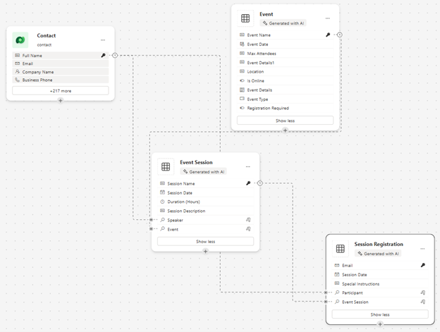

---
lab:
  title: "Lab\_2: Datenmodell erstellen"
  learning path: 'Learning Path: Manage the Microsoft Power Platform environment'
  module: 'Module 1: Describe Microsoft Dataverse'
---

## Lernziel

In dieser Übung verwenden Lernende Copilot, um ein Datenmodell zu erstellen. Sie geben eine Beschreibung des Tabellentyps an, den Sie erstellen möchten, und verwenden den Designer, um nach Bedarf Änderungen vorzunehmen, z. B. das Hinzufügen zusätzlicher Spalten.

Nach erfolgreichem Abschluss dieses Labs können Sie Folgendes:

- Copilot als Hilfsmittel beim Erstellen eines Datenmodells verwenden
- Tabellenspalten hinzufügen und bearbeiten

### Szenario

Contoso Consulting ist eine professionelle Dienstleistungsorganisation, die sich auf IT- und KI-Beratungsdienste spezialisiert hat. Im Laufe des Jahres veranstalten sie viele verschiedene Events für ihre Kunden. Einige davon sind Events im Stil von Messen, bei denen viele Partner anwesend sind und Informationen zu neuen Produkten, Markttrends und Dienstleistungen bereitstellen. Andere finden das ganze Jahr über statt und sind kurze Webinare, in denen Details zu einzelnen Produkten vorgestellt werden.

Contoso möchte Power Platform verwenden, um eine Eventverwaltungslösung zu erstellen, mit der das Unternehmen die verschiedenen Events verwalten kann, die es im Laufe des Jahres veranstaltet. Darüber hinaus möchte Contoso einige Anwendungen entwickeln, um das Employee Equipment Check Out-Programm zu unterstützen. 

In dieser Übung erstellen Sie einen Datenmodell, das verwendet wird, um die verschiedenen Arten von Events, Eventregistrierungen und anderen Daten zu speichern, die Contoso benötigt, um seine Events effektiv zu verwalten. Außerdem erstellen Sie die Tabelle „Arbeitsmittel“, die in den anderen Anwendungen verwendet wird.  

### Details zum Lab

Bevor Sie mit dieser Übung beginnen, empfiehlt es sich, Folgendes abgeschlossen zu haben:

- **Lab 1: Erstellen einer Lösung**

> **Wichtig:** Dieses Lab verwendet KI, um die Komponenten zu erstellen. Da KI-Ergebnisse variieren können, sind Ihre Ergebnisse möglicherweise unterschiedlich (aber ähnlich) mit den im Lab definierten Ergebnissen. Die grundlegenden Konzepte, die im Lab beschrieben werden, sind identisch, unabhängig davon, was erstellt wurde oder wie es benannt wurde. Wenn die Tabellen und Spalten nicht exakt übereinstimmen, müssen Sie sich möglicherweise an das, was für Sie erstellt wurde, anpassen.

### Lab-Planung

Die geschätzte Dauer dieser Übung beträgt **30 bis 45** Minuten.

> **Hinweis:** Im vorherigen Lab haben wir eine Eventverwaltungslösung erstellt und als bevorzugte Lösung in dieser Umgebung festgelegt. Aus diesem Grund müssen wir nicht direkt zur Lösung wechseln, um unser Datenmodell zu erstellen. Die von uns erstellten Elemente werden der Lösung automatisch hinzugefügt.

> **Hinweis:** Wenn beim Erstellen einer Auswahlspalte mit Copilot eine Fehlermeldung vom Typ **Eingreifen erforderlich** für die Tabelle auftritt, können Sie die Spalte manuell erstellen, indem Sie die folgenden Schritte ausführen:
1. Wählen Sie **Optionen anzeigen** und dann **Daten anzeigen** aus. Die Tabellenstruktur wird angezeigt.
1. Klicken Sie auf **+ Neue Spalte**, um eine neue Spalte hinzuzufügen.

## Aufgabe 1: Datenmodell erstellen

Contoso speichert derzeit Spenderkontaktinformationen in seiner Dataverse-Instanz. Das Unternehmen möchte Dataverse verwenden, um die beantragten Zuschüsse und die erhaltenen Spenden zu verfolgen. Sie müssen die erforderlichen Tabellen erstellen, um die zukünftigen Anwendungsanforderungen von Contoso zu unterstützen.

1.  Öffnen Sie bei Bedarf einen Webbrowser, und navigieren Sie zum [Power Apps](https://make.powerapps.com/) Maker Portal, und melden Sie sich mit den Anmeldeinformationen für Ihr Microsoft-Konto an.
1.  Wählen Sie auf der Power Apps-Startseite im Navigationsbereich auf der linken Seite die Option **Tabellen** aus.
1.  Wählen Sie unter **Tabellen** die Option **Erste Schritte mit Copilot** aus.
1.  Geben Sie auf dem Bildschirm **Beschreiben Sie die Tabellen, die Copilot erstellen soll** Folgendes ein: „*Erstelle einer Tabelle zum Verwalten von Events. Die Tabelle sollte den Namen des Events, die Eventdaten, den Veranstaltungsort, die maximalen Anzahl der Teilnehmenden und der Eventdetails enthalten.“*
1.  Wählen Sie neben der Schaltfläche **Generieren** die Option **Tabelleneinstellungen** aus, und konfigurieren Sie Folgendes:
    - **Tabellenoptionen:** Eine Tabelle
    - Erstellen Sie **KEINE** Beziehungen.

    

1.  Wählen Sie die Schaltfläche **Generieren** aus.

    > **Wichtig:** Copilot sollte nur **EINE** Tabelle namens **Events** erstellen. Wenn mehr als eine erstellt wurde, müssen Sie diese **LÖSCHEN**, indem Sie Copilot den Namen der zu löschenden Tabelle mitteilen. **Das Nichtentfernen zusätzlicher Tabellen wirkt sich auf den nächsten Schritt aus.**

    

**Bearbeiten des Datenmodells mit Copilot**

Nachdem wir die Tabelle erstellt haben, fügen wir ihr einige zusätzliche Spalten hinzu. Zunächst fügen wir eine Spalte für die Art des Events hinzu. Darüber hinaus werden Kontakte an unseren Events teilnehmen. Fügen wir die vorhandene Tabelle „Kontakt“ zum Datenmodell hinzu und ordnen Sie später den Eventregistrierungen zu.

7.  Geben Sie im Feld **Was möchten Sie als Nächstes tun?** Folgendes ein: *`Add a choice column named Event Type to Event table.`*
1.  Fügen Sie eine weitere Spalte hinzu, indem Sie den folgenden Text eingeben: *`Add a choice column named Registration Required to Event table.`*

    

    > **Wichtig:** Die Event-Tabelle muss nicht exakt mit dem obigen Bild übereinstimmen, sollte aber mindestens die folgenden Spalten aufweisen:
    - Veranstaltungsname
    - Event Date
    - Maximale Teilnehmeranzahl
    - Location
    - Ereignistyp
    - Registrierung erforderlich

    Wenn Sie nicht über alle oben genannten Spalten verfügen, verwenden Sie Copilot, um sie dem Datenmodell hinzuzufügen.  

    Als Nächstes fügen wir die Tabelle **Kontakt** zum Datenmodell hinzu.

1.  Wählen Sie in der **Befehlsleiste** oben **+ Vorhandene Tabelle** aus.
1.  Geben Sie im Feld **Suche** **Kontakt** ein, und wählen Sie **Ausgewählte hinzufügen** aus.

    Je nach Event gibt es möglicherweise eine oder mehrere Sitzungen. Um die verschiedenen Sitzungen zu verwalten, müssen wir definieren, was die Sitzung ist, und das Event, dem sie zugeordnet ist. Als Nächstes verwenden wir Copilot zum Erstellen der Tabelle „Eventsitzungen“.

1.  Geben Sie im Feld **Was möchten Sie als Nächstes tun?** Folgendes ein: *`Add a new table called Event Session. `*

    Copilot erstellt wahrscheinlich zwei Tabellen, „Eventsitzung“ und „Referierende“. Da es sich bei unseren Kontakten um Referierende handelt, entfernen wir die Tabelle „Referierende“.

1.  Geben Sie bei Bedarf im Feld **Was möchten Sie als Nächstes tun?** Folgendes ein: *`Remove the Event Speaker table.`*
1.  Geben Sie in Copilot den folgenden Text ein: *`Add a new text column to the Event Session table called Session Description.`*

    

    Als Nächstes fügen wir eine letzte Tabelle namens **Sitzungsanmeldungen** hinzu. Diese Tabelle wird verwendet, um die Personen zu verwalten, die sich für bestimmte Sitzungen anmelden.

1.  Geben Sie in Copilot den folgenden Text ein: *`Add a new table called Session Registrations.`*

    Copilot erstellt wahrscheinlich zwei Tabellen, „Sitzungsanmeldung“ und „Sitzung“ oder „Teilnehmende“ (oder etwas anderes). Da unsere Kontakte Teilnehmer sein können, werden wir die Tabelle „Teilnehmende“ entfernen. Wenn andere Tabellen (z. B. „Sitzung“) als „Sitzungsanmeldungen“ erstellt wurden, entfernen Sie sie.

1.  Geben Sie bei Bedarf in Copilot den folgenden Text ein: *`Remove the Participant table.`*
    
    Manchmal wird der Tabelle „Sitzungsanmeldungen“ die Spalte „Teilnehmername“ hinzugefügt. Wir müssen sie entfernen, da sie später Probleme verursachen kann, wenn wir versuchen, das Datenmodell zu speichern. (Wir werden sie später durch eine andere Teilnehmerspalte ersetzen.)  

1.  Geben Sie bei Bedarf in Copilot den folgenden Text ein: *`Remove the Participant Name column from the Session Registration table.`*

1.  Wenn Sie jetzt über ein Feld für die primäre Spalte verfügen, geben Sie den folgenden Text ein: *`Rename the Primary Column to Registration Name in Session Registration table.`*

1.  Geben Sie in Copilot den folgenden Text ein: *`Add a text column to the Session registration table called Special Instructions.`*

    Die fertige Tabelle „Sitzungsanmeldungen“ sollte der folgenden Abbildung ähneln:

    

    > **Wichtig** Ihre muss nicht exakt übereinstimmen, doch ist es wichtig, dass keine Spalte mit dem Namen „Teilnehmende“ und mindestens Folgendes vorhanden ist:
    - Anmeldename
    - Sitzungsdatum
    - Spezielle Anweisungen

    Jetzt werden wir Beziehungen zwischen unseren Tabellen erstellen. Da es sich bei Kontakten um Referierende in Sitzungen handeln kann, erstellen wir eine Beziehung zwischen den Tabellen „Kontakt“ und „Eventsitzung“.

1.  Wählen Sie auf der Befehlsleiste **Beziehungen erstellen** aus.
1.  Konfigurieren Sie die Beziehung wie folgt:
    - **Kardinalität:** 1:n
    - **1:** Contact
    - **n:** Eventsitzung
    - **Anzeigename**: `Speaker`
1.  Wählen Sie **Fertig** aus.

    

    Da Kontakte sich für Sitzungen in Sitzungen anmelden können, erstellen wir eine Beziehung zwischen den Tabellen „Kontakt“ und „Sitzungsanmeldungen“.

1.  Wählen Sie auf der **Befehlsleiste** **Beziehungen erstellen** aus.
1.  Konfigurieren Sie die Beziehung wie folgt:
    - **Kardinalität:** 1:n
    - **1:** Contact
    - **n:** Sitzungsanmeldung
    - **Anzeigename**: `Participant`

    

1.  Wählen Sie **Fertig** aus.

    Ein einzelnes Event kann mehreren Sitzungen zugeordnet sein, daher erstellen wir eine Beziehung zwischen den Tabellen „Event“ und „Eventsitzung“.

1.  Wählen Sie auf der **Befehlsleiste** **Beziehungen erstellen** aus.
1.  Konfigurieren Sie die Beziehung wie folgt:
    - **Kardinalität:** 1:n
    - **1:** Ereignis
    - **n:** Eventsitzung
    - **Anzeigename**: `Event`

    

1. Wählen Sie **Fertig** aus.

    Zudem melden sich Teilnehmende für Eventsitzungen an, daher müssen wir eine Beziehung zwischen den Tabellen „Eventsitzungen“ und „Sitzungsanmeldungen“ erstellen.

1.  Wählen Sie auf der **Befehlsleiste** **Beziehungen erstellen** aus.
1.  Konfigurieren Sie die Beziehung wie folgt:
    - **Kardinalität:** 1:n
    - **1:** Eventsitzung
    - **n:** Sitzungsanmeldungen
    - **Anzeigename**: `Event Session`

    

1.  Wählen Sie **Fertig** aus.

    Das neu erstellte Datenmodell sollte dem Bild ähneln:

    

1.  Wählen Sie **Speichern und beenden** aus.

## Aufgabe 2: Direktes Bearbeiten von Tabellen und Spalten

Copilot ist eine wunderbare Möglichkeit, Tabellen und Spalten sehr schnell zu erstellen. Es kann jedoch vorkommen, dass Sie Änderungen an Tabellen und Spalten direkt vornehmen müssen. In dieser Aufgabe aktualisieren wir beispielsweise einige vorhandene Spalten und verfolgen, wie viele Teilnehmende für eine bestimmte Sitzung angemeldet sind.

1.  Öffnen Sie bei Bedarf einen Webbrowser, und navigieren Sie zum [Power Apps](https://make.powerapps.com/) Maker Portal, und melden Sie sich mit den Anmeldeinformationen für Ihr Microsoft-Konto an.
1.  Wählen Sie links im Navigationsbereich die Option **Tabellen** aus.
1.  Geben Sie im Feld **Suche** **Event** ein.
1.  Öffnen Sie die Tabelle **Event**.
1.  Wählen Sie unter der Überschrift **Schema** **Spalten** aus.
1.  Suchen und öffnen Sie die Spalte **Art des Events**.
1.  Ersetzen Sie die Bezeichnungen durch Folgendes:
    - Konferenz
    - Messe
    - Webinar
    - Mittagessen und Lernen
    - Starten
1.  Legen Sie die **Standardauswahl** auf **Keine** fest.

    

1.  Wählen Sie die Schaltfläche **Speichern** aus. (*Wenn die Spalte beim ersten Mal nicht gespeichert werden kann, versuchen Sie es erneut.*)

    Als Nächstes fügen wir der Tabelle **Eventsitzung** eine neue Spalte hinzu, um die Gesamtanzahl der Sitzungsanmeldungen nachzuverfolgen.

1.  Wählen Sie mithilfe der Navigation auf der linken Seite **Tabellen** aus, um die Tabelle **Event** zu verlassen.
1.  Geben Sie im Feld **Suche** **Event** ein.
1.  Öffnen Sie die Tabelle **Eventsitzung**.
1.  Wählen Sie unter der Überschrift **Schema** **Spalten** aus.
1.  Wählen Sie auf der Befehlsleiste die Schaltfläche **Neue Spalte** aus.
1.  Konfigurieren Sie die neue Spalte wie folgt:
    - **Anzeigename**: `Total Registrations`
    - **Datentyp:** Ganzzahl
    - **Verhalten:** Rollup

    

1.  Klicken Sie auf **Speichern und bearbeiten**.

    > **Wichtig:** Wenn der Popupblocker aktiviert ist, müssen Sie ihn möglicherweise deaktivieren, damit das Rollupfeld angezeigt werden kann.

1.  Konfigurieren Sie die Rollupspalte wie folgt:
    - Wählen Sie unter **Verwandte Entität** **Verwandte Entität hinzufügen** aus.
    - Wählen Sie die Tabelle **Sitzungsanmeldungen** aus.
    - Wählen Sie die Schaltfläche **Änderungen speichern** aus (*Häkchen*).
    - Wählen Sie unter **Aggregation** **Aggregation hinzufügen** aus.
    - Wählen Sie unter **Aggregatfunktion** **Anzahl** aus.
    - Wählen Sie für das Feld **Aggregierte verknüpfte Entität** **Sitzungsanmeldungen** aus.
    - Wählen Sie die Schaltfläche **Änderungen speichern** aus (*Häkchen*).

    

1.  Wählen Sie **Speichern und schließen** aus.

    Sie haben nun erfolgreich das Datenmodell erstellt, das zur Unterstützung der Eventverwaltungsanwendung verwendet wird. 

## Aufgabe 3: Erstellen einer Arbeitsmitteltabelle

Zusätzlich zur Verwaltung von Events verfügt Contoso über ein Check-Out-Programm für Mitarbeitende.  Als Nächstes erstellen wir die Tabelle zum Speichern der Arbeitsmittel. 
1.  Wählen Sie links im Navigationsbereich die Option **Tabellen** aus.
1.  Wählen Sie unter **Tabellen** die Option **Erste Schritte mit Copilot** aus.
1.  Geben Sie auf dem Bildschirm **Beschreiben Sie die Tabellen, die Copilot erstellen soll** Folgendes ein: *`Create a table for checking out equipment. The table should include the Equipment Name, Due Date, and Item number.`*
1.  Wählen Sie neben der Schaltfläche **Generieren** die Option **Tabelleneinstellungen** aus, und konfigurieren Sie Folgendes:
    - **Tabellenoptionen:** Eine Tabelle
    - Erstellen Sie **KEINE** Beziehungen.

    

1. Wählen Sie die Schaltfläche **Generieren** aus.

    > **Wichtig:** Copilot sollte nur eine Tabelle namens **Arbeitsmittel ausleihen** erstellen. Wenn mehr als eine erstellt wurde, können Sie diese löschen, indem Sie Copilot den Namen der zu löschenden Tabelle mitteilen.

**Bearbeiten des Datenmodells mit Copilot**

Nachdem wir die Tabelle erstellt haben, fügen wir ihr einige zusätzliche Spalten hinzu. Zunächst fügen wir eine Spalte für die Art des Events hinzu. Darüber hinaus werden Kontakte an unseren Events teilnehmen. Fügen wir die vorhandene Tabelle „Kontakt“ zum Datenmodell hinzu und ordnen Sie später den Eventregistrierungen zu.

6.  Geben Sie im Feld **Was möchten Sie als Nächstes tun?** Folgendes ein: *`Rename the table to Equipment.`*
1.  Geben Sie im Feld **Was möchten Sie als Nächstes tun?** Folgendes ein: *`Add a choice column named Equipment type.`*
1.  Fügen Sie eine weitere Spalte hinzu, indem Sie den folgenden Text eingeben: *`Add a text column named Category.`*
1.  Fügen Sie eine weitere Spalte hinzu, indem Sie den folgenden Text eingeben: *`Add a text column named Status.`*

    Die fertige Tabelle sollte der folgenden Abbildung ähneln:

    

1.  Wenn Ihre Tabelle zusätzliche Spalten enthält, entfernen Sie diese Spalten, indem Sie *`Delete the [column name] column.`* eingeben.
1.  Sobald die Tabelle mit dem Bild übereinstimmt, wählen Sie **Speichern und beenden** aus.

## Aufgabe 4: Direktes Bearbeiten der Tabelle „Arbeitsmittel“

1.  Öffnen Sie bei Bedarf einen Webbrowser, und navigieren Sie zum Power Apps Maker Portal, und melden Sie sich mit den Anmeldeinformationen für Ihr Microsoft-Konto an.
1.  Wählen Sie links im Navigationsbereich die Option **Tabellen** aus.
1.  Geben Sie im Feld **Suche** **Arbeitsmittel** ein.
1.  Öffnen Sie die Tabelle **Arbeitsmittel**.
1.  Wählen Sie unter der Überschrift **Schema** **Spalten** aus.
1.  Suchen und öffnen Sie die Spalte **Art des Arbeitsmittels**.
1.  Ersetzen Sie die Bezeichnungen bei Bedarf durch Folgendes:
    - Elektrogeräte
    - Möbel
    - Extras
    - Accessories
1.  Legen Sie die **Standardauswahl** auf **Keine** fest.

    

1.  Wählen Sie die Schaltfläche Speichern aus. (Wenn die Spalte beim ersten Mal nicht gespeichert werden kann, versuchen Sie es erneut.)

Gut gemacht, Sie haben erfolgreich ein Datenmodell in Microsoft Dataverse erstellt.

