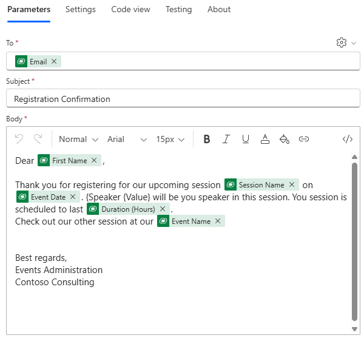

---
lab:
  title: "Lab\_5: Erstellen Sie einen Power Automate-Flow."
  learning path: 'Learning Path: Demonstrate the capabilities of Microsoft Power Automate'
  module: 'Module 2: Build a Microsoft Power Automate flow'
---

## Lernziel

In dieser Übung erstellen Lernende eine Reihe verschiedener Cloudflüsse mithilfe von Microsoft Copilot in Power Automate. Sie verwenden verschiedene Erstellungsmethoden wie Copilot von Grund auf, um sich mit den verschiedenen verfügbaren Optionen vertraut zu machen.

Nach erfolgreichem Abschluss dieser Übung werden Sie:

- Prompts in natürlicher Sprache zum Entwerfen von Workflows verwenden.
- Trigger und Aktionen konfigurieren.
- Die Automatisierung für den praktischen Einsatz testen.

### Szenario

Contoso Consulting ist eine professionelle Dienstleistungsorganisation, die sich auf IT- und KI-Beratungsdienste spezialisiert hat. Im Laufe des Jahres veranstalten sie viele verschiedene Events für ihre Kunden. Einige davon sind Events im Stil von Messen, bei denen viele Partner anwesend sind und Informationen zu neuen Produkten, Markttrends und Dienstleistungen bereitstellen. Andere finden das ganze Jahr über statt und sind kurze Webinare, in denen Details zu einzelnen Produkten vorgestellt werden. Darüber hinaus beginnt Contoso mit der Verwendung von automatisierten Agents, um Kunden bei Fragen zu unterstützen.

Contoso möchte Power Automate verwenden, um einen Bestätigungsfluss für die Registrierung zu erstellen, bei dem bei der Registrierung für ein Ereignis eine automatisierte E-Mail an einen Kunden gesendet wird. 

In dieser Übung erstellen Sie eine Reihe von Power Automate-Flüssen basierend auf bestimmten Kriterien.

Bevor Sie mit dieser Übung beginnen, müssen Sie die folgenden Labs abgeschlossen haben:

- **Lab 2: Erstellen eines Datenmodells**
- **Lab 5: Erstellen einer modellgesteuerten App**

Die geschätzte Dauer dieser Übung beträgt 20 bis 30 Minuten.

## Übung 1: Erstellen eines Benachrichtigungsflusses für die Sitzungsregistrierung

In dieser ersten Übung erstellen Sie einen Fluss, der automatisch ausgeführt wird, wenn eine neue Sitzungsregistrierung erstellt wird. Er erhält die Details der Sitzung, des Ereignisses und des Kontakts, der sich registriert hat, und sendet eine E-Mail mit den Registrierungsdetails.

### Aufgabe 1: Erstellen eines Flows

Wir möchten eine Registrierungsbestätigung an alle neu registrierten Benutzer senden. Wir erstellen einen Fluss, der Details einer Registrierung erfasst und eine Bestätigungs-E-Mail an den registrierten Benutzer sendet.

1. Navigieren Sie zu [https://make.powerautomate.com](https://make.powerautomate.com/).

1. Möglicherweise müssen Sie sich erneut authentifizieren. Wählen Sie dazu **Anmelden** aus, und befolgen Sie die Anweisungen, falls erforderlich.

1. Wählen Sie oben rechts die Umgebung **Dev One** aus, sofern sie noch nicht ausgewählt ist. (Wichtig, vergessen Sie nicht, diesen Schritt auszuführen).

1. Wählen Sie im linken Navigationsbereich **+ Erstellen** aus. (Wenn Sie dazu aufgefordert werden, wählen Sie **Erste Schritte** aus.)

1. Wählen Sie **Automatisierter Cloud-Flow** aus.

1. Geben Sie `Registration Notification` als **Flowname** ein.

1. Suchen Sie unter **Flowtrigger auswählen** nach `Dataverse`.

1. Wählen Sie den Trigger, **wenn eine Zeile hinzugefügt, geändert oder gelöscht wird**, und dann **Erstellen** aus.

    Wenn ein Fehler **Ungültige Parameter** angezeigt wird, liegt dies daran, dass Sie sich nicht authentifiziert haben. Führe die unten aufgeführten Schritte aus, um eine Verbindung herzustellen. 
    - Klicken Sie auf **Verbindung ändern**.
    - Wählen Sie **Neue hinzufügen** aus.
    - Geben Sie im Feld **Verbindungsname** den **MOD-Administrator** ein. Belassen Sie den **Authentifizierungstyp** bei **OAuth**, und wählen Sie **Anmelden** aus.
    - Nach der Anmeldung wechseln Sie zu **Schritt 9.** 

1. Füllen Sie die Triggerbedingungen für den Flow auf:

    - Wählen Sie **Hinzugefügt** für **Änderungstyp** aus.
    - Wählen Sie **Sitzungsregistrierungen** für den **Tabellennamen** aus.
    - Wählen Sie **Organisation** für **Umfang** im Triggerschritt aus. 

1. Benennen Sie den Triggerschritt `When a Session Registration is added` um.

    

Dies ist eine gute Vorgehensweise, damit Sie und andere Flow-Editoren den Zweck des Schritts erkennen können, ohne tiefer in die Details gehen zu müssen.

### Aufgabe 2: Erstellen Sie einen Schritt, um die Details der Ereignissitzung abzurufen, für die die Registrierung vorgesehen ist.

1. Wählen Sie **+ Neuer Schritt**aus. 

1. Suchen Sie nach **Zeile nach ID abrufen**. 

1. Wählen Sie die Aktion **Zeile nach ID abrufen** aus.

1. Wählen Sie **Ereignissitzungen** als **Tabellenname** aus.

1. Wählen Sie das Feld **Zeilen-ID** aus. Beachten Sie, dass Symbole angezeigt werden, um **Dynamische Inhalte** oder **Ausdrücke** auszuwählen.

1. Fügen Sie im Feld **Zeilen-ID** den Eintrag **Ereignissitzung (Wert)** in der **Liste für dynamische Inhalte** aus. In diesem Schritt suchen Sie die **Ereignissitzung** für die **Sitzungsregistrierung**, die erstellt wurde, um diesen Fluss auszulösen.

1. In der Aktion **Zeile nach ID abrufen**. Umbenennen dieser Aktion `Get the Event Session`

    

    Als Nächstes erhalten wir die Details des Ereignisses, in dem sich die Sitzung befindet.

1. Wählen Sie unter dem Schritt **Ereignissitzung abrufen** die Option **+ Aktion einfügen** aus.

1. Suchen Sie nach **Zeile nach ID abrufen**. 

1. Wählen Sie die Aktion **Zeile nach ID abrufen** aus.

1. Wählen Sie **Ereignisse** als **Tabellennamen** aus.

1. Wählen Sie das Feld **Zeilen-ID** aus. Beachten Sie, dass Symbole angezeigt werden, um **Dynamische Inhalte** oder **Ausdrücke** auszuwählen.

1. Fügen Sie im Feld **Zeilen-ID** den Eintrag **Ereignis (Wert)** in der Liste für **dynamische Inhalte** aus. In diesem Schritt suchen Sie das **Ereignis** für die **Ereignissitzung**, das im vorherigen Schritt erfasst wurde.

1. In der Aktion **Zeile nach ID abrufen**. Umbenennen dieser Aktion `Get the Event`.

    

    Schließlich werden wir die Details der Person abrufen, die für die Sitzung registriert ist.

1. Wählen Sie unter „Ereignisdetails abrufen“ die Option **Neue Aktion einfügen** aus.

1. Geben Sie im Suchfeld **Zeile nach ID abrufen** ein.

1. Wählen Sie die Aktion **Zeile nach ID abrufen** aus.

1. Wählen Sie **Kontakte** als **Tabellenname** aus.

1. Wählen Sie das Feld **Zeilen-ID** aus. Beachten Sie, dass ein Fenster geöffnet wird, in dem Sie **dynamische Inhalte** oder **Ausdrücke** auswählen können.

1. Wählen Sie im Feld **Zeilen-ID** das Feld **Teilnehmer (Wert)** aus dem Trigger **Wenn eine Sitzungsregistrierung hinzugefügt wird** der Liste **Dynamischer Inhalt** aus.

1. Wählen Sie den Text **Zeile nach ID abrufen** aus, und benennen Sie die Aktion `Get Participant Details` um.

    

### Aufgabe 3: Erstellen eines Schritts zum Senden einer E-Mail zum Bestätigen der Sitzungsregistrierung

1. Wählen Sie unter dem Schritt **Teilnehmerdetails abrufen** die Option **Neue Aktion einfügen** aus.

1. Geben Sie im Suchfeld **E-Mail senden** ein.

1. Wählen Sie **E-Mail senden (V2)** aus.

    Möglicherweise werden Sie aufgefordert, eine Verbindung mit Outlook herzustellen. Wenn ja, wählen Sie die Schaltfläche **Anmelden** aus, und melden Sie sich mit dem **Mod-Administrator**-Konto an. 

    

1. Wählen Sie direkt oberhalb des Felds **An** das **Zahnradsymbol** aus. Wählen Sie im daraufhin angezeigten Menü **Dynamischen Inhalt verwenden** aus.

     

1. Wählen Sie im Feld **An** unter **Teilnehmerdetails abrufen** die Option **E-Mail** aus.

    

1. Vergewissern Sie sich im Feld **Betreff**, dass `Registration Confirmation` angezeigt wird.

1. Geben Sie den folgenden Text in **E-Mail-Text** ein:

    > **Hinweis:** Dynamischer Inhalt muss dort platziert werden, wo Feldnamen in Klammern angegeben sind. Es wird empfohlen, zuerst den gesamten Text zu kopieren und einzufügen und dann dynamischen Inhalt an den richtigen Stellen hinzuzufügen.

    *`Dear {First Name}, Thank you for registering for our upcoming session {Session Name} on {Event Date}. {Speaker} will be your speaker in this session. Your session is scheduled to last {Duration (Hours)}. Check out our other session at our {Event Name}.`*

    *`Best regards,`*

    *`Events Administration`*
    
    *`Contoso Consulting`*

    Als Nächstes ersetzen wir den Text in den Klammern durch die unten beschriebenen Elemente.

1. Markieren Sie den Text **{First Name}** (Vorname). Ersetzen Sie ihn durch das Feld **Vorname** aus dem Schritt **Teilnehmerdetails abrufen**.

1. Markieren Sie den Text **{Sitzungsname}**. Ersetzen Sie ihn durch das Feld **Sitzungsname** aus dem Schritt **Ereignissitzung abrufen**.

1. Markieren Sie den Text **{Ereignisdatum}**. Ersetzen Sie ihn durch das Feld **Ereignisdatum** aus dem Schritt **Eventdetails abrufen**.

1. Markieren Sie den **{Referent}**-Text. Ersetzen Sie ihn durch das Feld **Referent (Wert)** aus dem Schritt **Ereignissitzung abrufen**.

1. Markieren Sie den Text **{Dauer (Stunden)}**. Ersetzen Sie ihn durch das Feld **Dauer (Stunden)** aus dem Schritt **Ereignissitzung abrufen**.

1. Markieren Sie den Text **{Ereignisname}**. Ersetzen Sie ihn durch das Feld **Ereignisname** aus dem Schritt **Ereignisdetails abrufen**.

    Ihr letzter Schritt sollte der Abbildung ähneln:

    

1. Wählen Sie **Speichern**.

    Lassen Sie die Registerkarte dieses Flows für die nächste Aufgabe geöffnet. Die Datei sollte folgendermaßen aussehen:

### Aufgabe 4: Fügen Sie einige Beispieldaten hinzu.

> **Hinweis:** Wenn Sie Lab 5 abgeschlossen haben – „Erstellen einer modellgesteuerten App“, können Sie diese Aufgabe überspringen und direkt zu Aufgabe 5 wechseln. 

1. Wählen Sie links im Navigationsbereich die Option **Apps** aus.

1. Ändern Sie die angezeigten Apps von **Meine Apps** in **Alle**.

1. Zeigen Sie auf die Anwendung **Ereignisverwaltung**, und wählen Sie das Symbol **Wiedergeben** aus.

1. Wählen Sie links im Navigationsbereich die Option **Kontakte** aus.

1. Wählen Sie auf der Befehlsleiste die Schaltfläche **+ Neu** aus.

1. Konfigurieren Sie auf der Oberfläche **Neuer Kontakt** den Kontakt wie folgt:

    - **Vorname:** Suzanne

    - **Nachname:** Diaz

    - **Position:** Techniker

1. Wählen Sie in der Formularkopfzeile den Abwärtspfeil neben **Kontakttyp** aus.

1. Legen Sie den **Kontakttyp** auf **Sprecher** fest.
    

1. Wählen Sie die Schaltfläche **Speichern** aus, um den Kontakt zu speichern, und lassen Sie ihn geöffnet.

1. Wählen Sie die Schaltfläche **+ Neu** aus.

1. Konfigurieren Sie im Bildschirm **Neuer Kontakt** wie folgt:

    - **Vorname:** Edgar

    - **Nachname:** Swenson

    - **Position:** architekt

    - **E-Mail:** Geben Sie Ihre E-Mail-Adresse ein (WICHTIG, oder Ihr Fluss wird nicht ausgeführt).

1. Wählen Sie in der Formularkopfzeile den Abwärtspfeil neben **Kontakttyp** aus.

1. Legen Sie den **Kontakttyp** auf **Teilnehmer** fest.

1. Wählen Sie die Schaltfläche **Speichern und schließen** aus.

    Als Nächstes fügen wir ein neues Ereignis hinzu.

1. Wählen Sie links im Navigationsbereich die Option **Ereignisse** aus.

1. Wählen Sie auf der Befehlsleiste die Schaltfläche **+ Neu** aus.

1. Konfigurieren Sie im Bildschirm **Neues Ereignis** wie folgt:

    - **Ereignisname:** Frühlingskonferenz

    - **Ereignisdatum:** Datum von morgen

    - **Maximale Teilnehmeranzahl:** 500

    - **Ereignisdetails:** Frühlingskonferenz zur Vorstellung von Produktneuheiten und Services von unseren unterstützten Lieferanten

    - **Ereignistyp:** Konferenz

    - **Standort:** Seattle

    - **Registrierung erforderlich:** Ja/Wahr

    

1. Wählen Sie die Schaltfläche **Speichern und schließen** aus.

    Als Nächstes fügen wir eine neue Sitzung für das Ereignis hinzu.

1. Wählen Sie links im Navigationsbereich die Option **Ereignissitzungen** aus.

1. Wählen Sie die Schaltfläche **+ Neu** aus.

1. Konfigurieren Sie die **Ereignissitzung** wie folgt:

    - **Sitzungsname:** Verantwortungsbewusste künstliche Intelligenz

    - **Sitzungsdatum:** Datum von morgen

    - **Dauer:** 1,5 Stunden

    - **Sitzungsbeschreibung:** Mit allen neuen KI-Lösungen ist es wichtig, verantwortungsbewusst zu handeln. Wir werden die Herausforderungen diskutieren.

    - **Referentin:** Suzanne Diaz

    - **Ereignis:** Frühlingskonferenz

    

1. Wählen Sie **Speichern und schließen** aus.

 
### Aufgabe 5: Flow überprüfen und aktivieren

1. Öffnen Sie bei Bedarf im Browser eine neue Registerkarte, und navigieren Sie zu [https://make.powerapps.com](https://make.powerapps.com/). 

1. Wählen Sie oben rechts die Umgebung **Dev One** aus, sofern sie noch nicht ausgewählt ist.

1. Wählen Sie **Apps** aus, und öffnen Sie die **Contoso-Ereignisverwaltungs-App**.

1. Lassen Sie diese Browserregisterkarte geöffnet, und navigieren Sie wieder zurück zu der vorherigen Registerkarte mit Ihrem Flow.

1. Wählen Sie in der Befehlsleiste **Test** aus. Wählen Sie **Manuell** aus, und wählen Sie dann **Testen** aus.

1. Navigieren Sie zur Browserregisterkarte mit geöffneter modellgesteuerter App.

    Schließlich erstellen wir eine **Sitzungsregistrierung**.

1. Wählen Sie mit der Navigation auf der linken Seite **Sitzungsregistrierungen** aus.

1. Wählen Sie auf der **Befehlsleiste** **+ Neu** aus.

1. Führen Sie die Sitzungsregistrierung wie folgt aus:

    - **Name**: `E, Swenson Registration`.

    - **Registrierungsdatum:** Heutiges Datum

    - **Teilnehmer:** `Edgar Swenson`

    - **Sitzung:** `Responsible AI`

    

1. Wählen Sie **Speichern und schließen** aus.

1. Navigieren Sie zur Browserregisterkarte, auf der Ihr Flowtest ausgeführt wird. Nach einer kurzen Verzögerung sollte der Flow ausgeführt werden. Hier können Sie alle Probleme im Flow abfangen oder bestätigen, dass er erfolgreich ausgeführt wurde.

Nach kurzer Verzögerung sollte eine E-Mail in Ihrem Posteingang angezeigt werden.

> **Hinweis:** Beachten Sie, dass sie möglicherweise in Ihrem Junk-E-Mail-Ordner landen kann.

