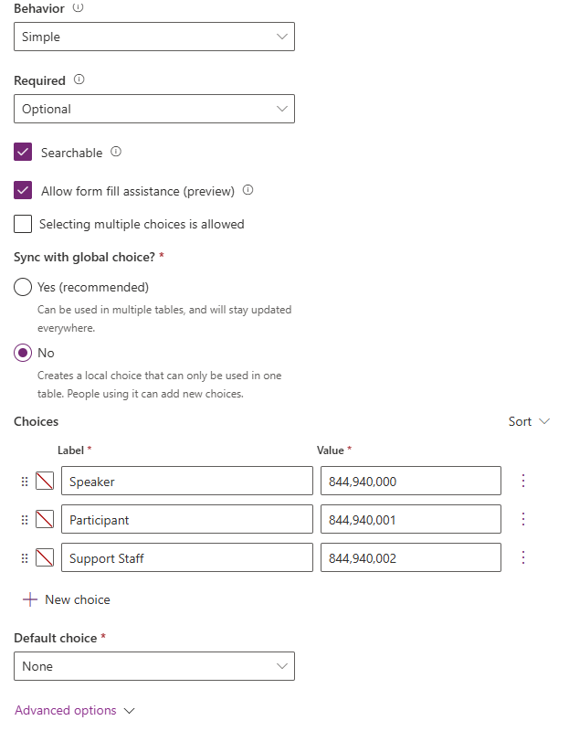

---
lab:
  title: "Lab\_5: Eine modellgesteuerte App erstellen"
  learning path: 'Learning Path: Demonstrate the capabilities of Microsoft Power Apps'
  module: 'Module 3: Build a model-driven app'
---
## Lernziel

In dieser Übung erstellen Lernende eine modellgesteuerte App in Power Apps mit Copilot. Sie definieren das Datenmodell, ändern Formulare und Ansichten und erstellen die Anwendung.

**Nach erfolgreichem Abschluss dieses Labs können Sie Folgendes:**

-   Eine modellgesteuerte Anwendung erstellen
-   Formulare und Ansichten in der Anwendung so ändern, dass sie Ihren Anforderungen am besten entsprechen
-   Durch eine modellgesteuerte Anwendung navigieren

### Szenario

Contoso Consulting ist eine professionelle Dienstleistungsorganisation, die sich auf IT- und KI-Beratungsdienste spezialisiert hat. Im Laufe des Jahres veranstalten sie viele verschiedene Events für ihre Kunden. Einige davon sind Events im Stil von Messen, bei denen viele Partner anwesend sind und Informationen zu neuen Produkten, Markttrends und Dienstleistungen bereitstellen. Andere finden das ganze Jahr über statt und sind kurze Webinare, in denen Details zu einzelnen Produkten vorgestellt werden.

Contoso möchte Power Platform verwenden, um eine Eventverwaltungslösung zu erstellen, mit der das Unternehmen die verschiedenen Events verwalten kann, die es im Laufe des Jahres veranstaltet.

In dieser Übung erstellen Sie eine modellgesteuerte Anwendung zum Verwalten von Events von Contoso. Die modellgesteuerte Anwendung basiert auf einem vorhandenen Datenmodell und umfasst Ereignisse, Ereignissitzungen und Sitzungsregistrierungen.

### Labdetails:

Bevor Sie mit dieser Übung beginnen, empfiehlt es sich, Folgendes abgeschlossen zu haben:

-   **Lab 1: Erstellen einer Lösung**
-   **Lab 2: Erstellen eines Datenmodells**

Die geschätzte Dauer dieser Übung beträgt **20 bis 30** Minuten.

## Aufgabe 1: Erstellen eines Datenmodells zur Unterstützung Ihrer neuen modellgesteuerten Anwendung

Contoso speichert derzeit Kontaktinformationen in der Dataverse-Instanz, und das Unternehmen möchte Dataverse verwenden, um Kurse und Kursregistrierungen nachzuverfolgen. Sie müssen die erforderlichen Tabellen erstellen, um die Anwendung zu unterstützen und eine modellgesteuerte Anwendung basierend auf diesem Datenmodell erstellen.

1.  Öffnen Sie bei Bedarf einen Webbrowser, navigieren Sie zum [Power Apps](https://make.powerapps.com/) Maker Portal, und melden Sie sich mit Ihren Microsoft-Kontoanmeldeinformationen an.
1.  Wählen Sie links im Navigationsbereich die Option **Lösungen** aus.
1.  Öffnen Sie die Lösung **Ereignisverwaltung**, die Sie zuvor erstellt haben.
1.  Wählen Sie in der **Befehlsleiste** die Optionen **Neu** \> **App** \> **Modellgesteuerte App** aus.
1.  Wählen Sie den Abschnitt **Erstellen** aus.
    -   **Name**: `Contoso Event Management`
    -   **Beschreibung:**` Used to manage Events and Event Sessions`.
1.  Wählen Sie die Schaltfläche **Erstellen**.
1.  Wählen Sie die Schaltfläche **+ Seite hinzufügen** und dann **Dataverse-Tabelle** aus.
1.  Wählen Sie die folgenden Tabellen aus:
    -   Kontakt
    -   Ereignis
    -   Eventsitzung
    -   Sitzungsregistrierung
1.  Stellen Sie sicher, dass **Im Navigationsbereich anzeigen** ausgewählt ist.

    

1. Wählen Sie die Schaltfläche **Hinzufügen** aus.

> **Hinweis:** Manchmal werden Sie aufgefordert, sich anzumelden, während Sie mit dem Designer arbeiten. Wählen Sie das X aus, um den Anmeldebildschirm abzubrechen.

## Aufgabe 2: Bearbeiten der modellgesteuerten Anwendung entsprechend Ihren Anforderungen

Nachdem die App erstellt wurde, nehmen wir einige Änderungen an der Darstellung der Anwendung vor. Wir möchten zwei unterschiedliche Gruppen haben: Personen und Ereignisse. Wir möchten die Tabelle „Kontakte“ in der Gruppe „Personen“ und alle Ereignistabellen in der Gruppe „Ereignisse“ haben.

1.  Wählen Sie auf der linken Seite des Bildschirm unter **Navigation** die Option **Neue Gruppe** aus.
1.  Erweitern Sie auf der rechten Seite der Anwendung den Bereich **Eigenschaften**.
1.  Ändern Sie den **Titel** von **Neue Gruppe** in `People`.

    

1.  Wählen Sie die **Auslassungspunkte** in der Gruppe **Personen** aus.
1.  Wählen Sie **Neue Gruppe** aus.
1.  Ändern Sie im Bereich **Eigenschaften** den Namen der Gruppe von **Neue Gruppe** in `Events`.
1.  Zeigen Sie mit dem Mauszeiger auf die Ansicht **Sitzungsregistrierungen** auf der linken Seite, wählen Sie die **Auslassungspunkte** und anschließend **Nach unten**, um **Sitzungsregistrierungen** in die Gruppe **Ereignisse** zu verschieben.
1.  Zeigen Sie mit dem Mauszeiger auf die Ansicht **Ereignissitzungen** auf der linken Seite, wählen Sie die **Auslassungspunkte** und anschließend **Nach unten**, um **Ereignissitzungen** in die Gruppe **Ereignisse** zu verschieben.
1.  Zeigen Sie mit dem Mauszeiger auf die Ansicht **Ereignisse** auf der linken Seite, wählen Sie die **Auslassungspunkte** und anschließend **Nach unten**, um **Ereignisse** in die Gruppe **Ereignisse** zu verschieben.

    Ihre App sollte dem Bild ähneln:

    

## Aufgabe 3: Bearbeiten der verschiedenen Formulare und Ansichten in Ihrer modellgesteuerten Anwendung

Die modellgesteuerte Anwendung verwendet Formulare und Ansichten, um Benutzenden auf der Benutzeroberfläche Daten zu präsentieren. Wir werden einige Änderungen an diesen Elementen vornehmen.

1.  Stellen Sie sicher, dass Ihre **Contoso-Ereignisverwaltung**-App im Designer geöffnet ist.
1.  Zeigen Sie auf der linken Seite des Bildschirms unter der Gruppe **Personen** auf das **Kontaktformular**, und wählen Sie **Bearbeiten** aus.

    Wenn Sie aufgefordert werden, Ihre Änderungen zu speichern, wählen Sie **Speichern und fortfahren** aus.

1.  Wählen Sie unter **Tabellenspalten** auf der linken Seite **Neue Tabellenspalte** aus.
1.  Konfigurieren Sie die Tabellenspalte wie folgt:
    -   **Anzeigename**: `Contact Type`
    -   **Datentyp:** Auswahl
    -   **Mit globaler Auswahl synchronisieren:** Nr.
1.  Legen Sie die **Bezeichnung** der ersten Wahl auf **Sprecher** fest.
1.  Wählen Sie **+ Neue Auswahl** aus, und legen Sie die Bezeichnung auf **Teilnehmer** fest.
1.  Wählen Sie **+ Neue Auswahl** aus, und legen Sie die Bezeichnung auf **Supportpersonal** fest.

    

1.  Wählen Sie die Schaltfläche **Speichern** aus.
1.  Wählen Sie mit der Maus den Text **Neuer Kontakt** aus, um den Formularkopf auszuwählen. *(Ein violettes Rechteck sollte um die Kopfzeile herum angezeigt werden)*
1. Geben Sie unter **Tabellenspalten** im Feld **Suche** **Kontakt** ein.
1. Wählen Sie die soeben erstellte Tabellenspalte **Kontakttyp** aus.
1. Der **Kontakttyp** sollte nun in der **Kopfzeile** angezeigt werden.

    

1. Wählen Sie auf der **Befehlsleiste** des Formulars die Schaltfläche **Speichern und veröffentlichen** aus.
1. Wählen Sie den **Zurück-Pfeil** aus, um zum Designer für die modellgesteuerte Anwendung zurückzukehren.
1. Zeigen Sie unter **Navigation** links mit dem Mauszeiger auf die Ansicht **Kontakte**, und wählen Sie das Symbol **Bearbeiten** aus. (Wenn Sie zum Speichern aufgefordert werden, wählen Sie **Speichern und fortfahren** aus.)
1. Wählen Sie **+ Sichtspalte** aus.
1. Suchen Sie nach der Spalte **Kontakttyp**, und fügen Sie sie der Ansicht hinzu.
1. Wählen Sie die Schaltfläche **Speichern und veröffentlichen** aus.
1. Wählen Sie die Schaltfläche **Pfeil „Zurück“** aus, um zum Designer für die modellgesteuerte Anwendung zurückzukehren.

    Als Nächstes nehmen wir die erforderlichen Änderungen an den verbleibenden Formularen vor.

1.  Wählen Sie unter **Navigation** die **Ereignisansicht** aus.
    
    Beachten Sie, dass möglicherweise eine Spalte namens **EventDetails1** vorhanden ist. Wenn ja, entfernen wir sie aus der Ansicht. *(Wenn die Spalte nicht vorhanden ist, können Sie mit **Vorgang 4: Speichern und veröffentlichen** fortfahren).*

1.  Zeigen Sie mit dem Mauszeiger auf die **Ereignisansicht**, und wählen Sie die Schaltfläche **Bearbeiten** aus.

    Wenn Sie zum **Speichern** von Änderungen aufgefordert werden, wählen Sie **Speichern und fortfahren** aus.

1.  Wählen Sie in der **Ansicht** den Pfeil neben **EventDetails1** aus, und wählen Sie im daraufhin angezeigten Menü **Entfernen** aus.

    

1.  Wählen Sie die Schaltfläche **Speichern und veröffentlichen** aus.
1.  Wählen Sie den **Pfeil „Zurück“** aus, um zum App-Designer zurückzukehren.
1.  Zeigen Sie unter **Navigation** mit dem Mauszeiger auf das **Formular** **Ereignisse**, und wählen Sie **Bearbeiten** aus.

    Wenn Sie zum Speichern von Änderungen aufgefordert werden, wählen Sie **Speichern und fortfahren** aus.

1.  Wählen Sie das Feld **Event Details1** aus, und drücken Sie die Taste **ENTF** auf Ihrer Tastatur.

    Ihr Formular sollte dem Bild ähneln:

    

    Wenn es nicht genau übereinstimmt, ist dies in Ordnung, solange alle Felder im Bild vorhanden sind.  

1.  Wählen Sie die Schaltfläche **Speichern und veröffentlichen**.
1.  Wählen Sie den **Pfeil „Zurück“** aus, um zum App-Designer zurückzukehren.

## Aufgabe 4: Speichern und Veröffentlichen (Wenn Sie das Feld „EventDetail1“ nicht auf dem Formular haben, fahren Sie hier fort.)

1.  Wählen Sie auf der **Befehlsleiste** der App die Schaltfläche **Speichern und veröffentlichen** aus.

1.  Wählen Sie die Schaltfläche **Zurück** aus, um zur Projektmappe **Ereignisverwaltung** zurückzukehren.
1.  Wählen Sie den Pfeil **Zurück zu Projektmappen** aus, um zum **Power Apps Maker** Portal zurückzukehren.
1.  Wählen Sie den Pfeil **Zurück** aus, um zum Hauptbildschirm von **Power Apps** zurückzukehren.

## Aufgabe 5: Testen Ihrer neuen Anwendung

Nachdem Ihre modellgesteuerte Anwendung erstellt wurde, testen wir ihre Funktionalität.

Zunächst werden wir ein paar Kontakte hinzufügen.

1.  Wählen Sie links im Navigationsbereich die Option **Apps** aus.
1.  Ändern Sie die angezeigten Apps von **Meine Apps** in **Alle**.
1.  Zeigen Sie auf die soeben erstellte Anwendung **Contoso-Eventverwaltung**, und wählen Sie das Symbol **Wiedergeben** aus.
1.  Wählen Sie links im Navigationsbereich die Option **Kontakte** aus.
1.  Wählen Sie auf der **Befehlsleiste** die Schaltfläche **+ Neu** aus.
1.  Konfigurieren Sie im Bildschirm **Neuer Kontakt** wie folgt:
    -   **Vorname:** `Suzanne`
    -   **Nachname:** `Diaz`
    -   **Position:** `Engineer`
1.  Wählen Sie in der Formularkopfzeile den Abwärtspfeil neben **Kontakttyp** aus.
1.  Legen Sie den **Kontakttyp** auf **Sprecher** fest.

    

1.  Wählen Sie die Schaltfläche **Speichern** aus, um den Kontakt zu speichern, und lassen Sie ihn geöffnet.
1. Wählen Sie die Schaltfläche **+ Neu** aus.
1. Konfigurieren Sie im Bildschirm **Neuer Kontakt** wie folgt:
    -   **Vorname:** Edgar
    -   **Nachname:** Swenson
    -   **Position:** architekt
    -   **E-Mail-Adresse:** Geben Sie Ihre E-Mail-Adresse ein (Stellen Sie sicher, dass Sie **Ihre** E-Mail-Adresse hinzufügen).
1. Wählen Sie in der Formularkopfzeile den Abwärtspfeil neben **Kontakttyp** aus.
1. Legen Sie den **Kontakttyp** auf **Teilnehmer** fest.
1. Wählen Sie die Schaltfläche **Speichern und schließen** aus.

    Als Nächstes fügen wir ein neues Ereignis hinzu.

1.  Wählen Sie links im Navigationsbereich die Option **Ereignisse** aus.
1.  Wählen Sie auf der Befehlsleiste die Schaltfläche **+ Neu** aus.
1.  Konfigurieren Sie im Bildschirm **Neues Ereignis** wie folgt:
    - **Eventname:** `Spring conference`.
    - **Ereignisdatum:** Datum von morgen
    - **Maximale Teilnehmeranzahl:** `500`
    - **Eventdetails:** `Spring conference to showcase newest products and services from our supported vendors`.
    - **Ereignistyp:** Konferenz
    - **Ort**: `Seattle`
    - **Registrierung erforderlich:** Ja/Wahr

    

1.  Wählen Sie die Schaltfläche **Speichern und schließen** aus.

    Als Nächstes fügen wir eine neue Sitzung für das Ereignis hinzu.

1.  Wählen Sie links im Navigationsbereich die Option **Ereignissitzungen** aus.
1.  Wählen Sie die Schaltfläche **+ Neu** aus.
1.  Konfigurieren Sie die **Ereignissitzung** wie folgt:
    - **Sitzungsname:** `Responsible AI`
    - **Sitzungsdatum:** Datum von morgen
    - **Dauer:** 1,5 Stunden
    - **Sitzungsbeschreibung:** `With all the new AI solutions, being responsible is important. We will discuss the challenges`.
    - **Referent:** `Suzanne Diaz`
    - **Event:** `Spring Conference`

    

1.  Wählen Sie **Speichern und schließen** aus.

    Schließlich erstellen wir eine **Sitzungsregistrierung**.

1.  Wählen Sie mit der Navigation auf der linken Seite **Sitzungsregistrierungen** aus.
1.  Wählen Sie auf der **Befehlsleiste** **+ Neu** aus.
1.  Führen Sie die Sitzungsregistrierung wie folgt aus:
    - **Registrierungsname:** `E, Swenson Registration`.
    - **Besitzer**: Nehmen Sie keine Änderung vor.
    - **Registrierungsdatum:** Heutiges Datum
    - **Spezielle Anweisungen:** `No Gluten`
    - **Teilnehmer:** `Edgar Swenson`
    - **Eventsitzung:** `Responsible AI`

    

1.  Wählen Sie **Speichern und schließen** aus.

