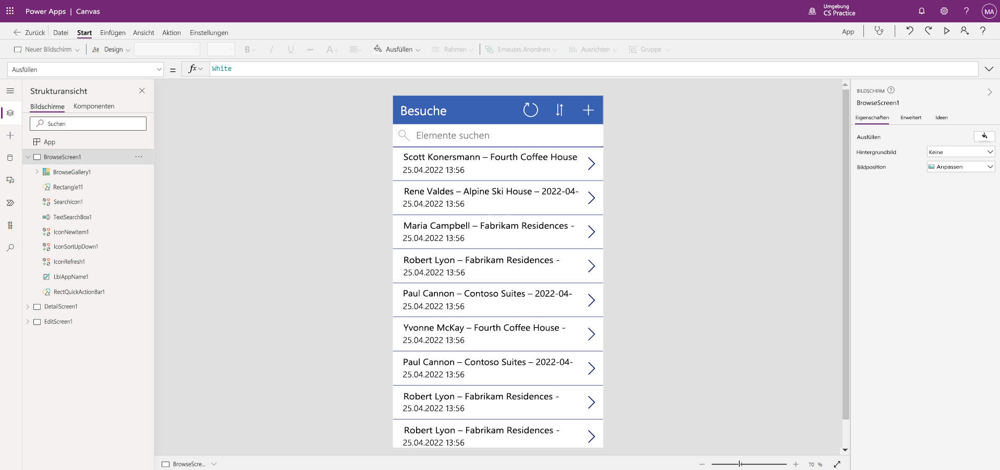

---
lab:
  title: "Lab\_2: Eine Canvas-App erstellen"
  module: 'Module 3: Get started with Power Apps'
---

# Lab 2: Eine Canvas-App erstellen

## Szenario

Bellows College is an educational organization with multiple buildings on campus. Campus visits are currently recorded in paper journals. The information is not captured consistently, and there are no means to collect and analyze data about the visits across the entire campus.

Currently, campus administration is leveraging an Excel spreadsheet to track visitor registration. They would like to modernize their visitor registration system where access to the buildings is controlled by security personnel and all visits are required to be pre-registered and recorded by their hosts.

Während dieses Kurses erstellen Sie Anwendungen und führen eine Automatisierung durch, damit das Verwaltungs- und Sicherheitspersonal des Bellows College den Zugang zu den Gebäuden auf dem Campus verwalten und kontrollieren kann.

## Weiterführende Schritte des Lab

Wir werden uns beim Entwerfen der App an nachstehende Gliederung halten:

- Erstellen einer Canvas-App aus Daten in der Tabelle „Besuch“

- Konfigurieren, wie die Besuche im Bildschirm „Durchsuchen“ angezeigt werden

- Vornehmen einiger einfacher Änderungen an der App

- Testen der App-Funktionalität

## Voraussetzungen

- Beendigung von **Modul 0 Lab 0 – Lab-Umgebung überprüfen**
- Abschluss von **Modul 2 Lab 1: Datenmodellierung**

## Übung 1: Erstellen einer Canvas-App für Besuche

**Ziel:** In dieser Übung erstellen Sie eine Canvas-App, indem Sie Ihre Tabelle „Visits“ (Besuche) verbinden, die Sie zuvor erstellt haben.

### Aufgabe \#1: Erstellen der „Visits“-App

1.  Navigate to <ph id="ph1">&lt;https://make.powerapps.com&gt;</ph>. You may need to reauthenticate - click <bpt id="p1">**</bpt>Sign in<ept id="p1">**</ept> and follow instructions if needed.

2.  Wählen Sie oben rechts Ihre **[Ihre Initialen] Übung**sumgebung aus, falls diese noch nicht ausgewählt ist.

3.  If necessary, click the <bpt id="p1">**</bpt>Home<ept id="p1">**</ept> icon on the left side of the screen. Under the <bpt id="p1">**</bpt>Start from<ept id="p1">**</ept> section, select <bpt id="p2">**</bpt>Dataverse<ept id="p2">**</ept>.

4.  Wählen Sie Ihre Dataverse-Verbindung aus.

    > **HINWEIS:** *Wenn es keine Dataverse-Verbindung gibt:*
    > - Wählen Sie **Neue Verbindung** aus.
    > - Suchen Sie **Microsoft Dataverse**.
    > - Klicken Sie auf **Erstellen**

5.  Suchen Sie die Tabelle **Besuche**, die Sie im vorherigen Lab erstellt haben, und wählen Sie sie aus.

6.  Wählen Sie in der rechten unteren Ecke die Schaltfläche **Verbinden** aus.

7.  Nachdem Ihre App erstellt wurde, aktivieren Sie auf dem Bildschirm „Willkommen bei Power Apps Studio“ das Kontrollkästchen **Nicht mehr anzeigen**, und wählen Sie dann **Überspringen** aus.

8.  Nach Abschluss der Erstellung sollte es wie die Abbildung unten aussehen.

9. Das Bellows College ist eine Bildungsorganisation mit mehreren Gebäuden auf dem Campus.

10. Schließen Sie die App-Vorschau, indem Sie rechts oben auf dem Bildschirm das **X** auswählen.

Campusbesuche werden derzeit in Papierzeitschriften aufgezeichnet.

### Aufgabe \#2: Ändern der neu erstellten App, inklusive Design

In dieser Aufgabe passen Sie den Kopfzeilentext für jeden der drei Bildschirme Ihrer App an (Durchsuchen, Details und Bearbeiten) und ändern das App-Design.

1.  Die Informationen werden nicht konsistent erfasst und es gibt keine Möglichkeit, Daten über die Besuche auf dem gesamten Campus zu sammeln und zu analysieren.

1.  Aktualisieren Sie auf der rechten Seite des Bildschirms unter der Registerkarte „Eigenschaften“ die **Text**-Steuerelementeigenschaft zu **„Bellows College Visits“** (Bellows College-Besuche).

1. Ändern Sie in den Eigenschaften den **Schriftgrad** auf **24**.

1.  Klicken Sie auf den leeren Bildschirmhintergrund, um den aktualisierten Text auf dem Bildschirm „Durchsuchen“ anzuzeigen.

1.  Wählen Sie über die Strukturansicht in der linken Navigationsleiste **DetailScreen1** aus.

1.  Wählen Sie die Bezeichnung **Besuche** auf dem Bildschirm aus.

1.  Aktualisieren Sie auf der rechten Seite des Bildschirms unter der Registerkarte „Eigenschaften“ die **Text**-Steuerelementeigenschaft zu **„Besuchsdetails“** .

1.  Klicken Sie auf den leeren Bildschirmhintergrund, um den aktualisierten Text auf dem Bildschirm „Details “ anzuzeigen.

1.  Wählen Sie mithilfe der Strukturansicht in der linken Navigationsleiste **EditScreen1** aus (möglicherweise müssen Sie nach unten scrollen, um die Option in der Strukturansicht anzuzeigen).

1.  Wählen Sie die Bezeichnung **Besuche** auf dem Bildschirm aus.

1.  Ersetzen Sie auf der rechten Seite des Bildschirms unter der Registerkarte „Eigenschaften“ den Text „Table1“ in der **Text**-Steuerelementeigenschaft durch **„Details bearbeiten“** .

1.  Klicken Sie auf den leeren Bildschirmhintergrund, um den aktualisierten Text auf dem Bildschirm „Bearbeiten“ anzuzeigen.

1. Wählen Sie über die Strukturansicht in der linken Navigationsleiste **BrowseScreen1** aus.

1. Wählen Sie auf der Befehlssymbolleiste die Schaltfläche **Design** aus und dann aus der angezeigten Liste die Designfarbe **Rot**.

### Aufgabe \#3: Testen Ihrer Besuche-App (Visits)

In dieser Aufgabe testen Sie Ihre neue App.

1.  Wählen Sie bei im App-Designer geöffneter Anwendung **Datei** aus, aktualisieren Sie den Namen Ihrer App auf **Besuche-App** (Visits-App), und wählen Sie **Speichern** aus.

2.  Wählen Sie den Pfeil **Zurück** aus, um zur App zurückzukehren.

3.  Wählen Sie links im Navigationsbereich die Option **BrowseScreen1** aus.

4.  In the app designer, select the <bpt id="p1">**</bpt>preview the app<ept id="p1">**</ept> button (Play icon) on the command bar. <bpt id="p1">*</bpt>(You can also preview the app by pressing F5 on your keyboard.)<ept id="p1">*</ept>

4.  Nachdem die App geöffnet wurde, geben Sie in das Feld **Suchelemente** den Text **Maria** ein.
     *(Beachten Sie, wie die Elemente im Katalog gefiltert werden, basierend auf der Eingabe im Suchfeld.)*

5.  Derzeit nutzt die Campusverwaltung eine Excel-Kalkulationstabelle, um die Besucherregistrierung nachzuverfolgen.

6.  Um den Datensatz zu bearbeiten, wählen Sie das **Bleistiftsymbol** oben rechts in der App aus.

7.  Sie können den Namen des Besuchs hier bearbeiten. Klicken Sie rechts oben auf das Häkchensymbol, um Ihre Änderungen zu speichern.

8.  Klicken Sie rechts oben auf dem Bildschirm auf das **X**, um zum Canvas-App-Editor zurückzukehren.

Sie möchte ihr Besucherregistrierungssystem modernisieren, wobei der Zugang zu den Gebäuden von Sicherheitspersonal kontrolliert werden soll und alle Besuche von den entsprechenden Gastgebern zuvor registriert und aufgezeichnet werden müssen.

## Herausforderungen

- Fügen Sie den Formularen in „DetailScreen1“ und „EditScreen1“ die folgenden Spalten hinzu: Tatsächlicher Start, Tatsächliches Ende, Code, Geplanter Start und Geplantes Ende.