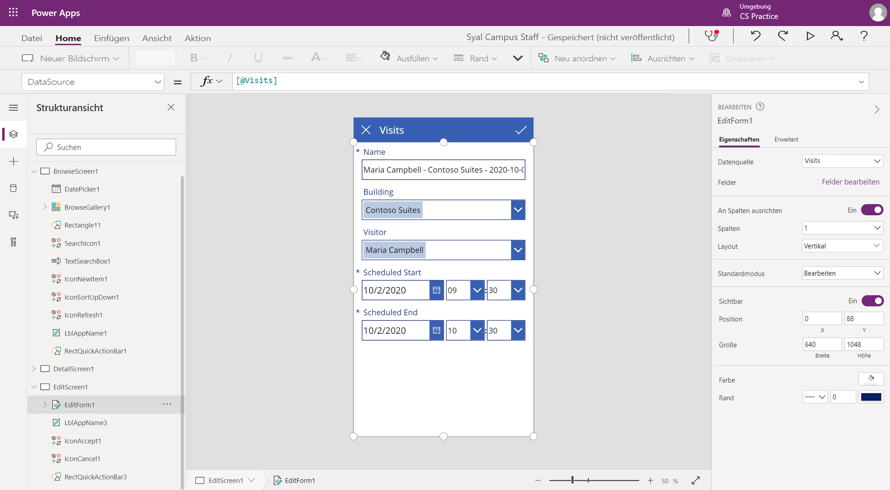
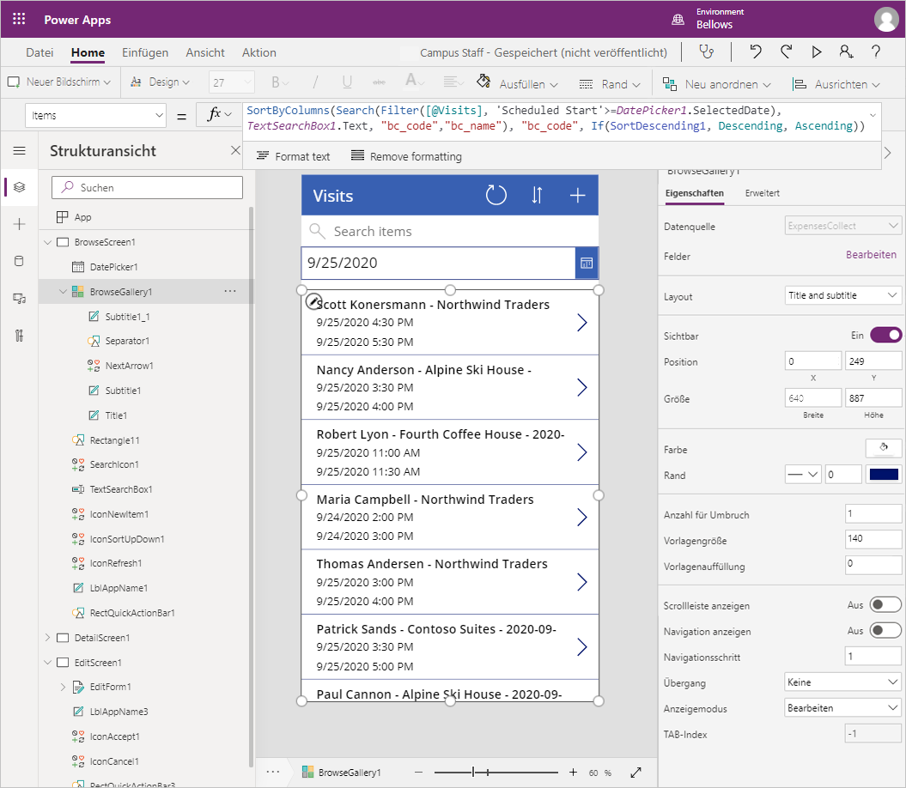

---
lab:
  title: 'Lab 2: Entwerfen einer Canvas-App, Teil 1'
  module: 'Module 3: Get started with Power Apps'
ms.openlocfilehash: ac6cec75309098dae7715c0bdf42db75c9b80429
ms.sourcegitcommit: ef58c858463b890e923ef808b1d43405423943fd
ms.translationtype: HT
ms.contentlocale: de-DE
ms.lasthandoff: 01/27/2022
ms.locfileid: "137898892"
---
# <a name="module-3-get-started-with-power-apps"></a>Modul 3: Erste Schritte mit Power Apps

## <a name="lab-how-to-build-a-canvas-app-part-1"></a>Lab: Entwerfen einer Canvas-App, Teil 1

# <a name="scenario"></a>Szenario

Das Bellows College ist eine Bildungsorganisation mit mehreren Gebäuden auf dem Campus. Campusbesuche werden derzeit in Papierzeitschriften aufgezeichnet. Die Informationen werden nicht konsistent erfasst und es gibt keine Möglichkeit, Daten über die Besuche auf dem gesamten Campus zu sammeln und zu analysieren. 

Die Campusverwaltung möchte ihr Besucherregistrierungssystem modernisieren, wobei der Zugang zu den Gebäuden von Sicherheitspersonal kontrolliert werden soll und alle Besuche von den entsprechenden Gastgebern zuvor registriert und aufgezeichnet werden müssen.

Während dieses Kurses erstellen Sie Anwendungen und führen eine Automatisierung durch, damit das Verwaltungs- und Sicherheitspersonal des Bellows College den Zugang zu den Gebäuden auf dem Campus verwalten und kontrollieren kann.  

In Teil 1 dieses Labs erstellen Sie eine Canvas-App in Power Apps, mit der Universitätsmitarbeiter Besuche für ihre Gäste verwalten können.

# <a name="high-level-lab-steps"></a>Weiterführende Schritte des Lab

Wir werden uns beim Entwerfen der App an nachstehende Gliederung halten:

-   Erstellen Sie die App aus Daten mithilfe der Smartphone-Formfaktor-Vorlage.
-   Konfigurieren Sie eine Detailseite mit Besuchsinformationen.
-   Konfigurieren Sie eine Bearbeitungsseite zum Erstellen von Besuchen.
-   Konfigurieren Sie ein Katalogsteuerelement zum Anzeigen der Besuche.
-   Fügen Sie Filter für die Katalogdatenquelle hinzu, um nur zukünftige Besuche anzuzeigen.

## <a name="prerequisites"></a>Voraussetzungen

* Beendigung von **Modul 0 Lab 0 – Lab-Umgebung überprüfen**
* Beendigung von **Modul 2 Lab 1 – Einführung in Microsoft Dataverse**

## <a name="things-to-consider-before-you-begin"></a>Vor dem Beginn zu beachtende Dinge

-   Was ist der am weitesten verbreitete Formfaktor für die Zielgruppe?
-   Schätzen Sie die Anzahl der Datensätze im System 
-   Ausgewählte Datensätze einschränken, um die App-Leistung und die Benutzereinführung zu verbessern

# <a name="exercise-1-create-staff-canvas-app"></a>Übung 1: Canvas-App für Mitarbeiter erstellen

**Ziel**: In dieser Übung erstellen Sie eine Canvas-App aus einer Vorlage und ändern sie dann so, dass sie die erforderlichen Daten enthält.

## <a name="task-1-create-canvas-app"></a>Aufgabe 1: Canvas-App erstellen

In dieser Aufgabe erstellen Sie eine Canvas-App mithilfe der Telefonlayoutvorlage, die auf Microsoft Dataverse basiert. Wenn Sie „Besuche“ als ausgewählte Tabelle aus Dataverse nutzen, generiert die Vorlage eine App „Katalog - Ansicht - Bearbeiten“ zum Verwalten von Campusbesuchen.

1.  Beginnen, eine App aus Daten zu erstellen

    -   Melden Sie sich bei <https://make.powerapps.com> an.

    -   Wählen Sie oben rechts Ihre **Umgebung** für die Übung aus, falls diese noch nicht ausgewählt ist.

    -   Wählen Sie auf der Startseite innerhalb von **Mit Daten beginnen** das Symbol **Dataverse** aus.

2.  Stellen Sie eine Verbindung zu Ihrer Besuchstabelle her.
    
    -   Wählen Sie **+ Neue Verbindung** aus.

    -   Wählen Sie **Microsoft Dataverse** aus und klicken Sie auf **Erstellen**

    -   Suchen Sie die Tabelle **Besuche** und wählen Sie sie aus

    -   Wählen Sie **Verbinden** aus.

3.  Das Fenster **Willkommen bei Power Apps Studio** wird möglicherweise angezeigt. Klicken Sie auf **Überspringen**.

4.  Anwendung speichern

    -   Klicken Sie auf **Datei \> Speichern**.

    -   Geben Sie [Ihr Nachname] Campus-Mitarbeiter als **App-Namen** ein.

    -   Klicken Sie auf **Speichern**.

## <a name="task-2-configure-visits-detail-form"></a>Aufgabe 2: Konfigurieren des Detailformulars für Besuche

In dieser Aufgabe konfigurieren Sie das Detailformular, um Informationen zu einzelnen Besuchsaufzeichnungen anzuzeigen.

1. Klicken Sie oben links auf den **Zurück**-Pfeil, um zur App-Definition zurückzukehren.

2. Erweitern Sie **DetailScreen1** unter **Strukturansicht**

3.  **DetailForm1** auswählen

4.  Wählen Sie auf der rechten Seite neben **Felder** die Option **Felder bearbeiten** aus.

5.  Klicken Sie auf **Feld hinzufügen**.

6.  Wählen Sie die unten aufgeführten Felder aus:

    * Tatsächliches Ende
    
    * Tatsächlicher Start
    
    * Erstellen 
    
    * Code
    
    * Geplantes Ende
    
    * Geplanter Start
    
    * Besucher
    
7.  Klicken Sie auf **Hinzufügen**.

8.  Ordnen Sie Felder im Bereich **Felder** neu an, indem Sie Feldnamen nach oben oder unten ziehen und ablegen. Empfohlene Bestellung ist:
    * Code, Name, Gebäude, Besucher, geplanter Start, geplantes Ende, tatsächlicher Start, tatsächliches Ende
    >**Tipp:** Sie können jedes Feld reduzieren, indem Sie auf den Pfeil nach unten neben dem Feldnamen klicken.

9.  Entfernen Sie das Feld **Erstellt am**, indem Sie auf die Schaltfläche mit den Auslassungspunkten ( **...** ) neben dem Feldnamen klicken und **Entfernen** auswählen. 

10.  Schließen Sie den Bereich **Felder**.
 
11.  Um Ihre Arbeit von Zeit zu Zeit zu speichern, klicken Sie auf **Datei**, und wählen Sie dann **Speichern** aus. Klicken Sie auf den Zurück-Pfeil, um zur App zurückzukehren.

## <a name="task-3-configure-visits-edit-form"></a>Aufgabe 3: Konfigurieren Sie das Bearbeitungsformular für Besuche

In dieser Aufgabe konfigurieren Sie ein Formular zum Bearbeiten von Informationen zu einzelnen Besuchszeilen.

1.  Erweitern Sie **EditScreen1** unter **Strukturansicht**.

2.  Wählen Sie **EditForm1** aus.

3.  Wählen Sie das Feld **Erstellt am** und klicken Sie die Taste **Entf** zum Entfernen des Feldes.

4.  Wählen Sie **Felder bearbeiten** im Eigenschaftenfenster

5.  Klicken Sie auf **Feld hinzufügen**.

6.  Wählen Sie die unten aufgeführten Felder aus:

    * Erstellen 
    
    * Geplantes Ende
    
    * Geplanter Start
    
    * Besucher
    
7.  Klicken Sie auf **Hinzufügen**.

8.  Ordnen Sie Felder im Bereich **Felder** neu an, indem Sie Feldnamen nach oben oder unten ziehen und ablegen. Empfohlene Bestellung ist:
    
    * Name, Gebäude, Besucher, geplanter Start, geplantes Ende
    >**Tipp:** Sie können jedes Feld reduzieren, indem Sie auf den Pfeil nach unten neben dem Feldnamen klicken. 

9.  Schließen Sie den Bereich **Felder**.

10.  Um Ihre Arbeit von Zeit zu Zeit zu speichern, klicken Sie auf **Datei**, und wählen Sie dann **Speichern** aus. Klicken Sie auf den Zurück-Pfeil, um zur App zurückzukehren.

Ihr Bildschirm sollte ungefähr wie folgt aussehen:



## <a name="task-4-configure-visits-gallery"></a>Aufgabe 4: Konfigurieren Sie die Besuchsgalerie

In dieser Aufgabe konfigurieren Sie den vorab generierten Katalog so, dass Titel sowie Start- und Enddatum für den Besuch angezeigt werden. 

1.  Erweitern Sie **BrowseScreen1** unter **Strukturansicht**

2.  Wählen Sie **BrowseGallery1** aus.

3.  Wählen Sie rechts im Panel mit erweiterten Eigenschaften die Eigenschaft **TemplateSize** aus.

4.  Ersetzen Sie den Ausdruck durch `Min(150, BrowseGallery1.Height - 60)`. Dadurch wird ausreichend Platz für zusätzliche Informationen garantiert.

5.  Wählen Sie in der App-Vorschau das erste Datums-/Uhrzeitfeld im Katalog aus.

6.  Ändern Sie in der Bearbeitungsleiste oben **ThisItem.'Erstellt am'** in `ThisItem.'Scheduled Start'`.

7.  Wählen Sie das Feld erneut aus.

8.  Drücken Sie **STRG+C** und dann **STRG+V**, um eine Kopie des Felds zu erstellen.

9.  Bewegen Sie das kopierte Steuerelement mit der Maus oder der Tastatur nach unten, und richten Sie es an den anderen Steuerelementen im Katalog aus, unter dem anderen Feld „Datum/Uhrzeit“.

10.  Ändern Sie in der Bearbeitungsleiste oben **ThisItem.'Geplanter Start'** in `ThisItem.'Scheduled End'`.

11.  Um Ihre Arbeit von Zeit zu Zeit zu speichern, klicken Sie auf **Datei**, und wählen Sie dann **Speichern** aus. Klicken Sie auf den Zurück-Pfeil, um zur App zurückzukehren.

## <a name="task-5-add-date-filter"></a>Aufgabe 5: Fügen Sie einen Datumsfilter hinzu.

Da die Anzahl der Besuche kontinuierlich zunimmt, benötigen Benutzer eine Funktion zum Filtern der Besuchergalerie. Beispielsweise möchte der Benutzer möglicherweise nur die zukünftigen Besuche sehen. In dieser Aufgabe können Sie Besuche erst nach einem vom Benutzer ausgewählten Datum anzeigen.

1. Wählen Sie **BrowseScreen1** aus.

2. Wählen Sie oben das Menü **Einfügen** aus.

3. Klicken Sie auf **Eingabe**, und wählen Sie **Datumsauswahl** aus.

4. Positionieren Sie das Steuerelement mit der Tastatur oder der Maus unter dem Suchfeld.

5. Wählen Sie **BrowseGallery1** aus. 

6. Ändern Sie die Größe des Katalogsteuerelements, und verschieben Sie es so, dass es sich unter der Datumsauswahl befindet und den Bildschirm abdeckt. Klicken Sie dazu oben in der Mitte des Katalogsteuerelements auf das Symbol zum Ändern der Größe, und ändern Sie die Größe des Steuerelements, um nach der Datumsauswahl zu beginnen.

7. Während **BrowseGallery1** ausgewählt ist, klicken Sie im Eigenschaftenbereich auf die Registerkarte **Erweitert**.

8. Suchen Sie die Eigenschaft **Items**, und klicken Sie in das Textfeld.

9. Suchen Sie im Ausdruck **[@Visits]** , und ersetzen Sie dies durch `Filter(Visits,'Scheduled End' >= DatePicker1.SelectedDate)`. Der komplette Ausdruck sollte wie folgt aussehen:

   ```
   SortByColumns(
    Search(
        Filter(
            Visits,
            'Scheduled End' >= DatePicker1.SelectedDate
           ),
           TextSearchBox1.Text,
        "bc_code","bc_name"
       ),
     "bc_scheduledstart",
     If(SortDescending1, Descending, Ascending)
   )
   ```
   
10. Um Ihre Arbeit von Zeit zu Zeit zu speichern, klicken Sie auf **Datei**, und wählen Sie dann **Speichern** aus. Klicken Sie auf den Zurück-Pfeil, um zur App zurückzukehren.

Ihr Bildschirm sollte ungefähr wie folgt aussehen:



# <a name="exercise-2-complete-the-app"></a>Übung Nr. 2: Fertigstellen der App

In dieser Übung testen Sie die Anwendung und fügen sie bei Erfolg Ihrer Lösung hinzu.

## <a name="task-1-test-app"></a>Aufgabe 1: App testen

1.  Starten der Anwendung

    -   Wählen Sie **BrowseScreen1** aus, und drücken Sie die Funktionstaste **F5**, oder klicken Sie auf das **Wiedergabesymbol** in der oberen rechten Ecke, um eine Vorschau der App anzuzeigen.
    
    -   Die Anwendung sollte eine Liste der Besuche laden und anzeigen. 
    
    -   Testen Sie den Filter, indem Sie verschiedene Daten in der Datumsauswahl auswählen
    
    -   Wählen Sie einen Besuch aus, und überprüfen Sie, ob das Anzeigeformular ordnungsgemäß funktioniert.
    
    -   Kehren Sie zum Katalog zurück, und drücken Sie **+** , um einen neuen Besuch zu erstellen. Überprüfen Sie, ob das Bearbeitungsformular die erforderlichen Spalten enthält, einschließlich Besucher, Gebäude sowie geplante Start- und Enddaten.
    
    -   Geben Sie die Informationen an und senden Sie sie. Überprüfen Sie, dass der neue Datensatz in der Galerie angezeigt wird.
    
    -   Erstellen Sie mindestens 2 weitere Besuche.
    
    -   Drücken Sie die **ESC**-Taste oder klicken Sie auf das **X**-Symbol zum Schließen des Vorschaumodus.

2.  Speichern und veröffentlichen Sie die Anwendung

    -   Klicken Sie auf **Datei**, und klicken Sie auf **Speichern**, wenn die Schaltfläche „Speichern“ angezeigt wird.

    -   Klicken Sie auf **Veröffentlichen**.

    -   Klicken Sie auf **Diese Version veröffentlichen**.

    -   Klicken Sie auf den **Zurück**-Pfeil, um zur App zurückzukehren.

    -   Schließen Sie das Browserfenster oder die Registerkarte **Designer**.

    -   Klicken Sie auf **Beenden**, wenn Sie aufgefordert werden, das Browserfenster zu schließen.

## <a name="task-2-add-app-to-solution-and-publish"></a>Aufgabe Nr. 2: App zur Lösung hinzufügen und veröffentlichen 

1. Öffnen Sie die Campus Management-Lösung.

   * Melden Sie sich bei <https://make.powerapps.com> an.
   
   * Wenn die oben rechts angezeigte Umgebung nicht Ihre Übungsumgebung ist, wählen Sie Ihre **Umgebung** aus. 
   
   * Wählen Sie **Projektmappen** aus.
   
   * Klicken Sie, um Ihre **Campusverwaltungslösung** zu öffnen.
   
2. Wählen Sie **Vorhandene hinzufügen** aus, klicken Sie auf **App**, und klicken Sie dann auf **Canvas-App**.

3. Wählen Sie die Registerkarte **Externe Dataverse** aus.

4. Wählen Sie die App **Campus-Mitarbeiter** aus, und klicken Sie auf **Hinzufügen**.

5. Wählen Sie **Alle Anpassungen veröffentlichen** aus.

# <a name="challenges"></a>Herausforderungen

* Kalenderansicht aller Besuche und Filtern nach Datumsbereich
* Möglichkeit zum Erstellen und Verwalten von Kontakten als Teil der App
* So zeigen Sie mehrere Besprechungen während eines einzelnen Besuchs an

