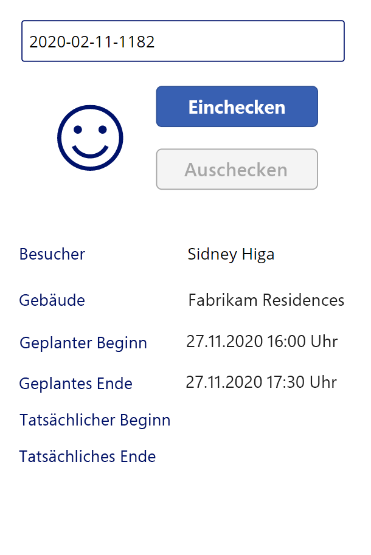

---
lab:
  title: 'Lab 3: So erstellen Sie eine Canvas-App, Teil 2'
  module: 'Module 3: Get started with Power Apps'
ms.openlocfilehash: c26f032744e228dc6632d254ad127f39cdbdef02
ms.sourcegitcommit: ef58c858463b890e923ef808b1d43405423943fd
ms.translationtype: HT
ms.contentlocale: de-DE
ms.lasthandoff: 01/27/2022
ms.locfileid: "137898956"
---
# <a name="module-3-get-started-with-power-apps"></a>Modul 3: Erste Schritte mit Power Apps
## <a name="lab-2-how-to-build-a-canvas-app-part-2"></a>Lab 2: So erstellen Sie eine Canvas-App, Teil 2

# <a name="scenario"></a>Szenario

Das Bellows College ist eine Bildungsorganisation mit mehreren Gebäuden auf dem Campus. Campusbesuche werden derzeit in Papierzeitschriften aufgezeichnet. Die Informationen werden nicht konsistent erfasst und es gibt keine Möglichkeit, Daten über die Besuche auf dem gesamten Campus zu sammeln und zu analysieren. 

Die Campusverwaltung möchte ihr Besucherregistrierungssystem modernisieren, wobei der Zugang zu den Gebäuden von Sicherheitspersonal kontrolliert werden soll und alle Besuche von den entsprechenden Gastgebern zuvor registriert und aufgezeichnet werden müssen.

Während dieses Kurses erstellen Sie Anwendungen und führen eine Automatisierung durch, damit das Verwaltungs- und Sicherheitspersonal des Bellows College den Zugang zu den Gebäuden auf dem Campus verwalten und kontrollieren kann. 

In Teil 2 dieses Labs erstellen Sie eine Power Apps-Canvas-App, mit deren Hilfe das Sicherheitspersonal an den Gebäudeeingängen die Besucher schnell bestätigen und registrieren kann.

# <a name="high-level-lab-steps"></a>Weiterführende Schritte des Lab

Sie werden sich beim Entwerfen der App an nachstehende Gliederung halten:

-   Erstellen der App mit dem Formfaktor „Smartphone“
-   Herstellen einer Verbindung mit Dataverse als Datenquelle
-   Erfassen der Eingabe (Besuchercode) und Suchen der Besucherzeile
-   Ein Formularansicht-Steuerelement konfigurieren, um die Besucherinformationen anzuzeigen
-   Verwenden einer Dataverse-Ansicht zum Füllen des Katalogs
-   Ausführen des Ein- und Auscheckvorgangs für einen Besucher

## <a name="prerequisites"></a>Voraussetzungen

* Beendigung von **Modul 0 Lab 0 – Lab-Umgebung überprüfen**
* Beendigung von **Modul 2 Lab 1 – Einführung in Microsoft Dataverse**

## <a name="things-to-consider-before-you-begin"></a>Vor dem Beginn zu beachtende Dinge

-   Auf welche Informationen würde ein Sicherheitsbeauftragter schnell zugreifen müssen?
-   Was soll geschehen, wenn ein Besuchercode ungültig ist?
-   Was soll geschehen, wenn der Besucher außerhalb der geplanten Zeiten ankommt?

# <a name="exercise-1-create-security-canvas-app"></a>Übung 1: Erstellen einer Sicherheits-Canvas-App

**Ziel**: In dieser Übung erstellen Sie eine Canvas-App.

## <a name="task-1-create-canvas-app"></a>Aufgabe 1: Canvas-App erstellen

1.  Öffnen Sie Ihre Campusverwaltung-Lösung.

    -   Melden Sie sich bei <https://make.powerapps.com> an.

    -   Wenn die oben rechts angezeigte Umgebung nicht Ihre Übungsumgebung ist, wählen Sie Ihre **Umgebung** aus. 

    -   Wählen Sie **Projektmappen** aus.

    -   Klicken Sie, um Ihre **Campusverwaltungslösung** zu öffnen.
    
2.  Erstellen Sie eine neue Canvas-Anwendung

    -   Klicken Sie auf **Neu**, und wählen Sie **App \| Canvas-App** aus.

    -   Geben Sie im Fenster zum Erstellen der Canvas-App aus einer leeren Vorlage **[Ihr Nachname] Campus Security** in das Feld für den App-Namen ein.

    -   Wählen Sie **Telefon** im Feld „Format“ aus.

    -   Klicken Sie auf **Erstellen**.
        Dadurch wird der App-Editor in einem neuen Fenster geöffnet. Klicken Sie auf **Überspringen**, wenn das Dialogfeld „Willkommen bei Power Apps Studio“ angezeigt wird.
    
3.  Speichern Sie die Canvas-App.

    -   Klicken Sie auf **Datei**, und wählen Sie **Speichern unter** aus.
    
    -   Überprüfen Sie, ob **Die Cloud** ausgewählt ist, und klicken Sie auf **Speichern**.

    - Vergewissern Sie sich, dass der Name **[Ihr Nachname] Campus Security** ist, und klicken Sie auf **Speichern**.
        
    -   Klicken Sie oben links (unter Power Apps) auf den **Zurück**-Pfeil, um zur App zurückzukehren.

3.  Verbindung zur Datenquelle herstellen (Besuche)

    -   Klicken Sie auf **Anzeigen \| Datenquellen**
    
    -   Klicken Sie auf **+ Daten hinzufügen**.

    -   Klicken Sie auf **Alle Tabellen anzeigen**.
    
    -   Wählen Sie **Besuche** aus, und warten Sie, bis die Tabelle „Besuch“ auf der Registerkarte „Daten“ angezeigt wird.
    
4.  Um Ihre Arbeit von Zeit zu Zeit zu speichern, klicken Sie auf **Datei**, und wählen Sie dann **Speichern** aus. Klicken Sie auf den Zurück-Pfeil, um zur App zurückzukehren.

## <a name="task-2-display-visitor-information"></a>Aufgabe 2: Besucherinformationen anzeigen

1.  Suchfeld hinzufügen

    -   Wählen Sie in der linken Navigationsleiste die Registerkarte **Strukturansicht** aus.
    
    -   Wählen Sie **Screen1** aus.
    
    -   Wechseln Sie zur Registerkarte **Einfügen**.
    
    -   Klicken Sie auf **Text**, und wählen Sie **Texteingabe** aus.
    
2.  Bearbeiten Sie das Texteingabeobjekt.

    -   Wählen Sie bei ausgewähltem Texteingabeobjekt den Text in der Eigenschaft **Standard** aus, und löschen Sie den Wert.
    
    -   Wählen Sie die Eigenschaft **Hinweistext** aus, und geben Sie `"Enter visitor code"` als Wert ein (mit den doppelten Anführungszeichen).
    
    -   Klicken Sie neben dem Steuerelementnamen in der Strukturansicht (TextInput1) auf die Schaltfläche **...** , wählen Sie **Umbenennen** aus, und ändern Sie den Namen in `textCode`.
    
3.  Fügen Sie eine Formularansicht hinzu.

    -   Klicken Sie auf der Registerkarte **Einfügen** auf **Formulare**, und wählen Sie dann **Anzeigen** aus (möglicherweise müssen Sie auf der rechten Seite des Menübands auf den Pfeil nach unten klicken, damit „Formulare“ angezeigt wird).
   
    -   Ziehen Sie, um das Formular zu positionieren und am unteren Bildschirmrand auszurichten.
   
    -   Wählen Sie während der Auswahl des neuen Formulars die Eigenschaft **Datenquelle** aus, und wählen Sie **Besuche** aus.
   
    -   Wählen Sie im Eigenschaftenbereich die Option **Horizontal** als **Layout** aus.

4.  Bearbeiten Sie die Formularansicht.

    -   Klicken Sie während der Auswahl des neuen Formulars auf **Felder bearbeiten**.

    -   Entfernen Sie die beiden Felder **Name** und **Erstellt am**.

    -   Klicken Sie auf **Feld hinzufügen**, und wählen Sie die folgenden Felder aus: **Tatsächliches Ende**, **Tatsächlicher Start**, **Gebäude**, **Geplantes Ende**, **Geplanter Start**, **Besucher**
   
    -   Klicken Sie auf **Hinzufügen**.
   
    -   Ändern Sie die Reihenfolge der ausgewählten Felder, indem Sie die Feldkarten in die Liste ziehen. Empfohlene Bestellung ist: „Besucher“, „Gebäude“, „Geplanter Start“, „Geplantes Ende“, „Tatsächlicher Start“, „Tatsächliches Ende“ (Sie können die Felder reduzieren, um sie leichter ziehen zu können).
   
    -   Klicken Sie auf das **X**, um den Felderbereich zu schließen
   
5.  Wählen Sie bei ausgewählter Formularansicht im Bereich „Eigenschaften“ die Registerkarte „Erweitert“ aus. Wählen Sie die Eigenschaft **Element** aus, und geben Sie `LookUp(Visits, Code = textCode.Text)` ein. 

6.  Um Ihre Arbeit von Zeit zu Zeit zu speichern, klicken Sie auf **Datei**, und wählen Sie dann **Speichern** aus. Klicken Sie auf den Zurück-Pfeil, um zur App zurückzukehren.

7.  Bereiten Sie das Testen der App vor.

    -   Wechseln Sie zur Registerkarte „Browser“, die die Lösung enthält

    -   Klicken Sie im Popupfenster auf **Fertig**.
   
    -   Wählen Sie die Tabelle **Besuch** aus.
   
    -   Wählen Sie die Registerkarte **Daten** aus
   
    -   Öffnen Sie die Ansichtsauswahl oben rechts, indem Sie auf den aktuellen Ansichtsnamen, **Aktive Besuche**, klicken
   
    -   Ändern Sie die Ansicht in **Alle Spalten**.
   
    -   Suchen Sie eine Besuchszeile, die keinen Wert für „Tatsächlicher Start“ oder „Tatsächliches Ende“ hat (d. h. für die beide Spalten leer sind). Wählen Sie den **Code** für diesen Besuch aus, und kopieren Sie ihn.

8.  Testen der App

    -   Wechseln Sie mit der App zur Registerkarte „Browser“, drücken Sie **F5**, oder klicken Sie auf das **Wiedergabesymbol** in der oberen rechten Ecke, um eine Vorschau der App anzuzeigen.
   
    -   Fügen Sie den kopierten Wert in das Suchtextfeld ein, und überprüfen Sie, ob der Datensatz im Formular angezeigt wird
   
9.  Löschen Sie den Inhalt des Suchtextfelds.
   
10.  Drücken Sie **ESC** um die laufende App zu beenden.

## <a name="task-3-add-check-in-and-check-out-buttons"></a>Aufgabe 3: Fügen Sie Eincheck- und Auscheck-Schaltflächen hinzu

In dieser Aufgabe erstellen wir Schaltflächen, mit denen der Benutzer seinen Besuch ein- und auschecken kann. 

1. Speichern Sie die Suchergebnisse in einer Variablen, um sie im gesamten Steuerelement wiederverwenden zu können

    * Wählen Sie das Steuerelement **textCode** aus
   
    * Wählen Sie im Eigenschaftenbereich die Registerkarte **Erweitert** aus, und wählen Sie die Eigenschaft **OnChange** aus
   
    * Geben Sie den folgenden Ausdruck ein: `Set(Visit, LookUp(Visits, Code = textCode.Text))`
    
    > Dadurch wird der Besuch in einer globalen Variablen gespeichert, wenn ein Benutzer im textCode-Suchfeld sucht. Dadurch können wir die Variable *Besuch* in der gesamten App verwenden, ohne dass der gesamte Suchausdruck erneut eingegeben werden muss.

2. Fügen Sie die Schaltfläche „Einchecken“ hinzu.

   * Wählen Sie die Registerkarte **Einfügen** aus
   
   * Klicken Sie auf **Schaltfläche**
   
   * Ändern Sie im Eigenschaftenbereich die Eigenschaft der Schaltfläche **Text** in „`Check In`“ (Sie können dies innerhalb der vorhandenen Anführungszeichen eingeben.)
   
   * Klicken Sie neben dem Schaltflächennamen in der Strukturansicht (Button1) auf **[...]** , wählen Sie **Umbenennen** aus, und ändern Sie den Namen in `CheckInButton`.

3. Fügen Sie die Schaltfläche „Auschecken“ hinzu.   

   * Klicken Sie auf der Registerkarte „Einfügen“ auf **Schaltfläche**, um eine weitere Schaltfläche hinzuzufügen.
   
   * Ändern Sie im Eigenschaftenbereich die Eigenschaft der Schaltfläche **Text** in „`Check Out`“ (Sie können dies innerhalb der vorhandenen Anführungszeichen eingeben.)
   
   * Benennen Sie die Schaltfläche in `CheckOutButton` um.
   
   * Positionieren Sie die Schaltflächen unter dem Suchfeld, wobei Sie **Einchecken** über **Auschecken** positionieren. 
   
## <a name="task-4-enable-and-disable-buttons-depending-on-visit-data"></a>Aufgabe 4: Aktivieren und Deaktivieren von Schaltflächen abhängig von den Besuchsdaten

Sobald Benutzer den Besuch nachgeschlagen haben, sollen sie die Schaltfläche „Einchecken“ verwenden, um für diesen Besuch einzuchecken. Wir möchten die Schaltfläche **Einchecken** aktivieren, wenn der Besuchsdatensatz gefunden wurde (nicht leer), der Datensatzstatus aktiv ist, und der Besuch noch nicht begonnen hat, d. h. der tatsächliche Startwert leer ist.

1. Wählen Sie die Schaltfläche **Einchecken** aus, und klicken Sie auf der Registerkarte „Eigenschaften“ auf die Eigenschaft **Anzeigemodus** der Schaltfläche.

2. Geben Sie den folgenden Ausdruck in die Funktionsleiste ein:

      ```
      If(!IsBlank(Visit) 
      && Visit.Status = 'Status (Visits)'.Active
      && IsBlank(Visit.'Actual Start'),
          DisplayMode.Edit,
          DisplayMode.Disabled
      )
      ```

   Der Ausdruck kann wie folgt unterteilt werden:

   * **!IsBlank(Visit)** – Besuchsdatensatz wurde gefunden
   * **&&** – logischer UND-Operator
   * **Visit.Status = 'Status (Besuche)'.Aktiv** – Status des Datensatzes ist *Aktiv*
   * **IsBlank(Visit.'Tatsächlicher Start')** – Das Feld „Aktiver Start“ enthält keine Daten.
   * **DisplayMode.Edit, DisplayMode.Disabled** – Wenn die oben genannten Bedingungen erfüllt sind, kann die Schaltfläche bearbeitet werden. Andernfalls bleibt die Schaltfläche deaktiviert.

Wir möchten die Schaltfläche **Auschecken** aktivieren, wenn der Besuchsdatensatz gefunden wurde (nicht leer ist), der Datensatzstatus aktiv ist und der Besuch bereits gestartet wurde, d. h., der tatsächliche Startwert ist nicht leer.

3. Wählen Sie die Schaltfläche „Auschecken“ aus, und klicken Sie auf der Registerkarte „Eigenschaften“ auf die Eigenschaft **Anzeigemodus** der Schaltfläche.

4. Geben Sie den folgenden Ausdruck in die Funktionsleiste ein:

     ```
     If(!IsBlank(Visit) 
     && Visit.Status = 'Status (Visits)'.Active
     && !IsBlank(Visit.'Actual Start'),
         DisplayMode.Edit,
         DisplayMode.Disabled
     )
     ```

5. Um Ihre Arbeit von Zeit zu Zeit zu speichern, klicken Sie auf **Datei**, und wählen Sie dann **Speichern** aus. Klicken Sie auf den Zurück-Pfeil, um zur App zurückzukehren.

6. Drücken Sie **F5** , um die App auszuführen. 

7. Beide Tasten sollten deaktiviert sein. Geben Sie den zuvor kopierten Codewert ein, und drücken Sie die **TAB**-Taste, um den Fokus vom Textfeld zu nehmen. (Alternativ können Sie auch außerhalb des Textfelds klicken.) Die Schaltfläche **Einchecken** sollte aktiviert werden. 

8. Löschen Sie den Inhalt des Suchfelds.

9. Drücken Sie **ESC** um die laufende App zu beenden.

## <a name="task-5-complete-check-in-and-check-out-process"></a>Aufgabe 5: Ein- und Auscheckvorgang abschließen

Um den Ein- und Auscheckvorgang durchzuführen, müssen die Dataverse-Besuchsdaten wie folgt aktualisiert werden:

* Wenn der Besucher eincheckt, setzen Sie das Feld *Tatsächlicher Start* auf das aktuelle Datum und die aktuelle Uhrzeit.
* Wenn der Besucher auscheckt, setzen Sie das Feld *Tatsächliches Ende* auf das aktuelle Datum und die aktuelle Uhrzeit. 
* Setzen Sie den Datensatzstatus nach dem Auschecken auf inaktiv, um anzuzeigen, dass der Besuch abgeschlossen wurde.

1. Klicken Sie auf die Schaltfläche **Einchecken**.

2. Legen Sie die Eigenschaft **OnSelect** auf der Registerkarte „Erweitert“ auf den folgenden Ausdruck fest.

   ```
   Patch(
       Visits,
       Visit,
       {'Actual Start': Now()}
   );
   Refresh([@Visits]);
   Set(Visit, LookUp(Visits, Code = textCode.Text));
   ```

   Dieser Ausdruck enthält die folgenden Informationen:

   * **Patch(Visits, Visit, {'Aktiver Start': Now()});** . Die Methode *Patch* aktualisiert die Tabelle **Besuche**, die durch die Variable **Besuch** (der aktuelle Besuch) identifizierte Zeile. Der Ausdruck legt den Wert der Spalte *Tatsächlicher Start* auf das aktuelle Datum und die aktuelle Uhrzeit fest (Methode *Now()* ).
   * **Refresh([@Visits]);** . Dieser Ausdruck aktualisiert die Besuchszeilen, wenn sich die zugrunde liegenden Werte geändert haben.
   * **Set(Visit, LookUp(Visits, Code = textCode.Text));** Dieser Ausdruck aktualisiert die Variable *Visit* mit aktuellen Daten aus Dataverse.
   
   > Wenn ein Benutzer auf diese Schaltfläche klickt, wird der tatsächliche Start des Besuchs auf das aktuelle Datum und die aktuelle Uhrzeit eingestellt und die Daten werden aktualisiert.

3. Wählen Sie die Schaltfläche **Auschecken**.

4. Legen Sie die Eigenschaft **OnSelect** auf der Registerkarte „Erweitert“ auf den folgenden Ausdruck fest:

   ```
   Patch(
       [@Visits],
       Visit,
       {
           'Actual End': Now(),
           Status: 'Status (Visits)'.Inactive
       }
   );
   Refresh([@Visits]);
   Set(Visit, LookUp(Visits, Code = textCode.Text));
   ```

   Wenn ein Benutzer auf diese Schaltfläche klickt, wird das tatsächliche Ende auf das aktuelle Datum und die aktuelle Uhrzeit festgelegt, der Status des Besuchs wird auf „Inaktiv“ festgelegt, und die Daten werden aktualisiert.

5. Um Ihre Arbeit von Zeit zu Zeit zu speichern, klicken Sie auf **Datei**, und wählen Sie dann **Speichern** aus. Klicken Sie auf den **Zurück**-Pfeil, um zur App zurückzukehren.

6. Drücken Sie **F5**, oder klicken Sie auf die Schaltfläche „Wiedergabe“, um die App auszuführen. Geben Sie den zuvor kopierten Code ein, und drücken Sie **Tab**, um den Fokus vom Textfeld zu nehmen. Die Schaltfläche **Einchecken** sollte aktiviert werden.

7. Klicken Sie auf die Schaltfläche **Einchecken**. Folgendes sollte geschehen:

   * **Tatsächlicher Start** ist auf das aktuelle Datum und die aktuelle Uhrzeit eingestellt
   
   * Die Schaltfläche **Einchecken** wird deaktiviert
   
   * Die Schaltfläche **Auschecken** wird aktiviert

8. Klicken Sie auf die Schaltfläche **Auschecken**.

   * **Tatsächliches Ende** ist auf das aktuelle Datum und die aktuelle Uhrzeit eingestellt
   
   * Beide Schaltflächen sind deaktiviert

9. Löschen Sie den Inhalt des Suchfelds.

10. Drücken Sie **ESC** um die laufende App zu beenden.

## <a name="task-6-add-visual-indicators"></a>Aufgabe 6: Visuelle Indikatoren hinzufügen

Die Benutzerfreundlichkeit einer mobilen App wird erheblich verbessert, wenn visuelle Indikatoren bereitgestellt werden. In dieser Aufgabe fügen wir ein Symbol hinzu, das angibt, ob ein Besucher ein- oder ausgecheckt werden kann.

1. Wählen Sie die Registerkarte **Einfügen** aus

2. Wählen Sie **Symbole \| Hinzufügen** aus. Wählen Sie Symbol aus. An dieser Stelle spielt es keine Rolle, welches Symbol wir auswählen, da der Wert dynamisch sein soll.

3. Ändern Sie die Größe des Symbols, und platzieren Sie es links neben den Schaltflächen.

4. Wählen Sie auf der Registerkarte „Erweitert“ für das Symbol die Eigenschaft **Symbol** aus (im Abschnitt „Design“), und geben Sie den folgenden Ausdruck ein

   ```
   If(
      CheckInButton.DisplayMode = DisplayMode.Disabled 
   && CheckOutButton.DisplayMode = DisplayMode.Disabled,
       Icon.EmojiFrown,
       Icon.EmojiSmile
   )
   ```

5. Um Ihre Arbeit von Zeit zu Zeit zu speichern, klicken Sie auf **Datei**, und wählen Sie dann **Speichern** aus. Klicken Sie auf den **Zurück**-Pfeil, um zur App zurückzukehren.

6. Drücken Sie **F5** , um die App auszuführen. Geben Sie den zuvor kopierten Code ein, und drücken Sie **Tab**, um den Fokus vom Textfeld zu nehmen. Stellen Sie sicher, dass das Symbol ein Stirnrunzeln-Emoji anzeigt.

7. Suchen Sie einen anderen Codewert, der zuvor noch nicht benutzt wurde (er sollte keinen tatsächlichen Start- oder Endwert haben). 

    > Sie können zur vorherigen Registerkarte navigieren, um einen anderen Code von einem der von Ihnen erstellten Besuche zu kopieren. Sie können auch Ihre zuvor erstellte App **Campus-Mitarbeiter** ausführen, um neue Besuchsdatensätze zu erstellen. Überprüfen Sie, ob das Symbol ein Smiley für diesen Code anzeigt.

Ihre ausgeführte App sollte ungefähr so aussehen:



8. Drücken Sie **ESC** um die laufende App zu beenden.

## <a name="task-7-publish-the-app"></a>Aufgabe 7: Veröffentlichen der App

1. Sie sollten die Campus Security-App weiterhin in Ihrem Browser geöffnet haben. Wählen Sie andernfalls die **Campus Security**-App aus, und klicken Sie auf **Bearbeiten**.

2. Wählen Sie **Datei \| Veröffentlichen** aus. 

3. Wählen Sie **Diese Version veröffentlichen** aus

# <a name="challenges"></a>Herausforderungen

* Vermeiden Sie die manuelle Eingabe des Besuchscodes
* Fügen Sie eine Gebäudevalidierung für den Besuch hinzu.
* Hinzufügen einer Validierung der tatsächlichen Besuchszeit im Vergleich zur geplanten Besuchszeit hinzu (zu früh, zu spät usw.).
* Fügen Sie einen detaillierten Status des Besuchs hinzu, z. B. eine. E-Mail-Anzeige und -Prüfung für den Besucher, Grund für die Verweigerung des Gebäudezugangs usw.
* Mehrere Gebäude/Besprechungen/Kontrollen während eines einzigen Campusbesuchs. Zum Beispiel kann jemand den Campus für einen Tag besuchen und an diesem Tag Mitarbeiter in mehreren Gebäuden zu unterschiedlichen Tageszeiten treffen. Würden Sie in Betracht ziehen, die *Termin*-Entität in die Lösung einzubeziehen?
