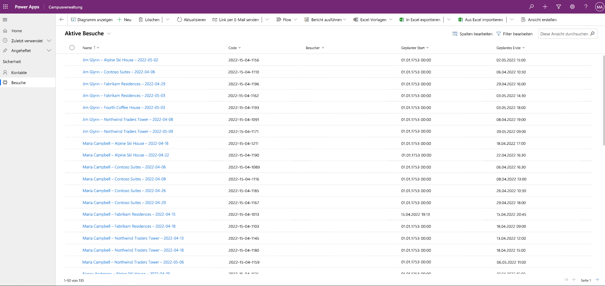

---
lab:
  title: 'Lab 3: So erstellen Sie eine modellgesteuerte App'
  module: 'Module 3: Get started with Power Apps'
ms.openlocfilehash: c69ca883cc8f8c8b00ed3f67fb18f93b035726e3
ms.sourcegitcommit: 50e1a519a6893e02a4a0c2c6bef93cafd2513611
ms.translationtype: HT
ms.contentlocale: de-DE
ms.lasthandoff: 07/14/2022
ms.locfileid: "147125760"
---
# Modul 3: Erste Schritte mit Power Apps
## Lab: So erstellen Sie eine modellgesteuerte App

# Szenario

Das Bellows College ist eine Bildungsorganisation mit mehreren Gebäuden auf dem Campus. Campusbesucher werden derzeit auf Papier erfasst. Die Informationen werden nicht konsistent erfasst und es gibt keine Möglichkeit, Daten über die Besuche auf dem gesamten Campus zu sammeln und zu analysieren.

Die Campusverwaltung möchte ihr Besucherregistrierungssystem modernisieren, wobei der Zugang zu den Gebäuden von Sicherheitspersonal kontrolliert werden soll und alle Besuche von den entsprechenden Gastgebern zuvor registriert und aufgezeichnet werden müssen.

Während dieses Kurses erstellen Sie Anwendungen und führen eine Automatisierung durch, damit das Verwaltungs- und Sicherheitspersonal des Bellows College den Zugang zu den Gebäuden auf dem Campus verwalten und kontrollieren kann.

In diesem Lab erstellen Sie eine modellgesteuerte Power Apps-App, mit der die Campus-Mitarbeiter im Backoffice die Besuchsdatensätze für den gesamten Campus verwalten können.

Weiterführende Schritte des Lab

Im Rahmen der Erstellung der modellgesteuerten App führen Sie Folgendes aus:

- Das Erstellen einer neuen modellgesteuerten App mit dem Namen „Campus Management“

- Bearbeiten der App-Navigation, um auf die erforderlichen Tabellen zu verweisen

- Anpassen der Formulare und Ansichten der erforderlichen Tabellen für die App

Wir werden mit folgenden Komponenten arbeiten:

- **Ansichten**: Mithilfe von Ansichten kann der Benutzer die vorhandenen Daten in Form einer Tabelle anzeigen.

- **Formulare**: Hier erstellt bzw. aktualisiert der Benutzer neue Zeilen in den Tabellen.

Beide werden für eine bessere Benutzererfahrung in die modellgesteuerte App integriert.

Voraussetzungen

- Abschluss von **Modul 0, Lab: Überprüfen der Laborumgebung**

- Abschluss von **Modul 2, Lab: Datenmodellierung**

- Abschluss von **Modul 3, Lab: Erstellen einer Canvas-App**

Vor dem Beginn zu beachtende Dinge

- Welche Änderungen sollten wir vornehmen, um die Benutzererfahrung zu verbessern?

- Was sollten wir auf der Grundlage des von uns erstellten Datenmodells in eine modellgesteuerte App aufnehmen?

- Welche Anpassungen können an der Seitenübersicht einer modellgesteuerten App vorgenommen werden?

Übung 1: Ansichten und Formulare anpassen

**Ziel**: In dieser Übung passen Sie Ansichten und Formulare der benutzerdefinierten erstellten Tabellen an, die in der modellgesteuerten App verwendet werden.

Aufgabe Nr. 1: Formular „Besuch bearbeiten“

1. Melden Sie sich bei [https://make.powerapps.com](https://make.powerapps.com/) an (falls Sie nicht bereits angemeldet sind).

2. Wählen Sie oben rechts Ihre **[Ihre Initialen] Übung** sumgebung aus, falls diese noch nicht ausgewählt ist.

3. Erweitern Sie im linken Navigationsbereich **Dataverse**, wählen Sie **Tabellen** aus, und klicken Sie auf Ihre Tabelle **Besuch**, um sie zu öffnen.

Wenn die Tabelle „Besuch“ nicht angezeigt wird, stellen Sie sicher, dass Sie sich in der richtigen Umgebung befinden (Schritt 2).

4. Wählen Sie in den „Datenfunktionen“-Abschnitten **Formulare** aus, und klicken Sie, um das Formular „Informationen“ mit dem **Hauptformulartyp** zu öffnen.

**WICHTIG:** Da alle Formulare standardmäßig „Information“ heißen, müssen Sie unbedingt überprüfen, ob das von Ihnen ausgewählte Formular den Formulartyp **Haupt** hat, und nicht einen anderen. Standardmäßig enthält das Formular zwei Felder: Name (Hauptfeld) und Besitzer.

5. Wählen Sie auf der rechten Seite des Bildschirms im Eigenschaftenpanel das Feld **Anzeigename** aus, und ändern Sie es in **Hauptinformation**.

6. Wählen Sie über das Menü am oberen Bildschirmrand **+ Formularfeld** aus, und fügen Sie unter dem Feld **Besitzer** die folgenden Felder hinzu, indem Sie Spalten in das Formular ziehen oder einfach auf Spaltennamen klicken:

    0. **Besucher**

    1. **Geplanter Start**

    2. **Geplantes Ende**

    3. **Actual Start (Tatsächlicher Start)**

    4. **Actual End (Tatsächliches Ende)**

7. Ziehen Sie die Spalte **Code**, und legen Sie sie im Formularkopf ab.

Die Kopfzeile ist der obere rechte Bereich des Formulars. Möglicherweise müssen Sie das Eigenschaftenpanel auf der rechten Seite des Bildschirms zuklappen, um das Feld im Formular anzuzeigen.

8. Aktivieren Sie bei weiterhin ausgewähltem Feld **Code** das Kontrollkästchen für **Schreibgeschützt** im Eigenschaftenpanel auf der rechten Seite.

9. Wählen Sie das Feld **Besitzer** aus. Ändern Sie im Eigenschaftenpanel die **Bezeichnung** in **Host**.

10. Klicken Sie oben rechts auf **Speichern**, und warten Sie, bis der Speichervorgang abgeschlossen ist.

11. Klicken Sie oben rechts auf **Veröffentlichen**, und warten Sie, bis die Veröffentlichung abgeschlossen ist.

12. Wenn die Bearbeitungsansicht auf einer neuen Browserregisterkarte oder in einem neuen Fenster geöffnet wurde, schließen Sie sie. Klicken Sie andernfalls oben links im Bildschirm auf **Zurück**. Sie sollten sich nun wieder auf der Registerkarte „Formulare“ für die Tabelle „Besuch“ befinden.

13. Sie verwenden die Breadcrumbs oben links (Tabellen > Besuchen > Formulare). Wählen Sie **Besuchen** aus, um zum Hauptbildschirm der Tabelle **Besuchen** zurückzukehren. 

Aufgabe Nr. 2: Bearbeiten der Ansicht „Aktive Besuche“

In dieser Aufgabe ändern wir die Standardansicht „Aktive Besuche“ und erstellen eine neue Ansicht für die heutigen Besuche.

1. Wählen Sie im Abschnitt „Datenfunktionen“  **Ansichten** aus, und klicken Sie, um die Ansicht **Aktive Besuche** zu öffnen.

2. Fügen Sie der Ansicht die folgenden Felder hinzu, indem Sie entweder auf die Felder klicken oder sie ziehen und ablegen:

    0. **Code**

    1. **Besucher**

    2. **Geplanter Start**

    3. **Geplantes Ende**

3. Klicken Sie auf die Spalte **Erstellt am**, und wählen Sie **Entfernen** aus. Das Feld **Erstellt am** wird nun aus der Ansicht entfernt.

4. Passen Sie die Größe der einzelnen Spaltenbreiten an die Daten an.

5. Klicken Sie auf **Speichern** und warten Sie, bis die Änderungen gespeichert sind.

6. Klicken Sie auf **Veröffentlichen** und warten Sie, bis die Veröffentlichung abgeschlossen ist.

Aufgabe 3: Erstellen einer neuen Ansicht für heutige Besuche

Jetzt werden wir die Ansicht klonen, um eine neue Ansicht für die heutigen Besuche zu erstellen.

WICHTIG: Stellen Sie sicher, dass Sie die Ansicht „Aktive Besuche“ nicht schließen, da wir sie nutzen werden, um die neue Ansicht der heutigen Besuche zu erstellen. 

1. Klicken Sie auf den **Dropdownpfeil** neben der Schaltfläche „Speichern“ (achten Sie darauf, dass Sie nicht auf die Schaltfläche selbst klicken), und wählen Sie **Speichern unter** aus.

2. Ändern Sie den Namen in **Heutige Besuche**, und wählen Sie **Speichern** aus.

3. Klicken Sie im Eigenschaftenpanel auf den Link **Filter bearbeiten**.

4. Klicken Sie auf **Hinzufügen**, und wählen Sie **Zeile hinzufügen** aus.

5. Wählen Sie **Geplanter Start** als Feld aus, und wählen Sie dann im Dropdownmenü **Heute** als Bedingung aus.

6. Klicken Sie auf **...** . in der Zeile **Status**, und klicken Sie auf **Löschen**, um diese Filterbedingung zu löschen.

7. Klicken Sie auf **OK**, um die Bedingung zu speichern. Die Ansicht wird jetzt gefiltert, um nur Datensätze anzuzeigen, bei denen das geplante Startdatum heute liegt.

8. Fügen Sie der Ansicht die Felder **Tatsächlicher Start** und **Tatsächliches Ende** hinzu.

**Hinweis:** Da wir nicht mehr nach dem Ansichtsstatus filtern, erhalten wir alle heutigen Besuche, einschließlich der abgeschlossenen. Diese Felder helfen dabei, zwischen abgeschlossenen und laufenden Besuchen zu unterscheiden.

1. Klicken Sie auf **Speichern**.

2. Klicken Sie auf **Veröffentlichen** und warten Sie, bis die Veröffentlichung abgeschlossen ist.

Übung Nr. 2: Eine modellgesteuerte Anwendung erstellen

**Ziel**: In dieser Übung erstellen Sie die modellgesteuerte App, passen die Sitemap an und testen die App.

Zur Vereinfachung und Kürzung behandeln wir einige der „Besuch“-Spalten in diesem Lab nicht.

Aufgabe Nr. 1: Anwendung erstellen

1. Melden Sie sich bei [https://make.powerapps.com](https://make.powerapps.com/) an (falls Sie nicht bereits angemeldet sind).

2. Wählen Sie oben rechts Ihre **[Ihre Initialen] Übung** sumgebung aus, falls diese noch nicht ausgewählt ist.

3. Erstellen der modellgesteuerten Anwendung:

    0. Wählen Sie **Leere App** im Abschnitt **Beginnen mit** des Startbildschirms aus.

    1. Wählen Sie unter **Leere App basierend auf Dataverse** die Option **Erstellen** aus.

    2. Geben Sie **Bellows Campusverwaltung** als „Name“ ein, und wählen Sie **Erstellen** aus.

4. Nachdem Ihre neue modellgesteuerte Anwendung geladen wurde, wählen Sie die Schaltfläche **Seite hinzufügen** aus.

5. Wählen Sie im Bildschirm „Seite hinzufügen“ die Option **Tabellenbasierte Ansicht und Formular** aus, und wählen Sie dann die Schaltfläche **Weiter** aus.

6. Fügen Sie die folgenden Tabellen hinzu:

    0. Navigieren Sie zu folgendem Pfad.

    1. Contact

7. Nachdem Sie die 2 Tabellen ausgewählt haben, wählen Sie **Hinzufügen** aus.

8. Wählen Sie mithilfe der Navigationssymbole auf der linken Seite des Bildschirms **Navigation** aus.

9. Wählen Sie im Navigationsbereich unterhalb der Bezeichnung „Navigationsleiste“ den Text **Gruppe 1** aus.

10. Ändern Sie auf der rechten Seite des Bildschirms im Abschnitt **Anzeigeoptionen** die Eigenschaft **Titel** in **Sicherheit**.

Aufgabe Nr. 2: Bearbeiten Ihrer App

Nachdem wir nun Ihrer modellgesteuerten Anwendung alle erforderlichen Komponenten hinzugefügt haben, organisieren wir nun Elemente.

1. Wählen Sie im Navigationsbereich unter der Gruppe „Sicherheit“ **SubArea1** aus.

2. Wählen Sie die **Auslassungspunkte** aus, und wählen Sie im angezeigten Menü **SubArea1 entfernen** aus.

3. Wählen Sie in der Navigation auf der linken Seite des Bildschirms **Seiten** aus.

4. Suchen und erweitern Sie **Besuch** im Bereich „Seiten“.

5. Wählen Sie **Besuchsformular** aus.

6. Wählen Sie auf der rechten Seite des Bildschirms **Formular hinzufügen** aus.

7. Wählen Sie das Formular **Hauptinformationen** aus.

8. Wählen Sie unter **Besuch** im Bereich „Seiten“ die Option **Besuchsansicht** aus.

9. Wählen Sie auf der rechten Seite des Bildschirms **Ansicht hinzufügen** aus.

10. Wählen Sie die Ansicht **Heutige Besuche** aus.

11. Wählen Sie erneut **Ansicht hinzufügen** aus. 

12. Wählen Sie die Ansicht **Aktive Besuche** aus. 

13. Wählen Sie **Speichern** aus.

14. Nachdem der **Speicher** vorgang abgeschlossen wurde, wählen Sie die Schaltfläche **Veröffentlichen** aus, um Ihre Änderungen zu veröffentlichen.

Aufgabe 3: Testanwendung

1. Starten der Anwendung

    0. Wählen Sie **Wiedergeben** aus, um Ihre App in einem neuen Fenster zu öffnen.

2. Erstellen Sie einen neuen Kontakt.

    0. Die App sollte in der Ansicht **Meine aktiven Kontakte** geöffnet werden. Wenn dies nicht der Fall ist, wählen Sie links „Kontakte“ aus.

    1. Klicken Sie im oberen Menü auf **Neu**.

    2. Geben Sie als **Vornamen** Herbert und als Nachnamen **Dorner** an.

    3. Geben Sie unter **E-Mail** Ihre persönliche E-Mail-Adresse an. Sie wird in einem zukünftigen Lab verwendet, in dem Sie eine E-Mail erhalten.

    4. Klicken Sie auf **Speichern und schließen**.

    5. Sie sollten nun den erstellten Kontakt in der Ansicht **Aktive Kontakte** sehen.

3. Erstellen Sie einen neuen Besuch.

    0. Wählen Sie **Besuche** in der Siteübersicht aus.

    1. Klicken Sie auf **Neu**.

    2. Füllen Sie die Felder folgendermaßen aus:

        0. **Name:** Neuer Testbesuch

        1. **Besucher**: Wählen Sie Max Mustermann aus

        2. **Geplanter Start**: Wählen Sie das morgige Datum und 14:00 Uhr als Startzeit aus

        3. **Geplantes Ende**: Wählen Sie das morgige Datum und 15:30 Uhr als Endzeit aus

- Klicken Sie auf **Speichern und schließen**. Der Besuch wird erstellt und sollte in der Ansicht für aktive Besuche zu sehen sein.

- Ändern Sie die Ansicht in **Heutige Besuche**. Sie sollten den neuen Besuch nicht mehr in der Ansicht sehen, da er für morgen geplant ist.

4. Sie können weitere Testdatensätze hinzufügen.

Ihre ausgeführte App sollte ungefähr so aussehen:

Herzlichen Glückwunsch! Sie haben Ihre erste modellgesteuerte App erstellt und konfiguriert.

# Herausforderungen

-   Auswählen spezifischer Ansichten und Formulare für Kontakte
