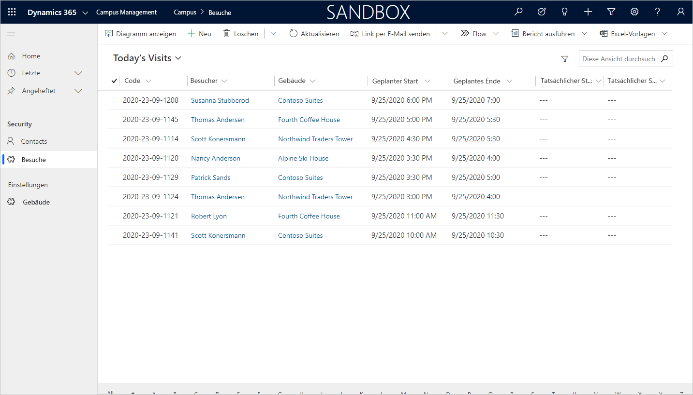

---
lab:
  title: 'Lab 4: So erstellen Sie eine modellgesteuerte App'
  module: 'Module 3: Get started with Power Apps'
ms.openlocfilehash: e0fcc3a12bb54b7fca08e41599d999b3e38eee23
ms.sourcegitcommit: ef58c858463b890e923ef808b1d43405423943fd
ms.translationtype: HT
ms.contentlocale: de-DE
ms.lasthandoff: 01/27/2022
ms.locfileid: "137898980"
---
# Modul 3: Erste Schritte mit Power Apps
## Lab 3: So erstellen Sie eine modellgesteuerte App

# Szenario

Das Bellows College ist eine Bildungsorganisation mit mehreren Gebäuden auf dem Campus. Campusbesucher werden derzeit auf Papier erfasst. Die Informationen werden nicht konsistent erfasst und es gibt keine Möglichkeit, Daten über die Besuche auf dem gesamten Campus zu sammeln und zu analysieren. 

Die Campusverwaltung möchte ihr Besucherregistrierungssystem modernisieren, wobei der Zugang zu den Gebäuden von Sicherheitspersonal kontrolliert werden soll und alle Besuche von den entsprechenden Gastgebern zuvor registriert und aufgezeichnet werden müssen.

Während dieses Kurses erstellen Sie Anwendungen und führen eine Automatisierung durch, damit das Verwaltungs- und Sicherheitspersonal des Bellows College den Zugang zu den Gebäuden auf dem Campus verwalten und kontrollieren kann. 

In diesem Lab erstellen Sie eine modellgesteuerte Power Apps-App, mit der die Campus-Mitarbeiter im Backoffice die Besuchsdatensätze für den gesamten Campus verwalten können.

# Weiterführende Schritte des Lab

Im Rahmen der Erstellung der modellgesteuerten App führen Sie Folgendes aus:

-   Das Erstellen einer neuen modellgesteuerten App mit dem Namen „Campus Management“

-   Bearbeiten der App-Navigation, um auf die erforderlichen Tabellen zu verweisen

-   Anpassen der Formulare und Ansichten der erforderlichen Tabellen für die App

Wir werden mit folgenden Komponenten arbeiten:

- **Ansichten**: Mithilfe von Ansichten kann der Benutzer die vorhandenen Daten in Form einer Tabelle anzeigen.

- **Formulare**: Hier erstellt bzw. aktualisiert der Benutzer neue Zeilen in den Tabellen.

Beide werden für eine bessere Benutzererfahrung in die modellgesteuerte App integriert.

## Voraussetzungen

* Beendigung von **Modul 0 Lab 0 – Lab-Umgebung überprüfen**
* Beendigung von **Modul 2 Lab 1 – Einführung in Microsoft Dataverse**

## Vor dem Beginn zu beachtende Dinge

-   Welche Änderungen sollten wir vornehmen, um die Benutzererfahrung zu verbessern?

-   Was sollten wir auf der Grundlage des von uns erstellten Datenmodells in eine modellgesteuerte App aufnehmen?
    
-   Welche Anpassungen können an der Seitenübersicht einer modellgesteuerten App vorgenommen werden?

# Übung 1: Ansichten und Formulare anpassen

**Ziel**: In dieser Übung passen Sie Ansichten und Formulare der benutzerdefinierten erstellten Tabellen an, die in der modellgesteuerten App verwendet werden.

## Aufgabe 1: Formular „Besuch bearbeiten“

1.  Melden Sie sich bei <https://make.powerapps.com> an (falls Sie nicht bereits angemeldet sind).

2.  Wählen Sie Ihre **Umgebung** aus.

3.  Wählen Sie **Projektmappen** aus.

4.  Klicken Sie, um Ihre **Campusverwaltungslösung** zu öffnen.

5.  Klicken Sie, um die Entität **Besuch** zu öffnen.

6.  Wählen Sie die Registerkarte **Formulare** sowie den **Hauptformulartyp** aus, und klicken Sie auf **Formular bearbeiten**.

    > Standardmäßig enthält das Formular zwei Felder: Name (Hauptfeld) und Besitzer.
    
7.  Wählen Sie **+ Formularfeld** aus, und fügen Sie unter dem Feld **Besitzer** die folgenden Felder hinzu, indem Sie Spalten in das Formular ziehen oder einfach auf Spaltennamen klicken:

    * **Building (Gebäude)**
    * **Besucher**
    * **Geplanter Start**
    * **Geplantes Ende**
    * **Actual Start (Tatsächlicher Start)**
    * **Actual End (Tatsächliches Ende)** 
    
8.  Ziehen Sie die Spalte **Code**, und legen Sie sie im Formularkopf ab. 

    > Die Kopfzeile ist der obere rechte Bereich des Formulars. Möglicherweise müssen Sie das Eigenschaftenpanel auf der rechten Seite des Bildschirms minimieren, um das Feld im Formular anzuzeigen.

9.  Aktivieren Sie bei weiterhin ausgewählten Feld **Code** das Kontrollkästchen für **Schreibgeschütztes Feld** im Eigenschaftenpanel.

10.  Wählen Sie das Feld **Besitzer** aus. Ändern Sie im Eigenschaftenpanel die **Feldbezeichnung** in **Host**.

11.  Klicken Sie oben rechts auf **Speichern**, und warten Sie, bis der Speichervorgang abgeschlossen ist.

12.  Klicken Sie oben rechts auf **Veröffentlichen**, und warten Sie, bis die Veröffentlichung abgeschlossen ist.

13.  Schließen Sie die Registerkarte, wenn die Bearbeitungsansicht in einer neuen Registerkarte angezeigt wird. Klicken Sie andernfalls oben links im Bildschirm auf **Zurück**. Sie sollten sich nun wieder auf der Registerkarte „Formulare“ für die Entität „Besuch“ befinden.

## Aufgabe 2: Besuchsansichten bearbeiten

In dieser Aufgabe ändern wir die Standardansicht „Aktive Besuche“ und erstellen eine neue Ansicht für die heutigen Besuche.

1.  Wählen Sie die Registerkarte **Ansichten** aus, und klicken Sie auf die Ansicht **Aktive Besuche**, um diese zu öffnen.

2.  Fügen Sie der Ansicht die folgenden Felder hinzu, indem Sie entweder auf die Felder klicken oder sie ziehen und ablegen:

    *  **Code**
    *  **Besucher**
    *  **Building (Gebäude)**
    *  **Geplanter Start** 
    *  **Geplantes Ende**
    
3.  Klicken Sie auf die Spalte **Erstellt am**, und wählen Sie **Entfernen** aus. Das Feld **Erstellt am** wird nun aus der Ansicht entfernt.

4.  Klicken Sie auf die Spalte **Name**, und wählen Sie dann **Entfernen** aus. Das Feld **Name** wird nun aus der Ansicht entfernt.

5.  Klicken Sie im Eigenschaftenpanel rechts auf **Sortieren nach...** , und wählen Sie **Geplanter Start** aus. Klicken Sie erneut auf **Geplanter Start**, um die Reihenfolge in „absteigend“ zu ändern.

6.  Passen Sie die Größe der einzelnen Spaltenbreiten an die Daten an.

7.  Klicken Sie auf **Speichern** und warten Sie, bis die Änderungen gespeichert sind.

8.  Klicken Sie auf **Veröffentlichen** und warten Sie, bis die Veröffentlichung abgeschlossen ist.

Jetzt werden wir die Ansicht klonen, um eine neue Ansicht für die heutigen Besuche zu erstellen.

9.  Drücken Sie im Eigenschaftenpanel auf den Link **Filter bearbeiten**.

10.  Klicken Sie auf **Hinzufügen**, und wählen Sie **Zeile hinzufügen** aus.

11.  Wählen Sie **Geplanter Start** als Feld aus, und wählen Sie dann im Dropdownmenü **Heute** als Bedingung aus. 

12.  Klicken Sie in der Zeile **Status** auf **[...]** und dann auf **Löschen**. 

13.  Klicken Sie auf **OK**, um die Bedingung zu speichern. Die Ansicht wird jetzt gefiltert, um nur Datensätze anzuzeigen, bei denen das geplante Startdatum heute liegt.

14.  Fügen Sie der Ansicht die Felder **Tatsächlicher Start** und **Tatsächliches Ende** hinzu. 

    > **Hinweis:** Da wir nicht mehr nach dem Ansichtsstatus filtern, erhalten wir alle heutigen Besuche, einschließlich der abgeschlossenen. Diese Felder helfen dabei, zwischen abgeschlossenen und laufenden Besuchen zu unterscheiden.

15.  Klicken Sie auf den **Dropdownpfeil** neben der Schaltfläche „Speichern“ (achten Sie darauf, dass Sie nicht auf die Schaltfläche selbst klicken), und wählen Sie **Speichern unter** aus.

16.  Ändern Sie den Namen in **Heutige Besuche** und drücken Sie auf **Speichern**.

17.  Klicken Sie auf **Veröffentlichen** und warten Sie, bis die Veröffentlichung abgeschlossen ist.

# Übung 2: Eine modellgesteuerte Anwendung erstellen

**Ziel**: In dieser Übung erstellen Sie die modellgesteuerte App, passen die Sitemap an und testen die App.

> Beim Erstellen Ihrer Anwendung werden mehrere Felder angezeigt, um die Sie sich nicht gekümmert haben, insbesondere bei den Schritten für die Siteübersicht. Für die Labs haben wir einige Abkürzungen vorgenommen. In einer realen Implementierung würden Sie diesen Elementen logische Namen geben.

## Aufgabe 1: Anwendung erstellen

1.  Öffnen Sie soweit noch nicht geschehen die Campusverwaltung-Lösung.

    -   Melden Sie sich bei <https://make.powerapps.com> an.

    -   Während Sie in Ihrer Umgebung sind, klicken Sie auf Ihre **Campusverwaltung**-Lösung, um sie zu öffnen.
    
2.  Eine modellgesteuerte Anwendung erstellen

    -   Klicken Sie auf **Neu**, und wählen Sie **App** und dann **modellgesteuerte App** aus.
    
    -   Klicken Sie auf dem Bildschirm zum Erstellen einer modellgesteuerten App aus einer leeren Vorlage auf **Erstellen**.
    
    -   Geben Sie **[Ihr Nachname] Campusverwaltung** als Namen ein.

    -   Aktivieren Sie das Kontrollkästchen **Vorhandene Lösung zum Erstellen der App verwenden** aus

    -   Wählen Sie **Weiter** aus.

    -   Wählen Sie Ihre **Campusverwaltung**-Lösung aus.
    
    -   Klicken Sie auf **Fertig**.
    
3.  Klicken Sie auf das Stiftsymbol neben **Siteübersicht.**

4.  Bearbeiten Sie die Standardtitel

    -   Wählen Sie **Neuer Bereich** aus.

    -   Ändern Sie den Titel von „Neuer Bereich“ im Eigenschaftenbereich rechts in **Campus**.

    -   Klicken Sie auf **Neue Gruppe**.

    -   Ändern Sie den Titel von „Neue Gruppe“ im Eigenschaftenbereich rechts in **Sicherheit**.
    
5.  Fügen Sie die Tabelle „Kontakt“ zur Siteübersicht hinzu.

    -   Klicken Sie auf **Neuer Unterbereich**.

    -   Wählen Sie im Bereich **Eigenschaften** die Option **Entität** aus der Dropdownliste für **Typ** aus.

    -   Suchen Sie in der Dropdownliste für **Entität** nach der Tabelle **Kontakt**.
    
6.  Fügen Sie die Tabelle „Besuch“ zur Siteübersicht hinzu.

    -   Wählen Sie die Gruppe **Sicherheit** aus, und klicken Sie auf **Hinzufügen**.

    -   Wählen Sie **Teilbereich** aus.

    -   Wechseln Sie zum Bereich **Eigenschaften**.

    -   Wählen Sie **Entität** in der Dropdownliste für **Typ** aus, und suchen Sie in der Dropdownliste für **Entität** nach der Tabelle **Besuch**.
    
7.  Fügen Sie die Tabelle „Gebäude“ zur Siteübersicht hinzu.

    -   Wählen Sie den **Campus**-Bereich aus, und klicken Sie auf **Hinzufügen**.
    
    -   Wählen Sie **Gruppe** aus.
    
    -   Geben Sie **Einstellungen** als den **Titel** im Bereich **Eigenschaften** ein.
    
    -   Klicken Sie bei weiterhin ausgewählter Gruppe **Einstellungen** auf **Hinzufügen**.
    
    -   Wählen Sie **Teilbereich** aus.
    
    -   Wechseln Sie zum Bereich **Eigenschaften**.
    
    -   Wählen Sie **Entität** in der Dropdownliste für **Typ** aus, und suchen Sie in der Dropdownliste für **Entität** nach der Tabelle **Gebäude**.

8.  Klicken Sie auf **Speichern**. Während des Speicherns der Änderungen wird das Ladebild angezeigt.

9.  Klicken Sie auf **Veröffentlichen**, und warten Sie, bis die Veröffentlichung der Siteübersicht abgeschlossen ist.

10.  Klicken Sie auf **Speichern und schließen**, um den Siteübersicht-Editor zu schließen. 

    > Die Assets für die Entitäten, die der Siteübersicht hinzugefügt wurden, sind jetzt in der Anwendung vorhanden.
     
11.  Klicken Sie im App-Designer auf **Speichern**.

12.  Klicken Sie auf **Überprüfen**, um die in der Anwendung vorgenommenen Änderungen zu überprüfen. 

    >  Es werden einige Warnungen angezeigt, die wir aber ignorieren können, da wir nicht auf eine bestimmte Ansicht und ein bestimmtes Formular für die Entitäten verwiesen haben und die Benutzer Zugriff auf alle Ansichten und Formulare für die Entitäten **Besuch** und **Gebäude** haben.
     
13. Klicken Sie auf **Veröffentlichen**.

14.  Klicken Sie auf **Speichern und schließen**, um den App-Designer zu schließen.

15.  Klicken Sie auf **Fertig**.

16.  Wählen Sie **Lösungen** und **Alle Anpassungen veröffentlichen** aus.

17.  Wählen Sie **Apps** aus. Ihre Anwendung sollte jetzt aufgelistet werden.

## Aufgabe 2: Testanwendung

1.  Starten der Anwendung

    -   Wählen Sie **Apps** aus, und klicken Sie auf Ihre **Campusverwaltung**-App. (Wenn Sie Ihre App anfangs nicht sehen, müssen Sie möglicherweise Ihren Browser aktualisieren.)

    -   Die Anwendung sollte in einem neuen Fenster geöffnet werden.
    
2.  Erstellen Sie einen neuen Kontakt.

    -   Die App sollte mit der Ansicht **Aktive Kontakte** geöffnet werden

    -   Klicken Sie im oberen Menü auf **Neu**.

    -   Geben Sie als **Vorname** „`John`“ und als **Nachname** „`Doe`“ an.

    -   Geben Sie unter **E-Mail** Ihre persönliche E-Mail-Adresse an. Dies wird in einem zukünftigen Lab verwendet. 
    
    -   Klicken Sie auf **Speichern und schließen**.

    -   Sie sollten nun den erstellten Kontakt in der Ansicht **Aktive Kontakte** sehen.
    
3.  Erstellen Sie ein neues Gebäude.

    -   Wählen Sie aus der Siteübersicht **Gebäude** aus.

    -   Klicken Sie auf **Neu**.

    -   Geben Sie `Microsoft Building` als **Name** ein.
        
    -   Klicken Sie auf **Speichern und schließen**. Dadurch wird der neu erstellte Datensatz in der Ansicht für aktive Gebäude angezeigt.
    
4.  Erstellen Sie einen neuen Besuch.

    -   Wählen Sie **Besuche** in der Siteübersicht aus.
    
    -   Klicken Sie auf **Neu**.
    
    -   Füllen Sie die Felder folgendermaßen aus: 
    
        -   **Name**: `New test visit`
        -   **Gebäude**: Alpine Ski House
        -   **Besucher**: Wählen Sie Max Mustermann aus
        -   **Geplanter Start**: Wählen Sie das morgige Datum und 14:00 Uhr als Startzeit aus
        -   **Geplantes Ende**: Wählen Sie das morgige Datum und 15:30 Uhr als Endzeit aus
        
    -   Klicken Sie auf **Speichern und schließen**. Der Besuch wird erstellt und sollte in der Ansicht für aktive Besuche zu sehen sein.
        
    -   Ändern Sie die Ansicht in **Heutige Besuche**. Sie sollten den neuen Besuch nicht mehr in der Ansicht sehen, da er für morgen geplant ist.
    
5. Sie können weitere Testdatensätze hinzufügen.

   Ihre ausgeführte App sollte ungefähr so aussehen:

# Herausforderungen

* Spezifische Ansichten und Formulare für Besuche und Gebäude auswählen
* Das Sicherheitspersonal arbeitet üblicherweise in einem einzigen Gebäude. Welche einfache Möglichkeit könnten Sie ihnen bieten, Besuche nur für ein ausgewähltes Gebäude anzuzeigen?
* Den Zugriff auf bestimmte Entitäten beschränken, z. B. sollte „Gebäude“ für alle Mitarbeiter außer den Administratoren schreibgeschützt sein
* Welche Dashboards würden Sie der App hinzufügen?
