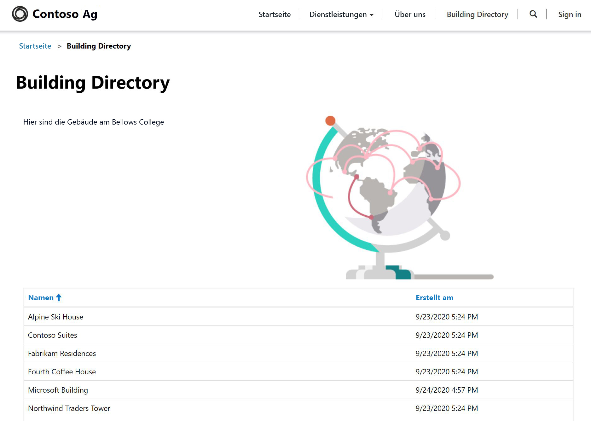

---
lab:
    title: 'Lab 5: Erstellen eines Power Apps-Portals'
    module: 'Modul 3: Erste Schritte mit Power Apps'
---

# Modul 3: Erste Schritte mit Power Apps

## Lab 4: Erstellen eines Power Apps-Portals

# Szenario

Das Bellows College ist eine Bildungsorganisation mit mehreren Gebäuden auf dem Campus. Campusbesuche werden derzeit in Papierzeitschriften aufgezeichnet. Die Informationen werden nicht konsistent erfasst und es gibt keine Möglichkeit, Daten über die Besuche auf dem gesamten Campus zu sammeln und zu analysieren.

Die Campusverwaltung möchte den Besuchern Informationen über die Gebäude auf dem Campus zur Verfügung stellen. Besucher können die Gebäudeliste auf einer Website anzeigen, die mithilfe eines Power Apps-Portals erstellt wird.

In diesem Lab stellen Sie ein Power Apps-Portal bereit und erstellen eine Portalwebseite, auf der eine Liste der Gebäude auf dem Campus angezeigt wird.

# Weiterführende Schritte des Lab

Sie halten sich beim Design des Power Apps-Portals an die nachstehende Gliederung:

* Ein Power Apps-Portal in der Dataverse-Umgebung bereitstellen
* Eine Webseite erstellen und konfigurieren, die eine Liste der Gebäude anzeigt
* Ein neues Design erstellen und auf das Portal anwenden

## Voraussetzungen

* Beendigung von **Modul 0 Lab 0 – Lab-Umgebung überprüfen**
* Beendigung von **Modul 2 Lab 1 – Einführung in Microsoft Dataverse**

## Vor dem Beginn zu beachtende Dinge

* Power Apps-Portale-Apps werden immer anhand einer Vorlage anstelle einer leeren Anwendung gestartet. Ihr Portal sollte in Modul 0 – Lab 0 erstellt worden sein. Wenn Sie ein Portal bereitstellen, enthält es bereits Seiten, Menüs und ein Standarddesign. 

# Übung 1: Eine Portal-Webseite erstellen

**Ziel:** In dieser Übung erstellen Sie eine neue Webseite, auf der statische Inhalte sowie eine Liste der Gebäude aus Dataverse angezeigt werden.

## Aufgabe 1: Navigieren Sie zum Portal

1.  Navigieren Sie zu <https://make.powerapps.com>.

2.  Überprüfen Sie, ob Sie sich in der Übungsumgebung befinden. Wenn dies nicht der Fall ist, ändern Sie die Umgebung in der oberen rechten Ecke.

3.  Klicken Sie auf **Apps**

4.  Suchen Sie die App mit dem **Typ** **Portal**

5.  Klicken Sie auf den Namen der App, um das Portal zu öffnen.

    > Sie sollten zur Landing Page Ihre Portalwebsite mit einer Begrüßungsnachricht weitergeleitet werden. Navigieren Sie in Ihrem Portal, um herauszufinden, welche Elemente beim Bereitstellen des Portals standardmäßig erstellt wurden. 

## Aufgabe 2: Eine Webseite erstellen

1.  Öffnen Sie Power Apps-Portale Studio

    -   Melden Sie sich bei <https://make.powerapps.com> an (möglicherweise ist dies noch auf Ihren Registerkarten geöffnet)

    -   Wählen Sie **Apps** aus.
    
    -   Suchen Sie die App mit dem **Typ** **Portal**

    -   Klicken Sie auf die Schaltfläche mit den Auslassungspunkten (**...**) rechts neben dem Namen der Portal-App, und wählen Sie **Bearbeiten** aus.

    > Sie befinden sich jetzt in Power Apps-Portale Studio. Hier können Sie Portalinhalte ändern und erstellen.

2.  Erstellen Sie eine neue Seite

    -   Wählen Sie auf der Befehlsleiste **Neue Seite** aus

    -   Die **Startseite** auswählen

3.  Ändern Sie im Eigenschaftenbereich unter **Anzeige** den **Namen** von **Neue Seite (1)** in `Building Directory` um.

4.  Ändern Sie den Wert in der **Teil-URL** in `building-directory` um, und drücken Sie die TAB-TASTE (um den automatischen Speichervorgang zu starten).

    > Der Titel der Seite sollte jetzt **Gebäudeverzeichnis** lauten
    
## Aufgabe Nr. 3: Statischen Inhalt hinzufügen

1.  Fügen Sie der Webseite einen neuen Abschnitt hinzu

    -   Wählen Sie auf der Canvas (Bereich, der die Webseite zeigt) einen Abschnitt der Seite aus, der keine Säule ist.

    -   Wählen Sie auf dem Toolbelt (linke Seite) das Symbol **Komponenten** aus

    -   Wählen Sie aus dem Bereich **Abschnittslayout** die Option **Abschnitt mit zwei Spalten** aus

2.  Statischen Text hinzufügen

    -   Wählen Sie auf der Canvas (Bereich, der die Webseite zeigt) die linke Spalte aus

    -   Wählen Sie auf dem Toolbelt (linke Seite) das Symbol **Komponenten** aus

    -   Wählen Sie aus dem Bereich **Portalkomponenten** die Option **Text** aus

    -   Geben Sie im neuen Textbereich folgenden Text ein:
          ```
          The following is the building directory.
          ```
    -   Wählen Sie das Textfeld über dem gerade bearbeiteten Textfeld aus, und klicken Sie in der Befehlsleiste auf **Löschen**, um den Standardtext zu entfernen.

3. Ein Bild hinzufügen

    -   Wählen Sie auf der Canvas (Bereich, der die Webseite zeigt) die rechte Spalte aus

    -   Wählen Sie auf dem Toolbelt (linke Seite) das Symbol **Komponenten** aus

    -   Wählen Sie aus dem Bereich **Portalkomponenten** die Option **Bild** aus

    - Klicken Sie im Eigenschaftenbereich auf **Ein Bild auswählen**. Suchen und wählen Sie die Seite **Pages.png**
    
    -   Klicken Sie im Eigenschaftenbereich auf die Dropdownliste des Abschnitts **Formatierung**, und ändern Sie die **Breite** in 70 % (geben Sie unbedingt „%“ ein). Sie können verschiedene Bildgrößen ausprobieren, bis alles wunschgemäß aussieht.

4.  Konfigurieren Sie Rechte, um die Gebäudeliste anzuzeigen 

    -   Klicken Sie im linken Menü auf Einstellungen (Zahnradsymbol) und wählen Sie **Mehr Einstellungen anzeigen**. Dadurch werden zusätzliche Einstellungen in einer neuen Registerkarte geöffnet.

    -   Scrollen Sie im linken Menü herunter zu **Sicherheit** und wählen Sie **Tabellenberechtigungen** aus.

    -   Klicken Sie auf **Neu** und fügen Sie folgende Werte hinzu:

        -   **Name**: Gebäudeliste anzeigen
        -   **Tabellennamen**: Wählen Sie in der Dropdownliste auf der rechte Seite „Gebäude“ (bc_building) aus
        -   **Website**: Klicken Sie auf die Bildschirmlupe und wählen Sie Ihre Website aus (Bellows College-Besucher – [Ihre Benennung])
        -   **Zugriffstyp**: Global
        -   **Rechte**: Lesen
    
    -   Wählen Sie oben im Menü **Speichern** aus.
    
    -   Scrollen Sie hinunter zum Abschnitt **Webrollen** und **Vorhandene Webrolle hinzufügen**.
    
    -   Klicken Sie auf die Bildschirmlupe, wählen Sie **Anonyme Benutzer** und klicken Sie auf **Hinzufügen**.
    
    -   Wählen Sie oben im Menü **Speichern und Schließen** aus.
    
    -   Kehren Sie zur vorherigen Registerkarte zurück.

5.  Klicken Sie auf **Website durchsuchen** um die Seite, wie sie jetzt ist, anzuzeigen.  Beachten Sie, dass die Option **Gebäudeverzeichnis** jetzt im Hauptmenü verfügbar ist.

    > Möglicherweise müssen Sie Ihren Browser für die Zulassung von Popups konfigurieren.

## Aufgabe 4: Eine Listenkomponente hinzufügen

1.  Navigieren Sie zur vorherigen Registerkarte, und fahren Sie mit Schritt 2 fort. Falls nicht verfügbar, führen Sie die folgenden Schritte aus, um zu diesem Speicherort zurückkehren.

    -   Melden Sie sich bei <https://make.powerapps.com> an (möglicherweise ist dies noch auf Ihren Registerkarten geöffnet)

    -   Suchen Sie die App mit dem **Typ** **Portal**

    -   Klicken Sie auf die Schaltfläche mit den drei Punkten (**...**), und wählen Sie **Bearbeiten** aus
    
    -   Wählen Sie auf dem Toolbelt (linke Seite) die Option **Seiten** 

    -   Suchen und wählen Sie die Seite **Gebäudeverzeichnis**, die Sie zuvor erstellt haben
    
2.  Fügen Sie der Seite „Gebäudeverzeichnis“ eine Listenkomponente hinzu.

    -   Wählen Sie den Abschnitt mit zwei Spalten aus.

    -   Wählen Sie auf dem Toolbelt (linke Seite) das Symbol **Komponenten** aus

    -   Wählen Sie aus dem Bereich **Abschnittslayout** die Option **Einspaltiger Abschnitt** aus (ein Abschnitt wird unter dem Bild und dem Text auf der Webseite angezeigt)

    -   Wählen Sie den neuen Spaltenabschnitt auf der Canvas aus

    -   Wählen Sie auf dem Toolbelt (linke Seite) das Symbol **Komponenten** aus

    -   Wählen Sie aus dem Bereich **Portalkomponenten** die Option **Liste** aus (eine Listenkomponente wird im neuen Abschnitt angezeigt)
    
3.  Konfigurieren Sie die Listenkomponente

    -   Wählen Sie die Listenkomponente auf der Canvas aus

    -   Geben Sie im Eigenschaftenbereich (rechte Seite) im Feld **Name** die Zeichenfolge `Buildings List` ein.

    -   Wählen Sie aus der Dropdownliste im Feld **Tabelle** die Option **Gebäude (bc_building)** aus.

    -   In **Ansichten** wählen Sie **Aktive Gebäude** aus

    -   Behalten Sie die verbleibenden Standardeinstellungen bei
    
4.  Klicken Sie auf **Website durchsuchen**, um die Seite anzuzeigen. 

    > Die Liste der Gebäude aus der Dataverse-Datenbank sollte auf der Webseite angezeigt werden.

# Übung Nr. 2: Das Portaldesign ändern

**Ziel:** In dieser Übung erstellen Sie ein neues Design, das das Farbschema Ihres Portals ändert. 

## Aufgabe Nr. 1: Design anwenden und bearbeiten

1.  Navigieren Sie zur vorherigen Registerkarte, und fahren Sie mit Schritt 2 fort. Falls nicht verfügbar, führen Sie die folgenden Schritte aus, um zu diesem Speicherort zurückkehren.

    -   Melden Sie sich bei <https://make.powerapps.com> an (möglicherweise ist dies noch auf Ihren Registerkarten geöffnet)

    -   Suchen Sie die App mit dem **Typ** **Portal**

    -   Klicken Sie auf die Schaltfläche mit den drei Punkten (**...**), und wählen Sie **Bearbeiten** aus
    
2.  Wenden Sie ein Basisdesign an, und passen Sie es an

    -   Wählen Sie in der Werkzeugleiste (linke Seite) das Symbol **Designs** aus.
    
    -   Stellen Sie sicher, dass der Schalter für **Basisdesign aktivieren** auf Ein festgelegt haben.
    
    -   Klicken Sie in einer der Voreinstellungen auf die Schaltfläche mit den drei Punkten (**...**), und wählen Sie **Anpassen** aus
    
    -   Eine Kopie des Basisdesigns wurde erstellt. 
    
    -   Probieren Sie im Eigenschaftenbereich unterschiedliche Farben aus, und untersuchen Sie die Auswirkungen dieser Änderungen auf Ihr Portal.
    
    -   Benennen Sie Ihr Design um
    
3.  Klicken Sie auf der Befehlsleiste auf **Synchronisierungsdatei**.

Ihr App-Layout sollte etwa die folgende Struktur aufweisen:



# Herausforderungen

* Erstellen Sie eine andere Ansicht von „Gebäude“, in der nur der Gebäudename angezeigt wird. Sie müssen in Portal Studio **Website durchsuchen** auswählen, um die Änderungen anzuzeigen.
* Klicken Sie im Toolbelt auf das Symbol **Designs**, und bearbeiten Sie das CSS Ihres benutzerdefinierten Designs.
* Erstellen Sie eine Seite mit der Komponente **Formular**, und ändern Sie eine Komponente **Liste**, um Dataverse-Zeilen mit dem Formular hinzuzufügen oder zu bearbeiten.
* Aktivieren Sie **Entitätsberechtigungen** für die **Einstellungen** einer Komponente **Liste**. Was geschieht mit den Daten?
* Wählen Sie in Portal Studio das Quellcode-Editor-Symbol `</>` aus, um die Seitenquelle anzuzeigen. Wenn Sie mit HTML vertraut sind, nehmen Sie einige Änderungen vor, und zeigen die Ergebnisse an.
