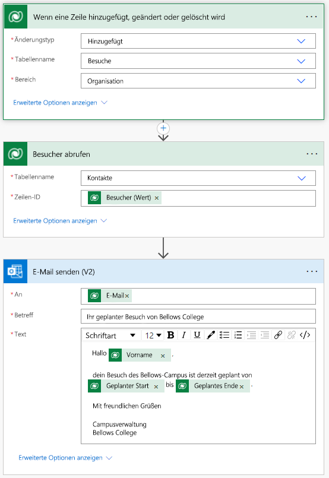

---
lab:
  title: "Lab\_4: Erstellen einer automatisierten Lösung"
  module: 'Module 4: Get Started with Power Automate'
---

# Lab 4: Erstellen einer automatisierten Lösung

**WWL-Mandanten – Nutzungsbedingungen** Wenn Ihnen im Rahmen einer Präsenzschulung ein Mandant zugewiesen worden ist, steht dieser für Praxislabs innerhalb der Präsenzschulung zur Verfügung. Mandanten sollten nicht für Zwecke außerhalb von Praxislabs freigegeben oder verwendet werden. Der in diesem Kurs verwendete Mandant ist ein Testmandant; er kann nach Abschluss des Kurses nicht verwendet oder erreicht werden und ist nicht für Erweiterungen geeignet. Mandanten dürfen nicht in ein kostenpflichtiges Abonnement konvertiert werden. Die im Rahmen dieses Kurses erworbenen Mandanten verbleiben im Eigentum der Microsoft Corporation, und wir behalten uns das Recht vor, jederzeit auf Mandanten zuzugreifen und diese zurückzuziehen. 

## Szenario

Das Bellows College ist eine Bildungsorganisation mit mehreren Gebäuden auf dem Campus. Campusbesucher werden derzeit auf Papier erfasst. Die Informationen werden nicht konsistent erfasst und es gibt keine Möglichkeit, Daten über die Besuche auf dem gesamten Campus zu sammeln und zu analysieren.

Die Campusverwaltung möchte ihr Besucherregistrierungssystem modernisieren, wobei der Zugang zu den Gebäuden von Sicherheitspersonal kontrolliert werden soll und alle Besuche von den entsprechenden Gastgebern zuvor registriert und aufgezeichnet werden müssen.

Während dieses Kurses erstellen Sie Anwendungen und führen eine Automatisierung durch, damit das Verwaltungs- und Sicherheitspersonal des Bellows College den Zugang zu den Gebäuden auf dem Campus verwalten und kontrollieren kann.

In diesem Lab erstellen Sie einen Power Automate-Flow, um einem Besucher per E-Mail mitzuteilen, wenn ein Besuch geplant ist.

## Weiterführende Schritte des Lab

Sie müssen die folgenden Anforderungen implementieren, um das Projekt abzuschließen.

- Kontakte müssen per E-Mail benachrichtigt werden, wenn ein Besuch geplant ist.

## Voraussetzungen

- Beendigung von **Modul 0 Lab 0 – Lab-Umgebung überprüfen**
- Abschluss von **Modul 2 Lab 1: Datenmodellierung**
- Abschluss von **Modul 2 Lab 3: Erstellen einer modellgesteuerten App**
- Der Kontakt „John Doe“ wurde mit einer aufgefüllten persönlichen E-Mail-Adresse erstellt.

## Übung 1: Einen Besuchsbenachrichtigungsfluss erstellen

**Ziel**: In dieser Übung erstellen Sie einen Power Automate-Flow, der die Anforderung implementiert. Dem Besucher sollte eine E-Mail gesendet werden, die den eindeutigen Code enthält, der dem Besuch zugewiesen ist, wenn ein Besuch erstellt wird.

### Aufgabe \#1: Erstellen eines Flows

1.  Navigieren Sie zu <https://make.powerapps.com>. Möglicherweise müssen Sie sich erneut authentifizieren. Klicken Sie dazu auf **Anmelden**, und folgen Sie den Anweisungen (falls erforderlich).

2.  Wählen Sie oben rechts Ihre **[Ihre Initialen] Übung**sumgebung aus, falls diese noch nicht ausgewählt ist.

3.  Wählen Sie im linken Navigationsbereich **Flows** aus.

4.  Wenn Sie dazu aufgefordert werden, wählen Sie **Erste Schritte** aus.

5.  Klicken Sie auf **Neuer Flow**, und wählen Sie **Automatisierter Cloud-Flow** aus.

6.  Geben Sie „Visit Notification“ (Besuchsbenachrichtigung) als **Flownamen** ein.

7.  Suchen Sie unter **Flowtrigger auswählen** nach **Dataverse**.

8.  Wählen Sie den Trigger **Wenn eine Zeile hinzugefügt, geändert oder gelöscht wird** aus, und klicken Sie dann auf **Erstellen**.

9.  Füllen Sie die Triggerbedingungen für den Flow auf:

    1.  Wählen Sie **Hinzugefügt** für **Änderungstyp** aus.

    2.  Wählen Sie **Besuche** als **Tabellenname** aus.

    3.  Wählen Sie im **Bereich** **Organisation** aus

    4.  Klicken Sie im Triggerschritt auf die Schaltfläche mit den Auslassungspunkten ( **...** ), und klicken Sie auf **Umbenennen**. Benennen Sie diesen Trigger in **„Wenn ein Besuch hinzugefügt wird“** um. Dies ist eine gute Vorgehensweise, damit Sie und andere Flow-Editoren den Zweck des Schritts erkennen können, ohne tiefer in die Details gehen zu müssen.

### Aufgabe \#2: Erstellen eines Schritts zum Abrufen der Besucherzeile

1.  Wählen Sie **+ Neuer Schritt**aus. Dieser Schritt ist erforderlich, um Besucherinformationen einschließlich der E-Mail-Adresse abzurufen.

2.  Suchen Sie nach **Dataverse**.

3.  Wählen Sie die Aktion **Zeile nach ID abrufen** aus.

4.  Wählen Sie **Kontakte** als **Tabellenname** aus.

5.  Wählen Sie das Feld **Zeilen-ID** aus. Beachten Sie, dass ein Fenster angezeigt wird, in dem Sie dynamische Inhalte oder Ausdrücke auswählen können.

6.  Fügen Sie im Feld **Zeilen-ID** den Eintrag **Besucher (Wert)** in der Liste für dynamische Inhalte aus. In diesem Schritt suchen Sie den Kontakt für die Zeile „Visit“, die erstellt wurde, um diesen Flow auszulösen. Da die E-Mail-Adresse Teil der Tabelle „Contact“ ist, benötigen Sie diese Informationen, um die E-Mail an die Besucher*innen zu senden.

7.  Klicken Sie bei dieser Aktion auf die Schaltfläche mit den Auslassungspunkten ( **...** ), und klicken Sie dann auf **Umbenennen**.
        Benennen Sie diese Aktion in **„Den Besucher abrufen“** um. Dies ist eine gute Vorgehensweise, damit Sie und andere Flow-Editoren den Zweck des Schritts erkennen können, ohne tiefer in die Details gehen zu müssen.

### Aufgabe \#3: Erstellen eines Schritts zum Senden einer E-Mail an den Besucher

1.  Klicken Sie auf **+ Neuer Schritt**. Mit diesem Schritt werden E-Mails an Besucher*innen gesendet.

2.  Suchen Sie nach *E-Mail*, wählen Sie den Connector **Office 365 Outlook** und die Aktion **E-Mail senden (V2)** aus.

3.  Wenn Sie aufgefordert werden, die „Nutzungsbedingungen für diese Aktion zu akzeptieren“, klicken Sie auf **Akzeptieren**.

4.  Wählen Sie **Dynamischen Inhalt hinzufügen** unter dem Feld **An** aus. 
    
5.  Wählen Sie das Feld **E-Mail** aus der Liste dynamischer Inhalte aus.
        > Notice that it is beneath the **Get the visitor** header. This means you
        are selecting the Email that is related to the Visitor that you looked
        up in the previous step.

6.  Geben Sie **Ihr geplanter Besuch am Bellows College** in das Feld **Betreff** ein.

7.  Geben Sie den folgenden Text in **E-Mail-Text** ein:

>   Dynamischer Inhalt muss dort platziert werden, wo Feldnamen in Klammern angegeben sind. Es wird empfohlen, zuerst den gesamten Text zu kopieren und einzufügen und dann dynamischen Inhalt an den richtigen Stellen hinzuzufügen.

~~~~~~~~~~~~~~~~~~~~~~~~~~~~~~~~~~~~~~~~~~~~~~~~~~~~~~~~~~~~~~~~~~~~~~~~~~~~~~~~
   Dear {First Name},

   You are currently scheduled to visit Bellows Campus from {Scheduled Start} until {Scheduled End}.

   Best regards,

   Campus Administration
   Bellows College
~~~~~~~~~~~~~~~~~~~~~~~~~~~~~~~~~~~~~~~~~~~~~~~~~~~~~~~~~~~~~~~~~~~~~~~~~~~~~~~~

8.  Markieren Sie den Text **{First Name}** (Vorname). Ersetzen Sie ihn durch das Feld **Vorname** aus dem Schritt **Besucher abrufen**.

9.  Markieren Sie den Text **{Scheduled Start}** (Geplanter Start). Ersetzen Sie es durch das Feld **Scheduled Start** aus dem Schritt **Wenn ein Besuch hinzugefügt wird**.

10.  Markieren Sie den Text **{Scheduled End}** (Geplantes Ende). Ersetzen Sie es durch das Feld **Scheduled End** aus dem Schritt **Wenn ein Besuch hinzugefügt wird**.

11.  Klicken Sie auf **Speichern**.

Lassen Sie die Registerkarte dieses Flows für die nächste Aufgabe geöffnet. Ihr Flow sollte in etwa wie folgt aussehen:

### Aufgabe \#4: Flow überprüfen und aktivieren

1.  Öffnen Sie im Browser eine neue Registerkarte, und navigieren Sie zu <https://make.powerapps.com>.

2.  Wählen Sie oben rechts Ihre **[Ihre Initialen] Übung**sumgebung aus, falls diese noch nicht ausgewählt ist.

3.  Klicken Sie auf **Apps**, und wählen Sie die **Bellows Campus-Verwaltungs-App** aus, die Sie zuvor erstellt haben.

3.  Lassen Sie diese Browserregisterkarte geöffnet, und navigieren Sie wieder zurück zu der vorherigen Registerkarte mit Ihrem Flow.

4.  Klicken Sie in der Befehlsleiste auf **Testen**. Wählen Sie **Manuell** aus, und klicken Sie dann auf **Testen**.

5.  Navigieren Sie zur Browserregisterkarte mit geöffneter modellgesteuerter App. 

6.  Wählen Sie links im Navigationsbereich die Option **Besuche** aus.

6. Klicken Sie auf die Schaltfläche **+ Neu**, um einen neuen **Besuch**sdatensatz hinzuzufügen.

7. Vervollständigen Sie den Besuchsdatensatz wie folgt:

    -   **Name:** Testbesuch

    -   **Besucher:** John Doe

    -   **Geplanter Start:** Morgen um 8:00 Uhr

    -   **Geplantes Ende:** Morgen um 9:00 Uhr

8. Wählen Sie die Schaltfläche **Speichern und schließen** aus.

9. Navigieren Sie zur Browserregisterkarte, in dem Ihr Flowtest ausgeführt wird. Nach einer kurzen Verzögerung sollte der Flow ausgeführt werden. Hier können Sie alle Probleme im Flow abfangen oder bestätigen, dass er erfolgreich ausgeführt wurde.

Nach einer kurzen Verzögerung sollten Sie eine E-Mail in Ihrem Posteingang sehen, da Sie die E-Mail-Adresse von John Doe mit Ihrer persönlichen E-Mail-Adresse aufgefüllt haben. Beachten Sie, dass sie möglicherweise in Ihrem Junk-E-Mail-Ordner landen kann.

## Herausforderungen

- Spielen Sie mit der Formatierung in der E-Mail. Wie können Sie es professioneller gestalten?
