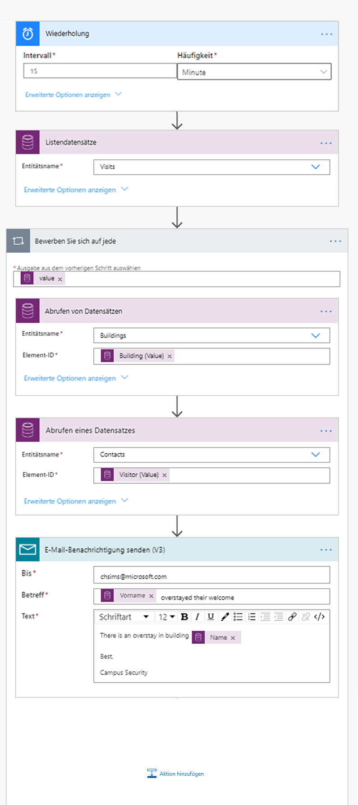

---
lab:
  title: 'Lab 6: Erstellen einer automatisierten Lösung'
  module: 'Module 4: Get Started with Power Automate'
ms.openlocfilehash: 9b26af0345e67d338409a3712fd77e581721ab29
ms.sourcegitcommit: ef58c858463b890e923ef808b1d43405423943fd
ms.translationtype: HT
ms.contentlocale: de-DE
ms.lasthandoff: 01/27/2022
ms.locfileid: "137898996"
---
# <a name="module-4-get-started-with-power-automate"></a>Modul 4: Erste Schritte mit Power Automate
## <a name="lab-how-to-build-an-automated-solution"></a>Lab: Erstellen einer automatisierten Lösung

## <a name="scenario"></a>Szenario

Das Bellows College ist eine Bildungsorganisation mit mehreren Gebäuden auf dem Campus. Campusbesucher werden derzeit auf Papier erfasst. Die Informationen werden nicht konsistent erfasst und es gibt keine Möglichkeit, Daten über die Besuche auf dem gesamten Campus zu sammeln und zu analysieren. 

Die Campusverwaltung möchte ihr Besucherregistrierungssystem modernisieren, wobei der Zugang zu den Gebäuden von Sicherheitspersonal kontrolliert werden soll und alle Besuche von den entsprechenden Gastgebern zuvor registriert und aufgezeichnet werden müssen.

Während dieses Kurses erstellen Sie Anwendungen und führen eine Automatisierung durch, damit das Verwaltungs- und Sicherheitspersonal des Bellows College den Zugang zu den Gebäuden auf dem Campus verwalten und kontrollieren kann. 

In diesem Lab erstellen Sie Power Automate-Flows, um verschiedene Aspekte der Campusverwaltung zu automatisieren. 

# <a name="high-level-lab-steps"></a>Weiterführende Schritte des Lab

Sie müssen die folgenden Anforderungen implementieren, um das Projekt abzuschließen.

* Der jedem Besucher zugewiesene eindeutige Code muss diesem vor seinem Besuch zur Verfügung gestellt werden.
* Das Sicherheitspersonal muss Benachrichtigungen erhalten, wenn Besucher ihre geplanten Zeitfenster überschreiten.

## <a name="prerequisites"></a>Voraussetzungen

* Beendigung von **Modul 0 Lab 0 – Lab-Umgebung überprüfen**
* Beendigung von **Modul 2 Lab 1 – Einführung in Microsoft Dataverse**
* Campusmitarbeiter-App, erstellt in **Modul 3, Lab 2 – Erstellen einer Canvas-App, Teil 2** (zum Testen)
* John Doe-Kontakt, erstellt mit einer persönlichen E-Mail-Adresse in **Modul 3, Lab 4 – Erstellen einer modellgesteuerten App** (zum Testen)

## <a name="things-to-consider-before-you-begin"></a>Vor dem Beginn zu beachtende Dinge

-   Welcher Verteilungsmechanismus ist für die Besuchercodes am besten geeignet?
-   Wie können Überschreitungen gemessen und strenge Richtlinien durchgesetzt werden?

# <a name="exercise-1-create-visit-notification-flow"></a>Übung 1: Einen Besuchsbenachrichtigungsfluss erstellen

**Ziel**: In dieser Übung erstellen Sie einen Power Automate-Flow, der die Anforderung implementiert. Dem Besucher sollte eine E-Mail gesendet werden, die den eindeutigen Code enthält, der dem Besuch zugewiesen ist.

## <a name="task-1-create-flow"></a>Aufgabe 1: Flow erstellen

1.  Öffnen Sie Ihre Campusverwaltung-Lösung.

    -   Melden Sie sich bei <https://make.powerapps.com> an.

    -   Wählen Sie Ihre **Umgebung** aus.

    -   Wählen Sie **Projektmappen** aus.

    -   Klicken Sie, um Ihre **Campusverwaltungslösung** zu öffnen.

2.  Klicken Sie auf **Neu**, und wählen Sie **Automation**, **Cloudfluss** und dann **Automatisiert**  aus. Dadurch wird der Power Automate-Flow-Editor in einem neuen Fenster geöffnet.

3. Suchen Sie unter **Trigger für Flow auswählen** nach **Microsoft Dataverse**.

4. Wählen Sie den Trigger **Wenn eine Zeile hinzugefügt, geändert oder gelöscht wird** aus, und klicken Sie dann auf **Erstellen**.

   * Wählen Sie **Hinzugefügt** für **Änderungstyp** aus.
   
   * Wählen Sie **Besuche** als **Tabellenname** aus.
   
   * Wählen Sie im **Bereich** **Organisation** aus
   
   * Klicken Sie im Triggerschritt auf die Schaltfläche mit den Auslassungspunkten ( **...** ), und klicken Sie auf **Umbenennen**. Benennen Sie diesen Trigger in **„Wenn ein Besuch hinzugefügt wird“** um. Dies ist eine gute Vorgehensweise, damit Sie und andere Flow-Editoren den Zweck des Schritts erkennen können, ohne tiefer in die Details gehen zu müssen.

5. Wählen Sie **Neuer Schritt** aus. Dieser Schritt ist erforderlich, um Besucherinformationen einschließlich der E-Mail-Adresse abzurufen.

6. Suchen Sie nach **Microsoft Dataverse**.

7. Wählen Sie die Aktion **Get a row by ID** aus. 

   * Wählen Sie **Kontakte** als **Tabellenname** aus.
   
   * Fügen Sie im Feld **Zeilen-ID** den Eintrag **Besucher (Wert)** in der Liste für dynamische Inhalte aus.
   
   * Klicken Sie bei dieser Aktion auf die Schaltfläche mit den Auslassungspunkten ( **...** ), und klicken Sie dann auf **Umbenennen**. Benennen Sie diese Aktion in **„Den Besucher abrufen“** um. Dies ist eine gute Vorgehensweise, damit Sie und andere Flow-Editoren den Zweck des Schritts erkennen können, ohne tiefer in die Details gehen zu müssen.

8. Klicken Sie auf **Neuer Schritt**. Dies ist der Schritt, in dem eine E-Mail erstellt und an den Besucher gesendet wird.

9. Suchen Sie nach *E-Mail*, wählen Sie den Connector **Office 365 Outlook** und die Aktion **E-Mail senden (V2)** aus.

   * Wenn Sie aufgefordert werden, die Nutzungsbedingungen für diese Aktion zu akzeptieren, klicken Sie auf **Akzeptieren**.
   
   * Wählen Sie das Feld **An** aus, und wählen Sie **E-Mail** aus der Liste für dynamische Inhalte aus. Beachten Sie, dass sich diese unterhalb der Kopfzeile **Den Besucher abrufen** befindet. Das bedeutet, dass Sie die E-Mail-Adresse auswählen, die zu dem Besucher gehört, den Sie im vorherigen Schritt nachgeschlagen haben. 

   * Geben Sie **Ihr geplanter Besuch am Bellows College** in das Feld **Betreff** ein.

   * Geben Sie den folgenden Text in **E-Mail-Text** ein:  
        
        > Dynamischer Inhalt muss dort platziert werden, wo Feldnamen in Klammern angegeben sind. Es wird empfohlen, zuerst den gesamten Text zu kopieren und einzufügen und dann dynamischen Inhalt an den richtigen Stellen hinzuzufügen.
   
        ```
        Dear {First Name},

        You are currently scheduled to visit Bellows Campus from {Scheduled Start} until {Scheduled End}.

        Your security code is {Code}, please do not share it. You will be required to produce this code during your visit.

        Best regards,

        Campus Administration
        Bellows College
        ```
   
10.  Wählen Sie oben den Flow-Namen **Ohne Titel** aus, und benennen Sie ihn in `Visit notification` um.

11. Klicken Sie auf **Speichern**.

    Lassen Sie die Registerkarte dieses Flows für die nächste Aufgabe geöffnet. Ihr Flow sollte in etwa wie folgt aussehen:


## <a name="task-2-validate-and-test-the-flow"></a>Aufgabe 2: Flow überprüfen und aktivieren

1.  Öffnen Sie im Browser eine neue Registerkarte, und navigieren Sie zu <https://make.powerapps.com>.

2.  Klicken Sie auf **Apps**, und wählen Sie die **Campus-Mitarbeiter**-App aus, die Sie erstellt haben.

3.  Lassen Sie diese Registerkarte geöffnet, und navigieren Sie wieder zurück zu der vorherigen Registerkarte mit Ihrem Flow. 

4.  Klicken Sie in der Befehlsleiste auf **Testen**. Wählen Sie **Manuell** aus, und klicken Sie dann auf **Speichern und testen**.

5.  Lassen Sie die Flow-Registerkarte geöffnet, und navigieren Sie wieder zurück zur vorherigen Registerkarte mit der **Campus-Mitarbeiter**-App.

6.  Drücken Sie **+** , um einen neuen Besuchsdatensatz hinzuzufügen.

7.  Geben Sie **John Doe** als **Name** ein, und wählen Sie ein beliebiges **Gebäude** aus.

8.  Wählen Sie **John Doe** als **Besucher** aus.

9.  Wählen Sie als **Geplanter Start** und **Geplantes Ende** beliebige Zeitpunkte in der Zukunft aus.

10.  Klicken Sie auf das **Häkchensymbol**, um den neuen Besuch zu speichern.

11.  Navigieren Sie wieder zurück zur vorherigen Registerkarte mit dem Flow, der getestet werden soll. Beobachten Sie, wie der Flow ausgeführt wird. Beim Auftreten von Fehlern gehen Sie zurück, und vergleichen Sie Ihren Flow mit dem obigen Beispiel. Wenn die E-Mail erfolgreich gesendet wurde, erhalten Sie sie in Ihrem Posteingang. 

12.  Klicken Sie auf den Zurück-Pfeil in der Befehlsleiste.

13.  Beachten Sie, dass im Abschnitt **Details** der **Status** auf **Ein** gesetzt ist. Dies bedeutet, dass Ihr Flow immer dann ausgeführt wird, wenn ein neuer Besuch erstellt wird, bis Sie ihn deaktivieren. Jedes Mal, wenn der Flow ausgeführt wird, wird er der Liste **28-tägiger Ausführungsverlauf** hinzugefügt.

14.  Schalten Sie den Flow aus, indem Sie auf der Befehlsleiste auf **Ausschalten** klicken. Möglicherweise müssen Sie auf die Schaltfläche mit den Auslassungspunkten klicken ( **...** ), um diese Option zu sehen.

15.  Schließen Sie dieses Fenster.

# <a name="exercise-2-create-security-sweep-flow"></a>Übung Nr. 2: Erstellen eines Security Sweep-Flows

**Ziel**: In dieser Übung erstellen Sie einen Power Automate-Flow, der die Anforderung implementiert. Alle 15 Minuten muss eine Sicherheitsprüfung durchgeführt werden. Sollte einer der Besucher seine geplante Aufenthaltszeit überschritten haben, ist die Sicherheit zu benachrichtigen.

## <a name="task-1-create-flow-to-retrieve-records"></a>Aufgabe Nr. 1: Einen Flow zum Abrufen von Datensätzen erstellen

1. Öffnen Sie Ihre Campusverwaltung-Lösung.

   -   Melden Sie sich bei <https://make.powerapps.com> an.

   -   Wählen Sie Ihre **Umgebung** aus.

   -   Wählen Sie **Projektmappen** aus.

   -   Klicken Sie, um Ihre **Campusverwaltungslösung** zu öffnen.

2. Klicken Sie auf **Neu**, und wählen Sie **Automation**, **Cloudfluss** und dann **Geplant**  aus. Dadurch wird der Power Automate-Flow-Editor in einem neuen Fenster geöffnet.

3. Legen Sie fest, dass der Flow alle **15** Minuten wiederholt werden soll.

4. Klicken Sie auf **Erstellen**.

5. Klicken Sie auf **Neuer Schritt**. Suchen Sie nach *Aktuell*, und wählen Sie **Microsoft Dataverse**-Connector. Wählen Sie die Aktion **Zeilen auflisten** aus.

   * Geben Sie **Besuche** als **Tabellenname** ein.
   
   * Klicken Sie auf **Erweiterte Optionen anzeigen**.

   * Geben Sie den folgenden Ausdruck in das Feld **Zeilen filtern** ein.

   ```
     statecode eq 0 and bc_actualstart ne null and bc_actualend eq null and Microsoft.Dynamics.CRM.OlderThanXMinutes(PropertyName='bc_scheduledend',PropertyValue=15)
   ```
   
   * Das bedeutet:
       * **statecode eq 0** filtert aktive Besuche (wobei „Status“ gleich „Aktiv“ ist).
       * **bc_actualstart ne null** beschränkt die Suche auf Besuche, bei denen „Tatsächlicher Beginn“ einen Wert hat, d. h. es wurde eingecheckt.
       * **bc_actualend eq null** beschränkt die Suche auf Besuche, bei denen kein Auschecken stattgefunden hat („Tatsächliches Ende“ hat keinen Wert). 
       * **Microsoft.Dynamics.CRM.OlderThanXMinutes(PropertyName='bc_scheduledend',PropertyValue=15)** beschränkt Besuche, die vor mehr als 15 Minuten abgeschlossen werden sollten.

   * Klicken Sie bei dieser Aktion auf die Schaltfläche mit den Auslassungspunkten ( **...** ), und klicken Sie dann auf **Umbenennen**. Benennen Sie diese Aktion in **„Aktive Besuche auflisten, die vor mehr als 15 Minuten geendet haben“** um. Dies ist eine gute Vorgehensweise, damit Sie und andere Flow-Editoren den Zweck des Schritts erkennen können, ohne tiefer in die Details gehen zu müssen.

6.  Klicken Sie auf **Neuer Schritt**. Such Sie nach *Anwenden*, und wählen Sie Aktion **Auf jedes anwenden** aus. 

7.  Wählen Sie **Wert** aus Dynamics-Inhalt im Feld **Eine Ausgabe aus vorherigen Schritten auswählen** aus. Beachten Sie, dass sich dieser unter der grauen Kopfzeile **Aktive Besuche auflisten, die vor mehr als 15 Minuten geendet haben** befindet. Dies bedeutet, dass Sie die Liste der Besuche auswählen, die Sie im vorherigen Schritt nachgeschlagen haben. 

8.  Abrufen von Gebäudedaten zu zugehörigem Datensatz

    * Klicken Sie auf **Eine Aktion hinzufügen** innerhalb der Schleife „Auf jedes anwenden“.
    
    * Wählen Sie **Microsoft Dataverse** aus. 
    
    * Wählen Sie die Aktion **Get a row by ID** aus.
    
    * Wählen Sie **Gebäude** als **Tabellenname** aus.
    
    * Wählen Sie **Gebäude (Wert)** als **Zeilen-ID** aus dem Dynamics-Inhalt aus.
    
    * Klicken Sie neben **Einen Datensatz abrufen** auf **[...]** , und wählen Sie **Umbenennen** aus. Geben Sie als Schrittname **Gebäude abrufen** ein.
    
9.  Abrufen von Besucherdaten zu zugehörigem Datensatz

    * Klicken Sie auf **Eine Aktion hinzufügen** innerhalb der Schleife „Auf jedes anwenden“.
    
    * Wählen Sie **Microsoft Dataverse** aus.
    
    * Wählen Sie die Aktion **Get a row by ID** aus.
    
    * Wählen Sie **Kontakte** als **Tabellenname** aus.
    
    * Wählen Sie **Besucher (Wert)** als **Zeilen-ID** aus dem Dynamics-Inhalt aus.
    
    * Klicken Sie neben **Einen Datensatz abrufen** auf **[...]** , und wählen Sie **Umbenennen** aus. Geben Sie als Schrittname **Besucher abrufen** ein.
    
10.  Senden von E-Mail-Benachrichtigungen

     * Klicken Sie auf **Eine Aktion hinzufügen** innerhalb der Schleife „Auf jedes anwenden“. Fügen Sie die Aktion **E-Mail senden (V2)** der Verbindung **Office 365 Outlook** hinzu.

11.  Ihre E-Mail-Adresse als **An** eingeben

12.  Geben Sie Folgendes in das Feld **Betreff** ein. **Vollständiger Name** ist ein dynamischer Inhalt aus dem Schritt **Besucher abrufen**.

   ```
   {Full Name} overstayed their welcome
   ```
   
13.  Geben Sie Folgendes in das Feld **Text** ein. **Name** ist ein dynamischer Inhalt aus dem Schritt **Gebäude abrufen**. Möglicherweise müssen Sie an das Ende der Liste scrollen.

   ```
   There is an overstay in building {Name}.
         
   Best,
         
   Campus Security
   ```

14.  Wählen Sie den Flow-Namen **Ohne Titel** in der oberen linken Ecke aus, und benennen Sie ihn in **Sicherheitsüberprüfung** um.

15.  Klicken Sie auf **Speichern**.

    Ihr Flow sollte in etwa wie folgt aussehen:



## <a name="task-2-validate-and-test-the-flow"></a>Aufgabe Nr. 2: Flow überprüfen und aktivieren

Ihr Flow beginnt, Ihnen E-Mails zu senden (an die E-Mail-Adresse, die Sie bei der Erstellung des Kontakts „Bernhard Schmid“ zuvor angegeben haben), wenn es Besuche gibt, die den im Flow festgelegten Anforderungen entsprechen.

1. Überprüfen Sie, ob Sie Datensätze zu Besuchen haben, für die Folgendes gilt:

   1. Aktivem Status
   
   2. Geplantem Ende in der Vergangenheit (über 15 Minuten)
   
   3. Wert für „Tatsächlicher Start“
   
   > **Hinweis:** Navigieren Sie zum Anzeigen dieser Daten auf einer neuen Registerkarte zu „make.powerapps.com“. Klicken Sie im linken Bereich auf „Lösungen“, um Ihre Lösung zu finden. Wählen Sie die Entität „Besuch“ aus, und wählen Sie dann die Registerkarte „Daten“ aus. Klicken Sie oben rechts auf „Aktive Besuche“, um die Ansichtsauswahl anzuzeigen, und wählen Sie dann „Alle Felder“ aus.
   
2. Navigieren Sie zum Flow **Sicherheitsüberprüfung**, wenn dieser noch nicht aktiv ist.

3. Wenn Ihr Flow geöffnet ist, klicken Sie auf **Testen**.

4. Wählen Sie **Manuell** aus.

5. Klicken Sie auf **Speichern und testen** und auf **Flow ausführen**.

6. Wenn der Flow abgeschlossen ist, klicken Sie auf **Fertig**. 

7. Erweitern Sie **Auf jedes anwenden** und dann den Schritt **Eine E-Mail-Benachrichtigung senden**. Überprüfen Sie die Werte **Betreff**, **E-Mail-Text**.

8. Klicken Sie auf den Zurück-Pfeil, um zu Details des Sicherheitsüberprüfungs-Flows zurückzukehren. Wählen Sie auf der Befehlsleiste **Ausschalten** aus. Dies soll verhindern, dass der Datenfluss nach einem Zeitplan auf dem Testsystem ausgeführt wird.

# <a name="challenges"></a>Herausforderungen

* Fügen Sie dem E-Mail-Text „Tatsächlicher Start“ und „Geplantes Ende“ hinzu.
* Wie können Sie sicherstellen, dass im E-Mail-Text eine benutzerfreundliche Datumsformatierung verwendet wird?
* Ist es möglich, eine Tabelle mit Informationen zu überschrittenen Aufenthaltszeiten zu generieren und nur eine einzige E-Mail zu senden?
* Können Sie einen Barcode für den Besuchscode generieren? Wann könnte das nützlich sein?
