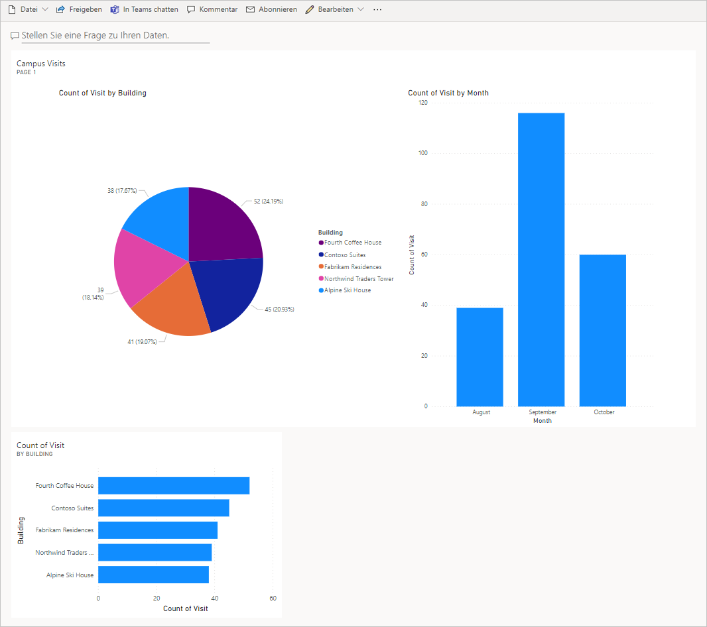

---
lab:
  title: "Lab\_5: Erstellen eines einfachen Dashboards"
  module: 'Module 5: Get Started with Power BI'
---

## Lab 5: Erstellen eines einfachen Dashboards

## Szenario

Bellows College is an educational organization with multiple buildings on campus. Campus visitors are currently recorded in paper journals. The information is not captured consistently, and there are no means to collect and analyze data about the visits across the entire campus.

Die Campusverwaltung möchte ihr Besucherregistrierungssystem modernisieren, wobei der Zugang zu den Gebäuden von Sicherheitspersonal kontrolliert werden soll und alle Besuche von den entsprechenden Gastgebern zuvor registriert und aufgezeichnet werden müssen.

Während dieses Kurses erstellen Sie Anwendungen und führen eine Automatisierung durch, damit das Verwaltungs- und Sicherheitspersonal des Bellows College den Zugang zu den Gebäuden auf dem Campus verwalten und kontrollieren kann.

In diesem Lab erstellen Sie einen Power BI-Bericht und ein Dashboard, das Daten zu Campusbesuchen visualisiert.

## Weiterführende Schritte des Lab

Wir werden die folgenden Schritte ausführen, um ein Power BI-Dashboard zu entwerfen und zu erstellen:

-   Einen Bericht mit verschiedenen Visualisierungen der Informationen zu Campusbesuchen erstellen

-   Eine Abfrage in natürlicher Sprache zum Erstellen zusätzlicher Visualisierungen verwenden

## Voraussetzungen

- Beendigung von **Modul 0 Lab 0 – Lab-Umgebung überprüfen**
- Abschluss von **Modul 2 Lab 1: Datenmodellierung**

## Vor dem Beginn zu beachtende Dinge

-   Wer ist das Zielpublikum des Berichts?
-   How will the audience consume the report? Typical device? Location?
-   Haben Sie ausreichend Daten für die Visualisierung?
-   Welche möglichen Merkmale können Sie verwenden, um Daten über die Besuche zu analysieren?

## Übung 1: Power BI-Bericht erstellen

**Ziel**: In dieser Übung erstellen Sie einen Power BI-Bericht basierend auf den Daten des Excel-Arbeitsblatts, das wir in einer vorherigen Übung genutzt haben.

### Aufgabe \#1: Vorbereiten des Power BI-Diensts

1.  Laden Sie [visits.pbix](https://github.com/MicrosoftLearning/PL-900-Microsoft-Power-Platform-Fundamentals/raw/master/Allfiles/visits.pbix) herunter, und speichern Sie die Datei auf Ihrem Computer.

2.  Navigieren Sie bei Bedarf zu <https://app.powerbi.com/>, und melden Sie sich an.

3.  Wählen Sie unten links auf dem Bildschirm **Daten abrufen** aus.

4.  Wählen Sie die Schaltfläche **Abrufen** unter **Dateien** im Abschnitt **Neuen Inhalt erstellen** aus.

5.  Wählen Sie **Lokale Datei**.

6.  Suchen Sie die Datei **visits.pbix**, die Sie zuvor heruntergeladen haben, und wählen Sie sie aus.

7.  Sobald der Datenladevorgang abgeschlossen ist, erweitern Sie **Mein Arbeitsbereich** und wählen den Bericht **visits** aus (beachten Sie, dass als „Typ“ **Bericht** festgelegt ist).

8.  Click <bpt id="p1">**</bpt>Edit<ept id="p1">**</ept>. If <bpt id="p1">**</bpt>Edit<ept id="p1">**</ept> menu item is not visible click <bpt id="p2">**</bpt>...<ept id="p2">**</ept> and then select <bpt id="p3">**</bpt>Edit<ept id="p3">**</ept>.

Damit haben den Power BI-Dienst für Ihre Labs eingerichtet.

### Aufgabe \#2: Diagramm- und Zeitvisualisierungen erstellen

1.  Klicken Sie auf das **Kreisdiagramm**symbol im Bereich **Visualisierungen**, um ein Diagramm einzufügen.

2.  Press the drop-down arrow beside <bpt id="p1">**</bpt>bc_building<ept id="p1">**</ept> in the Fields pane. Drag the <bpt id="p1">**</bpt>Building<ept id="p1">**</ept> field and drop it into <bpt id="p2">**</bpt>Legend<ept id="p2">**</ept> box.

3.  Das Bellows College ist eine Bildungsorganisation mit mehreren Gebäuden auf dem Campus.

4.  Ändern Sie die Größe des Kreisdiagramms mithilfe der Ziehpunkte an den Ecken, sodass alle Diagrammkomponenten sichtbar sind.

5.  Klicken Sie auf den Bericht außerhalb des Kreisdiagramms, um die Auswahl aufzuheben, und wählen Sie „Gestapeltes Säulendiagramm“ im Bereich **Visualisierungen** aus.

6.  Campusbesucher werden derzeit auf Papier erfasst.

7.  Ziehen Sie das Feld **Start** in das Zielfeld **X-Achse**.

8.  Klicken Sie im Bereich „Visualisierungen“ auf das **x** neben **Jahr** und **Quartal**, sodass auf der Achse nur noch die Summen von **Monat** und **Tag** angezeigt werden.

9.  Ändern Sie die Größe des Diagramms mithilfe der Ziehpunkte an den Ecken je nach Bedarf.

10. Testen Sie die Berichtsinteraktivität:

    1.  Klicken Sie auf verschiedene Gebäudesegmente im Kreisdiagramm, und beobachten Sie Änderungen im Zeitbericht.

    2.  Die Informationen werden nicht konsistent erfasst und es gibt keine Möglichkeit, Daten über die Besuche auf dem gesamten Campus zu sammeln und zu analysieren.

    3.  Führen Sie einen Drillup und Drilldown aus. Wählen Sie dann verschiedene Balken im Zeitsäulendiagramm aus, und beobachten Sie Änderungen im Kreisdiagrammbericht.

11. Speichern Sie laufende Arbeiten, indem Sie auf **Speichern** klicken.

## Übung 2: Power BI-Dashboard erstellen

### Aufgabe \#1: Power BI-Dashboard erstellen

1.  Sie sollten den Bericht aus der vorherigen Aufgabe geöffnet haben.

2.  Select <bpt id="p1">**</bpt>Pin to a dashboard<ept id="p1">**</ept> on the menu. Depending on the layout you may need to press <bpt id="p1">**</bpt>...<ept id="p1">**</ept> to show additional menu items.

3.  Wählen Sie bei der Eingabeaufforderung **An Dashboard anheften** die Option **Neues Dashboard** aus.

4.  Geben Sie **Campusverwaltung** unter **Dashboardname** ein, und klicken Sie auf **Live anheften**.

5.  A pop-up will prompt you that the dashboard has been created. Select <bpt id="p1">**</bpt>Go to dashboard<ept id="p1">**</ept>.

6.  Testen Sie die Interaktivität der angezeigten Kreis- und Balkendiagramme.

### Aufgabe \#2: Visualisierungen in natürlicher Sprache hinzufügen

1.  Wählen Sie in Ihrem Dashboard **Campusverwaltung** die Leiste **Stellen Sie eine Frage zu Ihren Daten** ganz oben aus.

2.  Enter <bpt id="p1">**</bpt>buildings by number of visits<ept id="p1">**</ept> in Q&amp;A area. A bar chart will be displayed.

3.  Wählen Sie **Visualisierung anheften** aus.

4.  Wählen Sie **Vorhandenes Dashboard** und dann Ihr Dashboard **Campusverwaltung** aus, und klicken Sie auf **Anheften**.

5.  Klicken Sie auf **F&A beenden**.

Your <bpt id="p1">**</bpt>Campus Management<ept id="p1">**</ept> dashboard should be displayed with three visuals on it. You may have to scroll down to see the new Q&amp;A visual.

Ihr Dashboard sollte ungefähr wie folgt aussehen:

