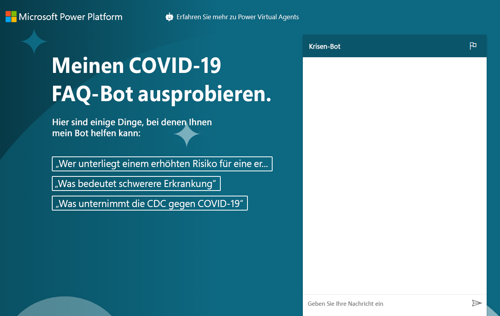

---
lab:
    title: 'Lab 8: So erstellen Sie einen grundlegenden Chatbot'
    module: 'Modul 6: Einführung in Power Virtual Agents'
---

# Modul 6: Einführung in Power Virtual Agents
## Lab: So erstellen Sie einen grundlegenden Chatbot

# Szenario

Das Bellows College ist eine Bildungsorganisation mit mehreren Gebäuden auf dem Campus. Campusbesuche werden derzeit in Papierzeitschriften aufgezeichnet. Die Informationen werden nicht konsistent erfasst und es gibt keine Möglichkeit, Daten über die Besuche auf dem gesamten Campus zu sammeln und zu analysieren.

Wie die meisten Organisationen reagiert das Bellows College schnell auf Bedenken bezüglich Fehlinformationen zu COVID-19, Best Practices, Zeitplänen usw. In dieser Übung erstellen Sie einen Power Virtual Agent-Chatbot, der auf die Seite des Center for Disease Control mit Fragen und Antworten zum aktuellen Status der Pandemie verweist. Das College möchte dieses Setup, damit es in seine Portal-Website eingebettet und ad hoc zur Verfügung gestellt werden kann, wenn die Abteilungen ihre eigene geplante Wiedereröffnung vornehmen.

## Generelle Schritte

Wir folgen der nachstehenden Übersicht, um unseren Power Virtual Agent zu erstellen:

  - Registrieren Sie sich für eine Testversion von Power Virtual Agent

  - Erstellen Sie einen Bot mithilfe von FAQs

  - Testen Sie den Bot

  - Ändern Sie die Standardbegrüßung

  - Veröffentlichen Sie den Bot

  - **Bonus-Herausforderung:** Betten Sie den Bot in Ihr Portal ein

## Voraussetzungen

Sie müssen die folgenden Anforderungen implementieren, um das Projekt abzuschließen.

  - Beendigung von **Modul 0 Lab 0 – Lab-Umgebung bestätigen**

  - Beendigung von **Modul 2 Lab 1 – Einführung in Microsoft Dataverse**

  - Nur Bonusübung: Abschluss von **Modul 6 Lab 4 – Einführung in Power Apps-Portale** 

## Vor dem Beginn zu beachtende Dinge

Bots können in vielen verschiedenen Szenarien sehr nützlich sein. Überlegen Sie anhand Ihrer bisherigen Kenntnisse über das Bellows College, wo in der Organisation sonst ein Bot von Nutzen sein könnte.

# Übung Nr. 1: Für PVA registrieren und einen neuen Bot erstellen

In dieser Übung registrieren Sie sich für die Testversion von Power Virtual Agents.

1.  Navigieren Sie zu [Power Virtual Agents](https://powerva.microsoft.com/)

2.  Klicken Sie auf **Kostenlos einsteigen**.

3.  Melden Sie sich gegebenenfalls an.

4. Das Fenster **Neuen Bot erstellen** sollte geöffnet werden.

5. Geben Sie **Krisenbot** als **Name** ein, und wählen Sie eine Sprache aus.

6. Wählen Sie Ihre Übungsumgebung aus, um den Bot zu erstellen, und klicken Sie auf **Erstellen**. Warten Sie, bis der Bot erstellt ist. Klicken Sie auf **Bot erkunden**, wenn Sie dazu aufgefordert werden.

7. Testen Sie den Bot. Geben Sie **Hallo** in das Meldungsfeld ein, und klicken Sie auf **Senden**. Der Bot sollte Sie begrüßen und Ihnen sagen, was er tun kann.

8. Schließen Sie den **Chat**.

9. Wählen Sie **Themen** aus. Der Bot enthält einige Beispielbenutzerthemen und Systemthemen. Die Standardbegrüßung stammte aus den Systemthemen.

> In der nächsten Übung generieren Sie Ihre eigenen Themen aus der CDC-FAQ-Website. Navigieren Sie nicht von diesem Browserfenster weg.

# Übung Nr. 2: Themen erstellen

In dieser Übung generieren Sie Themen von der CDC-FAQ-Website.

1.  Navigieren Sie auf einer neuen Registerkarte zur [CDC FAQ](https://www.cdc.gov/coronavirus/2019-ncov/faq.html)-Website, und prüfen Sie, was auf der Website vorhanden ist. Sie werden Ihre Themen aus diesen FAQs generieren.

2.  Kopieren Sie die URL.

3.  Kehren Sie zu Power Virtual Agents zurück, und stellen Sie sicher, dass Sie immer noch **Themen** ausgewählt haben.

4.  Wählen Sie die Registerkarte **Vorgeschlagen** unter **Themen** aus.

5.  Klicken Sie auf **Los geht's**.

6. Fügen Sie die URL, die Sie kopiert haben, in das Textfeld **Link zu Online-Inhalten** ein, und klicken Sie auf **Hinzufügen**. Bitte beachten Sie, dass https:// zweimal aufgeführt wird, wenn Sie die komplette URL kopiert haben. Stellen Sie sicher, dass die URL das Protokoll nur einmal aufführt.

7.  Klicken Sie auf **Start**, und warten Sie. Dies kann einige Minuten dauern.

8.  Es sollten einige vorgeschlagene Themen für Sie erstellt werden. Klicken Sie, um eines der vorgeschlagenen Themen zu öffnen.

9. Sie sollten die Triggerbegriffe und die Antwort des Bots sehen. **Klicken Sie auf „Zu Themen hinzufügen“.**
    
10. Das vorgeschlagene Thema sollte zu Ihren Themen hinzugefügt werden. Wählen Sie alle vorgeschlagenen Themen aus, und klicken Sie auf **Zu Themen hinzufügen**. 

    > Sie können mithilfe des Symbols links neben der Spalte „Name“ alle Themen auswählen. Wenn Sie eine Fehlermeldung erhalten, versuchen Sie es erneut.

11. Wenn die vorgeschlagenen Themen hinzugefügt wurden, wählen Sie die Registerkarte **Vorhandene** aus. Sie sollten die neuen Themen mit dem Status „Aus“ sehen.

12. Verwenden Sie die Umschaltfläche in der Spalte **Status**, um einige der Themen auf **Ein** umzuschalten. 

13. Notieren Sie sich die Triggerphrase für eines der Themen, die Sie aktiviert haben, damit Sie später damit testen können.

> Navigieren Sie nicht von diesem Browserfenster weg.

# Übung Nr. 3: Themen testen

In dieser Aufgabe testen Sie die Themen, die Sie hinzugefügt haben.

1.  Klicken Sie unten links auf **Ihren Bot testen**.

2.  Klicken Sie auf **Zurücksetzen**.

3.  Geben Sie die Triggerphrase ein, die Sie in der vorherigen Aufgabe aufgezeichnet haben, und klicken Sie auf **Senden**.

4.  Der Bot sollte Ihnen die richtigen Informationen liefern und fragen, ob er Ihre Frage beantwortet hat. Klicken Sie auf **Ja**.

5.  Der Bot sollte Sie nach Ihrer Bewertung, wie er funktioniert hat, fragen. Geben Sie ihm eine hervorragende Bewertung.

6.  Der Bot sollte fragen, ob er Ihnen noch anderweitig helfen kann. Klicken Sie auf **Nein, danke**.

7.  Der Bot sollte die Chatsitzung beenden.

8.  Geben Sie **Hallo** ein, und klicken Sie auf **Senden**.

9.  Der Bot sollte Sie begrüßen und Ihnen sagen, was er tun kann. Ihr Bot kann jetzt Benutzern mit COVID-19-FAQs helfen, sodass Sie die Begrüßungsnachricht in der nächsten Aufgabe ändern müssen. Navigieren Sie nicht von diesem Browserfenster weg.

# Übung Nr. 4: Begrüßung ändern

In dieser Aufgabe ändern Sie die Begrüßung in eine COVID-19-spezifische Begrüßung.

1.  Vergewissern Sie sich, dass Sie **Themen** ausgewählt haben, und wählen Sie die Registerkarte **Vorhandene** aus.

2.  Reduzieren Sie den Abschnitt **Benutzerthemen**.

3.  Klicken Sie, um das Thema **Begrüßung** der Systemthemen zu öffnen. Sie können im Suchfeld auch die Option **Bestehende Themen suchen** verwenden.

4.  Das Begrüßungsthema enthält 52 Triggerbegriffe. Klicken Sie auf **Zum Dokumenterstellungsbereich**.

5.  Navigieren Sie zur ersten Nachricht, und ersetzen Sie sie durch `Hi, I’m a virtual agent. I can tell you about how COVID-19 spreads, how to protect yourself, preparing your home and family for COVID-19, symptoms, testing, and more.`

6.  Klicken Sie auf **Speichern**.

7.  Klicken Sie auf **Testbot**, wenn Ihr Bot nicht mehr geöffnet ist. Klicken Sie auf **Zurücksetzen**, um den Chat zurückzusetzen.

8.  Geben Sie „Hallo“ ein, und klicken Sie auf **Senden**.

9.  Der Bot sollte nun mit der neuen Begrüßung antworten.

# Übung Nr. 5: Den Bot veröffentlichen

In dieser Übung veröffentlichen Sie den Bot.

1.  Wählen Sie auf der linken Navigationsleiste **Veröffentlichen** aus.

2.  Klicken Sie auf **Veröffentlichen**.

3.  Klicken Sie erneut auf **Veröffentlichen**, und warten Sie, bis die Veröffentlichung abgeschlossen ist.

4.  Erweitern Sie in der linken Navigationsleiste **Verwalten** aus, und wählen Sie **Kanäle** aus.

5.  Sie erhalten eine Liste der verfügbaren Kanäle, auf denen Sie Ihren Bot veröffentlichen können. Wählen Sie **Demo-Website** aus.

6.  Ändern Sie die Begrüßungsnachricht in `Try my COVID-19 FAQ bot.` um.

7.  Geben Sie Folgendes in **Gesprächsstarter** ein:
    ```
     “Who is at higher risk for serious illness from COVID-19”
     “What does more severe illness mean”
     “What is the CDC doing about COVID-19”
    ```
    
8.  Klicken Sie auf **Speichern**.

9.  Kopieren Sie die **URL**.

> Sie können die URL mit Ihren Kollegen teilen und Feedback von ihnen erhalten. 

10.  Starten Sie ein neues Browserfenster oder eine neue Registerkarte, und navigieren Sie zu der URL, die Sie kopiert haben. Die Demo-Website sollte der nachfolgenden Abbildung ähneln.

11. Fangen Sie an, mit dem Bot zu chatten.  
    
Wenn Sie fertig sind, sollte Ihr veröffentlichter Bot ungefähr so aussehen:



# Herausforderungen 
* Betten Sie Ihren Chatbot in Ihr Bellows College-Besucherportal ein (weitere Informationen dazu finden Sie unter **Bot zu Power Apps hinzufügen** [hier](https://docs.microsoft.com/de-de/power-virtual-agents/publication-connect-bot-to-web-channels).)
